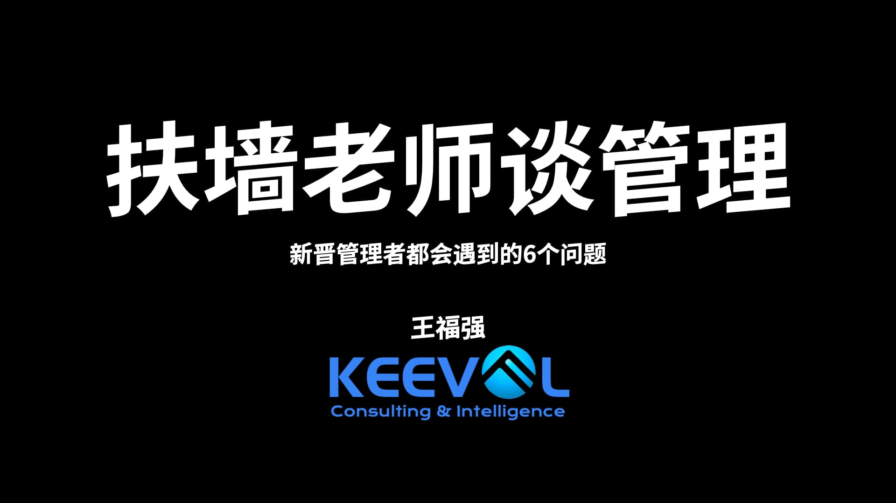
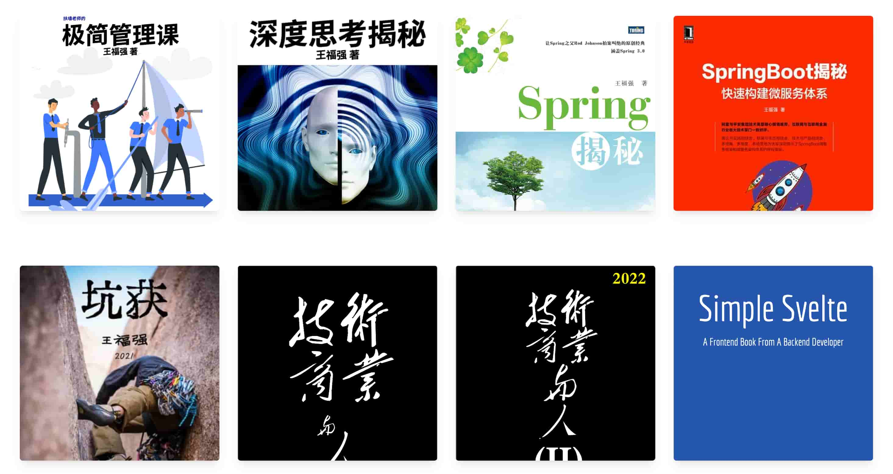
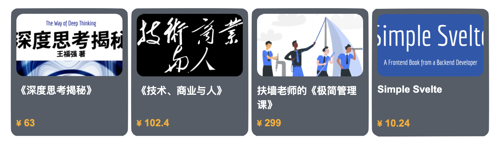

% 福強个人图书列表
% 王福强
% 2018-06-16

[除了图书之外的其它产品和服务](private_products_and_services.html)

# 《Spring揭秘》

建议走出版社或者现有销售渠道购买。

# 《SpringBoot揭秘》

建议走出版社或者现有销售渠道购买。

# 《深度思考揭秘》aka. 《The Way of Deep Thinking》 

怎么深度思考？ 如何独立思考？ 或许这里有你要找的答案。

**面向读者**

- 终身学习者
- 追求真知者
- 思考与践行者

**购买渠道**

- [去面包多购买](https://mianbaoduo.com/o/fgg)
- [去Gumroad购买](https://gumroad.com/l/BRmvgb)

---

另，[->>> 读者的反馈](book-readers-praise.html)与您分享。

# 《技术、商业与人》

囊括了作者对技术、商业与人的思考凝炼与践行总结。

**面向读者**

- 资深技术研发人员
- 创业者
- 组织者与管理者

**购买渠道**

<!-- - [直接购买](https://afoo.me/afpay/?id=tbh) -->
- [去面包多购买](https://mianbaoduo.com/o/fgg)
- [去Gumroad购买](https://gum.co/uLPkW)

---

[免费试读](books/技术_商业与人-免费试读.pdf)部分章节

# 《技术、商业与人(II)》

如若要试读，可以关注公众号：'福强'，然后点击菜单选择“试读尝鲜” ^-^

# 《极简管理课》

作为管理者和领导者，你是否不知道：

- 该怎么做决策？
- 该怎么定目标？
- 该怎么谈绩效？
- 该怎么领导队伍向前跑？
- 该怎么提升士气和团队氛围？

或许《极简管理科》能给你一些启示...

**面向读者**

- 新晋管理者
- 团队leaders
- CTOs

**购买渠道**

- [去面包多购买](https://mianbaoduo.com/o/bread/YZ2WlZdq)
- [去Gumroad购买](https://gum.co/fANOaE)

---

另附"*InfoQ 大咖说*"上有关管理的个人分享([视频回放](https://youtu.be/tIPwf7KKinc))

> NOTE
> 
> 实际上，本书中所提及的内容并非普遍适用，甚至可以说对于大部分中国企业来说并不适用，只有你个人追求进取而且企业自身也追求进取的情况下，本书中的内容或许才有价值。
> 
<!--  -->

# 《坑获》

你可以自己踩坑，你也从别人踩坑的惨痛经历中吸取教训然后自己少踩坑儿...

**面向读者**

- (2B)创业者
- 终身学习者
- 追求真知者
- 想要防止自己被坑的准CTO和CTO们？

**购买渠道**

- [Gumroad Sale **Only**](https://wfq.gumroad.com/l/kenghuo)

# [《Simple Svelte: A Frontend Book From A Backend Developer》](https://wfq.gumroad.com/l/simple_svelte) ^[Simple Svelte is a pure English Tech book for Svelte 3.]

Have you ever...

- Create a Single Page Application from scratch?  Svelte is simple to get start.
- Migrate a legacy web application? Svelte is simple to integrate.
- As a backend developer who wants to try frontend nowadays? Svelte is simpler to play with than React/Vue.

[《Simple Svelte》](https://wfq.gumroad.com/l/simple_svelte) will cover from product design to technology implementations, I will guide you thru how to think, how to design and how to build even how to operate. With this book, you will learn more than just svelte3 and technology things, but also product, marketing and human natures.

**For Readers**

- backend developers
- frontend beginners
- developers old-fashioned who want to learn new tricks

Grab the **FREE** trial chapters: 

- [downloading free trail chapters of Simple Svelte](https://afoo.me/books/SimpleSvelte_Trial_Edition.pdf).

**Buy Now**!

- [Buy on Gumroad](https://wfq.gumroad.com/l/simple_svelte), 19.99美金
<!-- - [去面包多购买](https://mianbaoduo.com/o/bread/YpeTkp1s), 10.24元 -->

---

If you want to get a feel for the sample SPA, play with [keeposter](https://poster.keevol.cn/) instead. ^[[How to use?](https://www.bilibili.com/video/BV1pg411F7jQ?share_source=copy_web)]

# [《福鱼画册》](https://wfq.gumroad.com/l/wKzbp) ^免费(free_of_charge)^

作者个人的思考点滴与金句汇集成此一画册。

[点击链接](https://wfq.gumroad.com/l/wKzbp)免费获取。

# [福强海报2021合集](https://wfq.gumroad.com/l/fqhb2021) 

付费读者群专属海报2021年合集

[点击获取](https://wfq.gumroad.com/l/fqhb2021)

# 购买渠道与支付方式

BTW. 你永远可以通过邮箱`i AT afoo DOT me`联系到我。

## [Gumroad](https://wfq.gumroad.com/)

[所有上架电子书都可以在Gumroad访问获取](https://wfq.gumroad.com/l) 

> **gumroad是购买后直接在gumroad网站下载获取本书，不是通过邮件发送，发现有的同学有疑惑，所以这里提醒一下**

## [面包多](https://mianbaoduo.com/o/fgg)

国内在面包多平台也有[部分上架](https://mianbaoduo.com/o/fgg)

