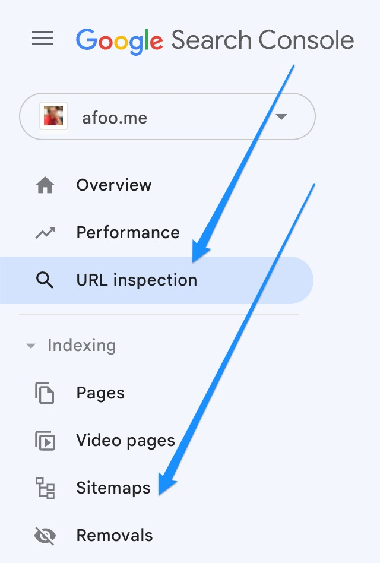

% 3种主动要求Google收录网站内容的常用方法
% 王福强
% 2023-08-29

新站点要加快SEO收录的速度，主动向Google提交收录请求肯定比傻傻地等要强。

最常用的三种向Google请求网站收录的方式：

1. 通过URL in spection工具请求索引收录（request indexing）
2. 通过提交Sitemap请求收录
3. 通过google ping提交sitemap请求收录

1和2的入口都在Google search console后台里： 

3则是通过请求 `https://www.google.com/ping?sitemap=https://{DOMAIN}/sitemap.xml` 提交sitemap。

> NOTE
>
> 也可以在robots.txt中添加sitemap引用，google bot爬取的时候会参考，但不如上面三种方式直接，当然，起码感觉上更直接，虽然都可能需要先入爬取等待队列，然后等1-2周才会被爬取。放robots.txt总感觉是被动等待；）

