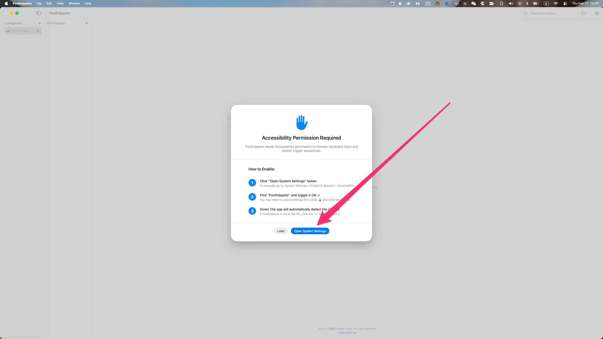
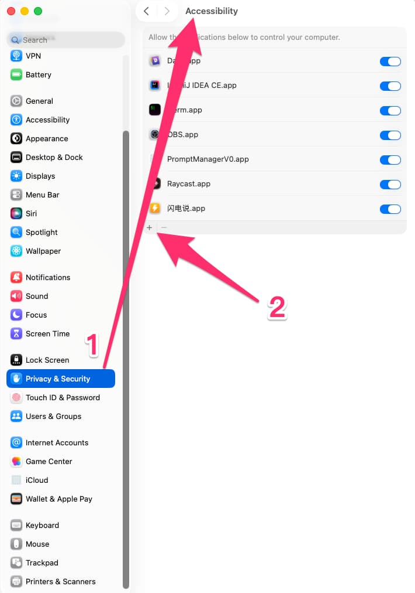
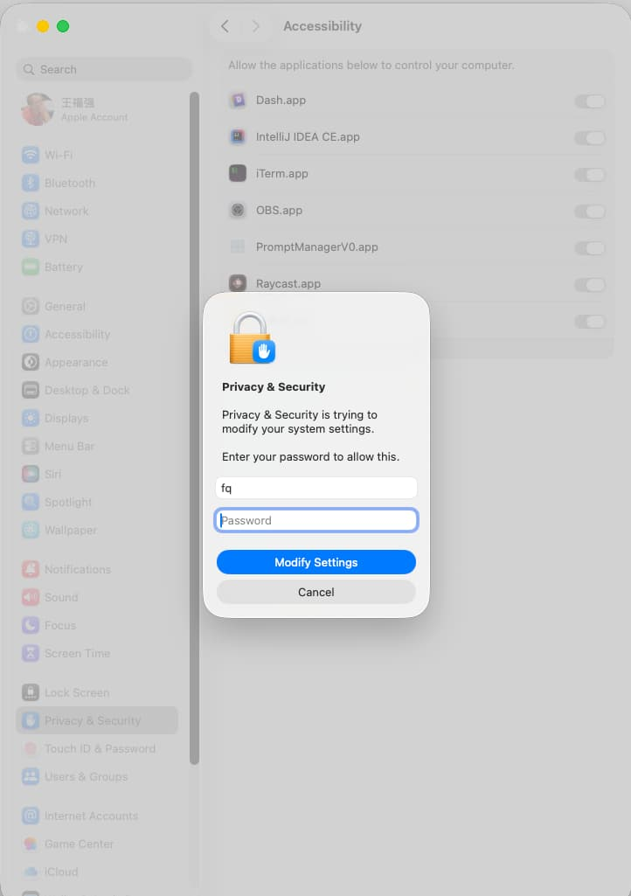
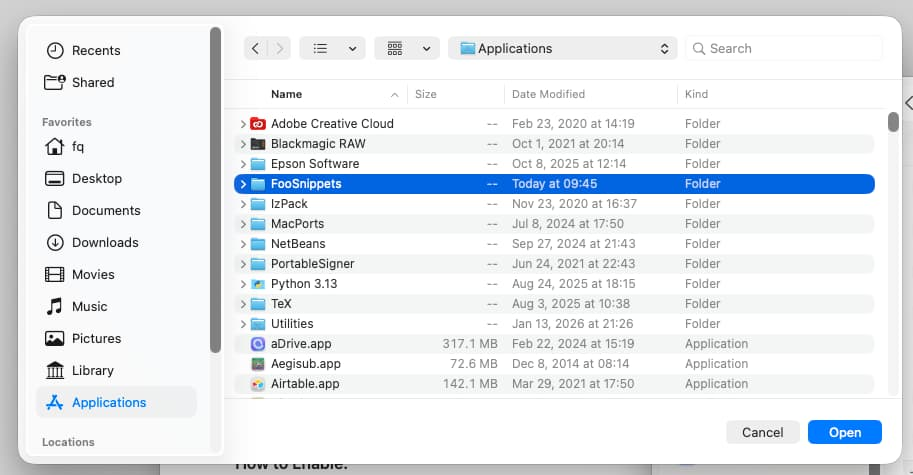
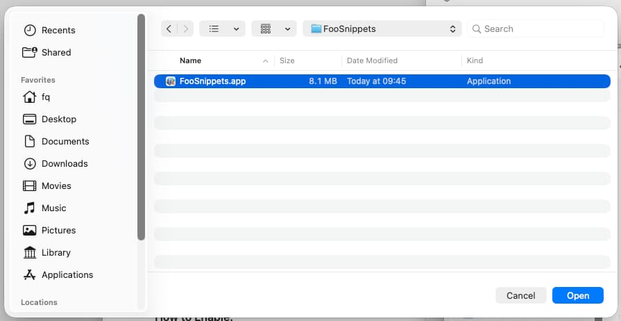
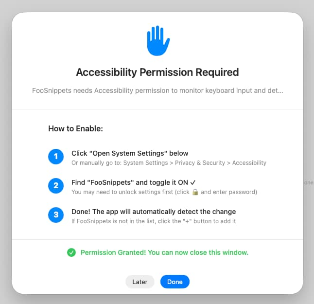
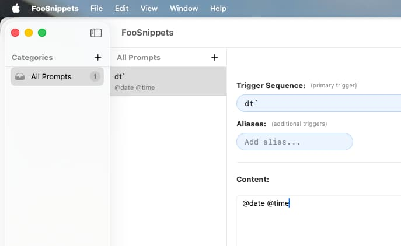

% FooSnippets 初次使用授权说明书
% 王福强
% 2026-02-12

[FooSnippets](https://foosnippets.afoo.me/) 因为需要监听键盘事件来自动触发关键词的替换和扩展，

所以，需要在首次安装之后，先给它相应的授权。

虽然为了方便用户了解这个授权如何做

但个人使用后发现，在Apple Silicon和Intel芯片两种不同的MacOS系统上，授权路径依然存在差异，主要是FooSnippets的安装路径不太一样。

故此，整理了这份文档，方便用户了解在不同的MacOS系统上如何正确授权。

当你从[App Store](https://apps.apple.com/us/app/foosnippets/id6758233050?mt=12)安装好FooSnippets之后，首次打开，你应该会看到如下的界面：

点击图中按钮开始授权，这时候，会打开 `System Settings -> Privacy & Security -> Accessibility` 界面：

点击图中箭头2所示的➕号（去选择要授权的应用，也就是我们的FooSnippets）， 这时候系统会提示你输入当前系统用户的密码（或者如果有指纹键，可以直接使用指纹键）：

输入完成后，会弹出应用选择对话框，也就是 `/Applications` 目录路径：

Apple Silicon的MacOS系统与Intel芯片的MacOS系统，在这里出现了关键差异：

1. Apple Silicon的MacOS系统：FooSnippets 会被直接安装在 `/Applications` 根路径下，这时候直接选择 `FooSnippets.app` 就可以了；
2. Intel芯片的MacOS系统： FooSnippets 会被安装在 `/Applications` 根路径下的 FooSnippets 子目录下，这时候需要点选进入FooSnippets子目录，然后再选择 `FooSnippets.app` ， 如图所示：

	- 
	- 

不管是哪种MacOS系统，只要选择对了安装的 `FooSnippets.app` ，FooSnippets 会在后台自动检测到授权成功：

这时候点击 Done 按钮， 就算是整个授权过程成功完成了。

现在，我们就可以添加自己的snippets开始使用了。 

比如， 添加一个快速输入日期时间的snippet：

保存后，在任何文本编辑器或者聊天输入框输入 "dt`",  FooSnippets 就会自动使用当前日期和时间替换输入内容，比如变成 -> 2026-02-12 13:50:59

当然，这是最简单的快捷替换和扩展，FooSnippets还提供了更多的placeholder选项，期待大家到 FooSnippets 的设置中去发现更多的惊喜 🤪

