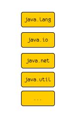
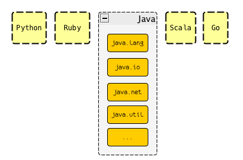
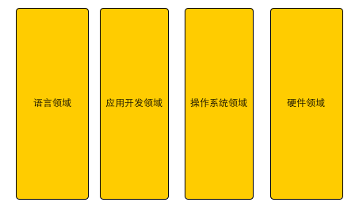
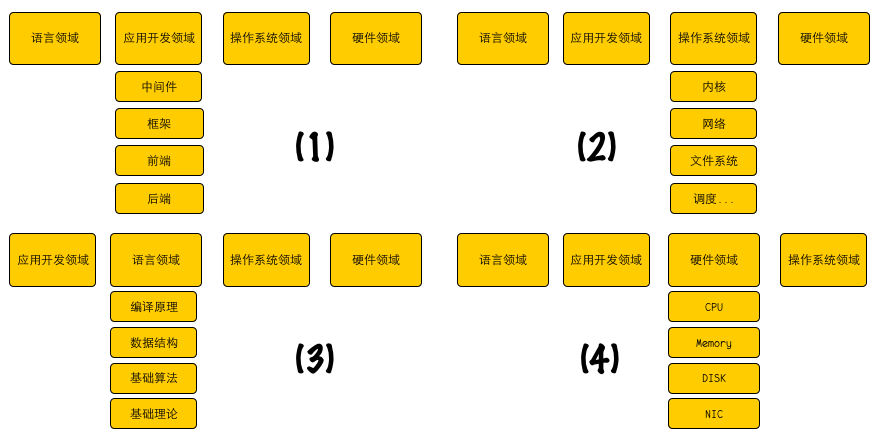
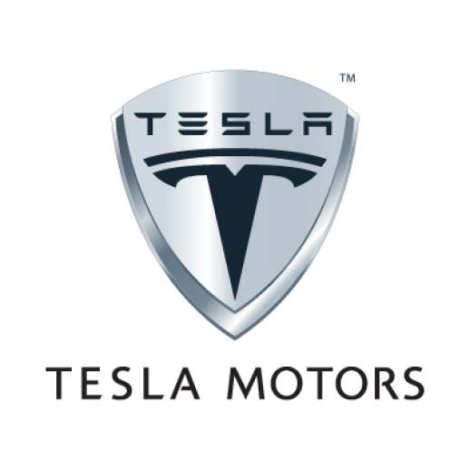

% 架构师的类莫比乌斯T型之路  #lollapalooza + positioning# 

这看起来更像一个哲学问题， 抽象到我都不知道从什么地方开始谈起，所以，我决定简化它，但尽量能够保持这个话题的精髓， 尽量保持辩证统一。

# Hello, World

每一个软件从业人员学习并写下的第一行或者第一段程序应该就是传说已久的hello world， 从这个hello world， 我们会深入学习某一门计算机语言，比如各种类库的扩展学习， 然后我们就有了第一级的历练之路：

随着对语言理解的深入，你我会走不同的方向，比如我假设我们在自己熟知的第一门语言的基础上，又去了解了其它的计算机语言， 那么， 历练之路就变成了：

但一般情况下，我们应该会有一门更较为熟悉的语言，所以， 语言层面可以形成了第一个T型足迹:

# 近乎循环的T型之路

了解语言和对应的类库并非整个计算机领域的全部，随着在这个领域的浸润，我们还会逐步的去了解应用开发领域, 操作系统领域, 硬件领域, 等等：

同样的，大部分人没法在所有的这些领域精通，一般情况下都是在某一个领域练级打怪，首先成为某个领域的专家， 比如

1. 在语言领域中， 深入了解解析器/编译器原理， 深入了解数据结构/基础算法等； 
2. 在应用开发领域中， 深入了解前端，后端，深入了解框架设计和应用， 深入了解各项中间件设计和应用等等；
3. 在操作系统领域， 深入了解操作系统设计和开发， 深入了解网络层面的设计和开发等；
4. 在硬件领域， 深入了解各种硬件体系的设计和开发， 深入了解硬件体系内单一实体的设计和开发等等；

从而，也就走出了另一层级的不同的T型路：

各位技术的同学，你以为这就是重点了吗？ NO, 否则我怎么会声称这是一条近乎循环之路那，；）

现在我们缩略粒度，并摄影机镜头拉远，放到一个起码能够看到公司边界的焦距上， 这个时候，我们看到的或许是这样一幅景象：

一个公司的架构我暂且假定是有公司的老板决定的，那么这个老板的出身往往决定了这个公司的定位和基因， 比如一个技术出身的老板， 他或许会将技术作为公司的核心竞争力，并投入更多资源； 一个市场出身的老板，可能认为市场是更重要的， 以此类推，这就意味着什么？

> 这里就有一个比较有意思的东西了， 我们大部分人都是从某个细分领域成长起来的，所以， 不太可能一上来就看到不同层级的T(主要是那个"横")， 所以往往都会认为自己才是最牛叉的，应该占有更多资源，荣誉等等， 但实际上，任何一个因素都会不同的时空下产生不同的效果。

摄像机的镜头可以继续拉远， 我们还会看到更多不同粒度的T型结构， 但我就不在陪着大家走了， 但有一点是肯定的， 这个世界上没有两片一样的树叶， 当你处于不同的层次的时候，你跟别人看到同样一个东西所产生的效应是不一样的， 格局有多大，你作为架构师可以产生的影响就有多大。

王齐原来跟我讲过一个人，即曼哈顿计划的负责人罗伯特·奥本海默， 这个人知道做这个事情应该找哪些人，每个人都有这么特质， 然后把这些人拉到一起来做同一件事情， 这个层次的架构要求他首先需要了解核物理各个领域的情况和人，否则他没法做这个事情的负责人（总架构师）。

神探狄仁杰大家在看的时候，或者再回头去看，应该可以发现， 狄仁杰的对手其实各个都是很牛叉的架构师，他们要调动的知识体系， 社会体系等等资源， 之前如果没有横向和纵向的积累，是没法推进这些事情的，更不用说会出现这些念头，只不过为了剧情需要（或者真的生不逢时，哈哈），最终成就了狄公的英名。

军事指挥官， 改革的总设计师， 不同的角色，要做出不同的架构，但本质上是一样的， 只不过，要走这条路，你准备好了吗？

# 结语

要成为优秀的架构师，需要不断探索和学习， 同样需要不断进取和创新的精神， 有能力，买辆特斯拉吧，哈哈

