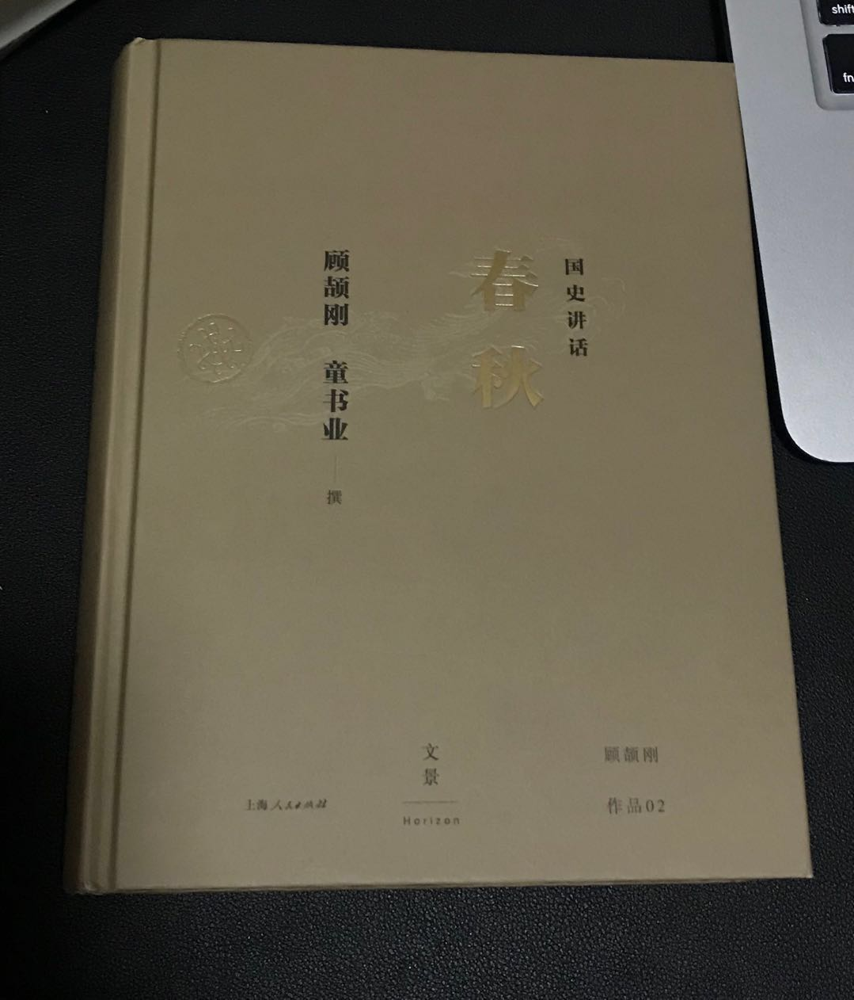

% 《春秋》碎语
% 王福强 著
% 2018-07-16

读得这一本，虽然感觉很多地方描述的情节比较混乱， 但多少有些内容值得摘录，所以有了此篇...

# 鲁X公N年的梗儿

《春秋》是鲁国人写的，所以年份都以鲁国为准，但从春秋列国整体看，就有些别扭。

# 孔子

从政或许失败，但**作为教育家**， 孔子的思想至今应该**无出其右**者。

鲁国的**臧文仲**能够立言垂世， 郑国的**子产**能够有很开明的思想， 并且施之于实际的政治， 这些人也都属于春秋时期不世出的圣贤。

# 倒霉的公子买， 被卖的经理人

夹在晋楚两大国之间，鲁国公为了自身利益，可耻的出卖了替他带兵打仗的公子买，实在有些无耻。

故事大体上是这样的： 卫国与楚国相近， 鲁国派兵救卫，但又惧怕晋国，所以又不想救卫，同时还不想薄了楚国的面子，这可咋整？ 把所有责任一推六二五， 让公子买当替罪羊， 把公子买杀了之后， 对晋说公子买不听指挥，对楚说公子买消极怠工， 呜呼，倒霉的公子买成了被人出卖的经理人！

# 秦穆公的胸怀

孟明视军争多次失败，依然给与信任和重用，此等君主的胸怀，值得所有领导者学习。

下属需要通过试错才能成长，所以， 作为领导者也需要有耐心来包容试错。

# 围魏救赵也好， 远交近攻也罢

在春秋时代就有案例，所以战国时期的战例多少应该从中有所借鉴吧！

郑庄公时代挟天子以令诸侯，就采用了`远交(齐、鲁)近攻（宋、卫）`的政策，努力经营，国际地位持续上升。

# 多行不义必自毙

郑庄公真jb沉得住气， timing is the most important thing.

# 鱼丽之阵

郑国的鱼丽之阵，算是步坦协同战术的始祖吗？ 

# 内外兼修还是内外交困

内外兼修，国势强盛； 内外交困，国势衰微。列国纷争，很多国家都是因为内乱而终止了强盛的势头。

尊王攘夷， 尊王是为了巩固内部关系， 攘夷是为了对外扩展疆土； 尊王是团结本族的手段， 攘夷是抵御外寇的口号。

能够兼修的，一般都发展的不错。

大部分只能顾一头。

# 挟天子以令诸侯

出师有名很重要！ 出师无名死得早！最好的结局是无功而返，灰头土脸。而像齐桓公攻卫那样， 以王命（东周王）攻卫，责卫， 然后还拿了贿赂之后才罢兵， 这tnd算是名利双收的特例了。

当然， 有些时候也别真把自己太当回事， 周天子后期真正实力已经消失殆尽， 却表面上依然表现的威严和煊赫，其实是因为所有诸侯都在玩“尊王”的权术，而所谓的“王”，也只是一个供着的工具而已。在“我们要不惜一切代价如何如何”中，自己要搞清楚自己到底是“我们”，还是“代价”...

像楚灵王得国不正， 又暴虐臣下， 穷兵黩武， 搞得内外交怨，大乱骤起， 说白了也是名分不够，否则起码统治期间会长很多。

# 假道伐虢

体现的其实是谋士的悲哀，宫之奇再聪明和有智谋，也架不住国君SB， 看破了，进谏了， 君主不听，依然没有鸟用，所以晋国先借道灭了虢国， 回头再顺道灭了宫之奇所在的虞国。

虞国纵有宫之奇和百里奚这样的智慧之人， 却只能去他国谋求发展， 对于不尊重人才的虞国（以及战国时候的魏国）， 死了也不足惜呀！

# 无信的晋惠公

SB秦惠公不懂“无信则不立”的道理， 回国掌权之前明明求助于秦国并许诺了人家好处， 等秦国帮助他复位，他除去内部威胁之后，却想赖掉送给秦国的好处， 从而内外对他都不满意，终归没有落得个好下场。

# 一姓不再兴

春秋是有一种迷信，叫做“一姓不再兴”， 是说一国被灭了之后， 就不能重新兴起来了， 如果勉强去兴复已灭的国， 就要得罪上天。

反清复明确实从来没有成过 ;0)

# 上下同心熬苦 VS. 上下交相逐利

孟子曰： `上下交相逐利， 国亡`， 实际上是说没有民族性和价值观的利益群体其实是很脆弱的。

楚国有段时间被人家追的到处逃窜，迁都来，迁都去，最后有大夫反对迁都说： "我们能去， 敌人岂不能去？我们愈退让， 敌人就愈进攻， 不如尽力抵抗。敌人见我们随遭荒年， 仍能出兵， 野心或许会消失。" ， 楚庄王听之，上下同心熬苦，终于得以崛起， 甚至还问鼎中原。

# 灭此朝食

齐候的这句“灭此朝食”虽然豪迈，结局却是失败告终，哈哈

势均力敌的时候， 很难说决心和信心就是取胜的关键。

# 春秋五霸

不同史书不同观点，按照手头上这本《国史讲话-春秋》来看，是下面五位：

1. 齐桓公  - 姜小白
2. 晋文公
3. 楚庄王
4. 吴王阖闾
5. 越王勾践

# 附录

1. 亡臣 ： 逃亡之臣
2. 殷以前是神话时代， 比如降福的神叫勾芒。

