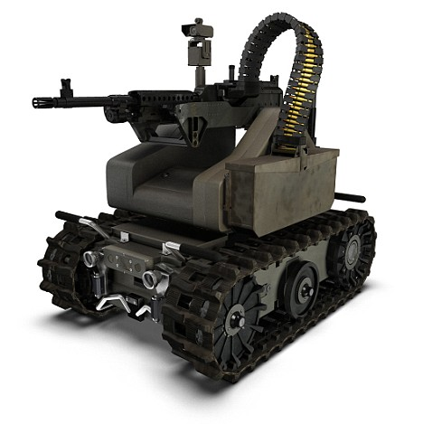

% 人工智能恐慌（AI Panic）
% 王福强
% 2018-09-17

我觉得现在有些人已经过度夸大人工智能（AI)的危害了...

从程序本质上来说， AI其实就是一个更大的循环（Big Loop），原来你的程序可能循环1000次，一万次，在AI的世界里则是1000万次， 一万亿次，甚至更大的循环次数而已。况且， 即使在这么大的循环次数下面，即使有持续的数据来“喂”各种AI程序，他们最终的判定也只是根据以往的“经验”去“猜”， “嗯， 这个东西跟之前的一类数据好像差不多， 那么这个东西应该就是XXX了”, 这样的智能，与其称之为智能，不如称其为智障，只会**因循守旧**的“傻瓜”罢了。

而如果从人工智能的分类上来看， 现在的人工智能分为： **感知智能 **和 **认知智能**。

现阶段，大部分声称或者已经大规模实践和应用的人工智能技术，依然处在感知智能的范畴，比如图像识别，语音识别，各种传感器等。

认知层面，现在只有人类才会有。即使将来真的生产出了杀人机器人，那体现的也是人类的意志， 而不是机器人的意志。

终结者(Terminator)机器人看起来很NB，但也只是将来材料科学等新技术进一步发展的产物，剥去纷繁复杂的各种细节，其实他们跟现在战场上用的机器人没有本质上的差别：

无非都是摄像头加上一堆红外传感器，XYZ传感器作为输入， 然后配合程序进行判断，再执行动作指令作为输出（比如到底是射杀当前目标，还是忽略当前目标, etc.）。

本质上来说，机器人杀人的行为，也只是程序的目标设定，即使再进一步，让机器人造机器人，其实还是程序控制的延伸，背后都是某些人的意志。

机器人终归是没有意识的，他们只有指令。机器人绝对不会产生什么意识，所以，你我害怕的不应该是机器人，而应该是人。就跟你我*不应该害怕鬼而应该怕人*是一个道理。