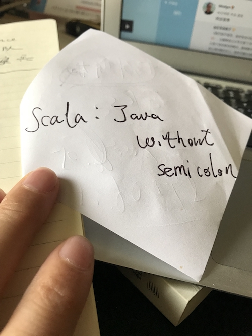

% 我对Scala的爱与恨
% 王福强
% 2018-09-24

原则上这种文字早就不应该出现在我的当下了， n年前写写还情有可原， 只是看到一个群里后辈们这几天的热情，或许是被这种热情感染了吧！

要说对Scala的爱有多少，我也说不清楚，唯一说的清楚的就是，写过Scala代码之后，我就很少写Java了。 而绕了很大一圈，学了又动手写了很多不同的计算机语言， 终究还是会回到Scala这里，概因为语言语法这东西就跟一个的样貌或者性格一样，萝卜白菜各有所爱吧，有人喜欢golang，有人喜欢Rust， 而我独喜欢Scala...

实际上，Scala于我，只是每个语句后面没有了恼人的分号的java而已。

本质上，我是在用Scala写Java，或者更确切地说，是在用Scala写跑在Java虚拟机上的程序，仅此而已。

我一直认为计算机语言只是计算机提供给人使用的一种API，而API的设计和使用就是应该越简单，越容易理解和使用越好。而我对Scala或者说Scala社区的恨，就来自他们（我也不知道这个他们都指谁）把Scala搞得很复杂， 却觉得这是一条高大上的阳春白雪之路，n年前我说过这不是一个合适的路径，现在我也是这样认为的。 好在，这1年内像lihaoyi这样的社区意见领袖（KOL）也开始反水， 尝试奋声疾呼Scala社区要向Simple方向走， 而不是更多为了“炫技”。

Scala社区有很多优秀的技术人才， 但没有多少优秀的产品经理，如果语言也是一种产品的话。

Spark的成功带动了Scala的接受程度， 但Spark的成功来自它的API设计之简洁和使用之简单， 而不是它背后的实现用了多少Scala的高级特性、类库甚至编程框架。

语言的成功比拼的是生态的繁荣， 现在很多技术人员其实可以使用各种语法工具构建自己的计算机语言，但只有被大规模接受和使用才能体现语言的价值。

我挺讨厌Scala社区“炫技”的氛围，但我确实喜欢写Scala代码，虽然已经不再编码一线多年，但闲暇时候还是喜欢用Scala写一写自己用的小工具，只不过， 我更觉得我用的Scala称为Scala Lite或者Scar Scala更为合适， 那些绚丽而不实用的语法、类库、框架都是被我抛弃使用的，大部分时候， 我觉得Java在这些方面反而做得更好。

爱恨交织，但永远以**Be Pragmatic**作为选择标准， 而不是偏执于一隅。

