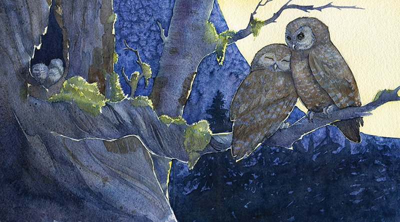
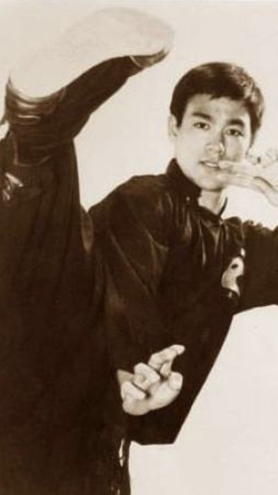

% 人还是要向上活
% 王福强
% 2018-12-16

我这阵子经常跟人自嘲，说2018年是一个灾年，起码对我来说， 因为甲状腺癌这手术和治疗一顿折腾， 对自己前半辈子的人生会有很多的反思（当然也可能是迷茫），或许人只有得病的时候再会有更多自省吧！

body， mind， spirit， 没有了健康身体的支撑， 自己认为自己再坚强， 其实精神上还是会受到一些削弱的。再加上外部环境和人的一些影响， 自然而然会有一些不好的想法。

随着身体的逐步恢复，也在让自己的精神逐步恢复过去那种奋发向上的状态。

前几天跟老婆绕村溜达， 听她这家长那家短的唠叨，念叨到有家老太太102岁了， 还能够自己洗衣服做饭， 腿脚灵便的样子， 明显感觉到老婆话语里面的羡慕之情。 嗯，其实长寿确实挺让人羡慕的，只是我想的可能就不是这些了...

人需要有个选择，你到底是想向上活，还是向下活。 怎么说呢？ 其实人怎么都是一辈子， 你是选择活出一段让更多人可以羡慕和作为榜样的人生，还是想即使活102岁虽然健康但每天过得平平淡淡？虽然都是芸芸众生的一员， 虽然也经历了病痛和坎坷，但我想我还是要追求前者，虽然不容易。选择舒服是很容易的， 但正确的选择往往不容易，**there is no right way or wrong way, only right way or easy way!**

今天家里跟父母吃饭，说到了姓王的一个本家老太太今年8月份左右去世了， 我觉得很突然， 年初春节还去拜过年， 今年春节可能就物是人非了。 从小，老师就教导我， “**人过留名， 雁过留声**”， 否则这辈子活得意义又在什么地方呢？

得病当然不好， 但也不全是坏事。一个人可以体验虚极的状态和坎坷，但不能陷入其中而不自拔，芸芸众生已经很多了，不缺你这一个，所以还不如去折腾自己，去追求和实现一些出格的梦想，最坏的结果也只是一同沦为芸芸众生罢了。按照赔率的说法就是，追求梦想其实是赔率很好的一件事情，因为向下的空间有限。虽然概率上不高，但绝对不是最坏的选择。通过思考和选择以及审慎的实践，原则上是可以提高概率的。

**志不求易，事不避难**，干！

