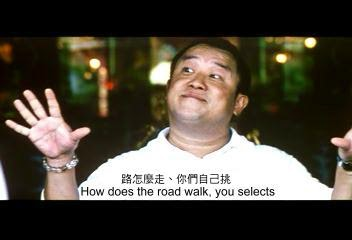

% 王福强：人不为己天诛地灭
% 王福强
% 2018-12-17

不好意思，我用这个标题其实是在钓鱼(Phishing)， 因为我要说的不是大多数人直觉里的那个意思...

人不为己天诛地灭， 不是让你自私自利， 利欲熏心，为了一己之私而无所不用其极。 人不为己天诛地灭其实更应该读做“人不为(wéi)己天诛地灭”， 人要做好你自己， 否则才会让天诛让地灭呀！

为(wéi)己， 是要你先做好自己啦！^[为己，有几个不同层次的理解， 我们回头有机会再聊吧！]

其实，你认为这个`为`字读四声(wèi)我也没有什么意见的， 中国话本来就是这样，同样一句话， 不同的人有不同的理解， 所以我也说， 书，其实就是一面镜子， 同样一本书，不同的人读出来的东西都是不一样的， 什么光怪陆离都有。

社会上的例子和人我就不说了，得罪人，只是各位看官路怎么走，自己看着办咯~

