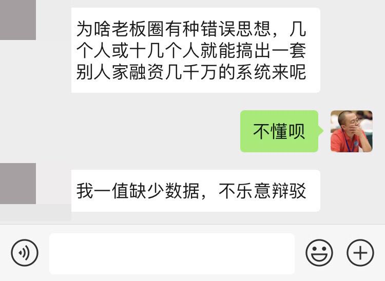

% 为啥CTO的委屈CEO不懂
% 王福强
% 2019-07-17

昨天阿久突然微信上问我二维火团队有多少人， 我觉得很突兀， 细聊才了解他啥意图，因为他现在要做的行业也是偏餐饮，所以会去对标二维火，而他问多少人的最终意图，其实是想验证一下自己的想法：

我说CEO“不懂呗”，不是贬低各位CEO们，而是说， CEO关注的核心不是这些，所以，他们对于自己不关心的事情当然也就不懂咯， 在不懂的方面，他只要做好“用人做事”或者“做事用人”就好了。如果CEO什么都懂， 他岂不是要在职场上跟各领域的专业人才竞争了吗？

但是， 我们也不得不说，CEO跟CEO也是不一样的， 对于大部分不懂技术的CEO来说， CTO的委屈就得学会向其诉说，我觉得这一点@大象在房地产某集团做CTO的时候做的挺好的：当房地产出身的老板问为啥要招这么多人，@大象就场景带入，你不是做房地产出身嘛， 做房地产你总得有包工头，施工队，泥瓦匠， 装修设计师，物业，blablala，技术团队也得有设计师，架构师， 研发，测试，运维这些吧？ 你看，**沟通方式很重要**， 见人说人话，见鬼说鬼话， 真不是贬义词儿 ；）

还有一类CEO财大气粗的， 甩手就是几个亿，你做CTO，给我拉个团队搞个云集出来， 2年赶英超美，这种CEO怎么说呢？ 有底气，也砸得起钱，就是格局上差点儿，之前可能投资做得挺好，但真要自己跳到组织里做经营，在组织和业务运营层面的短板就暴露出来了， 所以，他需要有CTO， CXO等人来补齐，但是， 可能是过去看balance sheet看多了吧， 觉得任何一家成功的公司都是某个时点上的数字和投入， 却忽略了组织演化的中间过程其实带有很大的不确定性和运气成分在里面，所以， 要砸几个亿做出一个云集出来也就不难理解了。 但是， 钱是一方面， **认知+执行也很重要**。

我们说CTO跟CTO也是不一样的， 小公司的CTO那叫高级研发工程师， 成长型公司的CTO叫研发经理， 大公司的CTO才要人事组织一把抓，再大就是使命愿景价值观了。

CEO其实也是一个道理， CEO跟CEO也是不一样的，也是跟其企业的所在阶段有关的。
小公司的CEO就是团队里面老子最牛逼，所以要打样儿带头干， 成长型的公司则要开始业务和组织的人事排布和目标管理， 大型公司则抓规范化、体系化和文化环境的营造以求稳，之后再求创新和突破。

所以CEO也是分段位的，CEO也是普通人，不要认为所有的CEO都那么神， 很多时候， 没成长到某个阶段他其实就是不知道也不那么容易接受高一层级的理念和做事方式，只有经历了磨难和煎熬，可能才会意识到别人曾经说的话太对了， 但是不切身经历一下，自己其实也绝对不会认同的。

在成长的路上， 我们都是三季人，只不过，智者不说，谁也意识不到自己到底是不是那个三季人，从这个角度来讲， **胸怀若谷地持续成长更是重要**, Ego is not your amigo。 

总得来说， CEO不懂CTO的委屈很正常，因为CTO也不懂CEO的委屈， 当你要扩团队，要给团队升职加薪，要创造团队影响力和品牌影响力的时候，你有懂CEO的委屈吗？ (◐‿◑)

