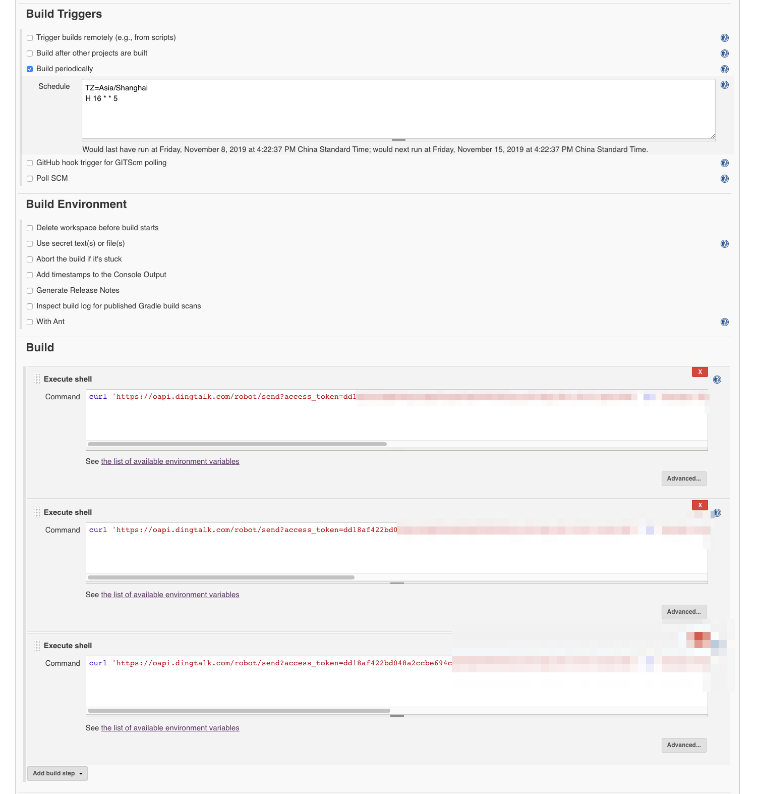
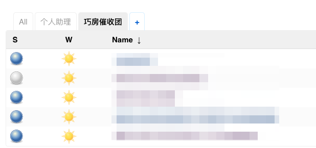
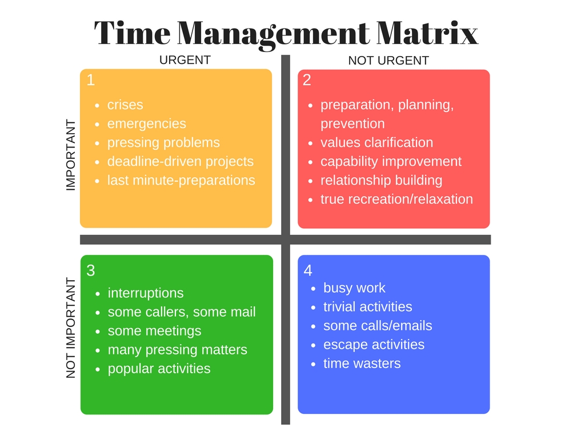

% 我是如何用机器人做催收的
% 王福强
% 2019-11-14

其实标题原来想叫“技术管理之日常催收 - 基于Jenkins的重要不紧急事项的定时提醒与敦促”，whatever, 故事的背景是这样的...

新接手团队， 杂事颇多， 团队更是上下习惯于胡子眉毛一把抓，没有抓大放小的意识，就是什么都想要，一切向业务需求看齐，这当然没有错，但作为一个技术团队，还是要有些追求的，否则，就陷入了bug hell而不能自拔，急着开发，急着上线，急着修bug，急着开发下一批需求， 急着开发...

很多重要但不紧急的事情往往就无人关注，大家都陷入Event Driven，完全无人关注全局性和中长远价值的事情， 比如团队成长， 比如技术基础设施的沉淀，比如关键数字资产的保全， 诸如此类， 短期看来或许没有价值，但要走的长远，却又是明眼上看不到、实际上却保证后劲的蓄电池。

于是，像我这样傻逼的领导，在明确主战略方向之后， 日常就开始抓那些零散的重要不紧急的事情啦， 不抓不知道，一抓一千条（TODO ITEM）， mmp，靠我天天念叨我也不一定关键时刻想的起来啊，于是，我就得外包，把这些重要不紧急事情的“控进度”交给了机器和机器人（BOT）， 我是这样想的：

1. 有个助理可以定期提醒我有这些或者那些重要不紧急的事情需要关注和跟进；
2. 这个助理更可以定期push这些重要不紧急的事情给相关负责人，相关负责人可以选择继续让我push或者抓紧时间想想办法把事情给做了；
3. push消息到群体面前，这样大家可以一起做团队监督；

正好我要push的负责人都在一个钉钉群里，所以，我就选择了钉钉的bot来做我的傻逼助理（其实一点儿不智能），在为群加了Custom的bot之后（小乔同学）， 剩下的就是让bot小乔定时提醒啦， 在mini PC上run一个jenkins， 然后设置一个job执行shell，比如每周五16点以后，发送提醒：

```
curl 'https://oapi.dingtalk.com/robot/send?access_token=dd18af422bd048a2ccbe694ce694bf9995902a1a3910ea128113xxxxxxxxxxx' -H 'Content-Type: application/json' -d '{"msgtype": "text", "text": {"content": "@树袋熊， 那个啥事儿搞完了没呀？又一周过去啦..."}, "at": {"isAtAll": true}}'
```



另外， 除了钉钉群， 还同时构建了基于邮件和邮件列表以及Telegram的push信道， anyway，总之就是多信道打击，😯，说漏嘴了，多信道触达，保证信息的触达率达到理想的效果 ；）



啥？ 你还问我为啥要搞这个？  咱其实是有理论依据的， **时间管理四象限法**听说过不？ 我相信应该都听说过的：

1. 重要紧急
2. 重要不紧急
3. 紧急不重要
4. 不重要不紧急



对于重要紧急的事儿怎么做？ 马上干啊，丫的都火烧火燎了， 你就是救火的；

对于重要不紧急的事儿咋办？ 规划好将来某个时间做， 排期起码有个盼头儿，是不是？

紧急不重要的事儿， 讲清楚，交给其他人去做， 也给小朋友们试错成长的机会嘛~

不重要不紧急的事儿， 嗯， “哈，好的，没问题，那都不是事儿”（滚一边去）

此中有个关系各位看官要搞清楚，如果重要不紧急的事儿你一直排期，一直规划，一直tnd不去做，那么，后面一定有很多重要紧急的事儿火烧火燎地来烧你屁股，你就天天救火吧， 哼哼~

所以， 为了避免天天救火，天天疲于奔命， 我只能采取这种下策了，毕竟，老子时间有限，一天就24个小时，还得陪老婆，看书学习上进， 开会打豆豆， 能够外包的一定要外包呀， 当然， 为了保证效果，除了Jenkins的定时推送， 我自己当然也有一个TODO LIST啦， VS Code编辑的markdown， 配合Markdown Checkbox， 不要太爽！

最后， 敦促次数多了如果还是没有进展， 那也就只能直接找上门去了那啥啦~


