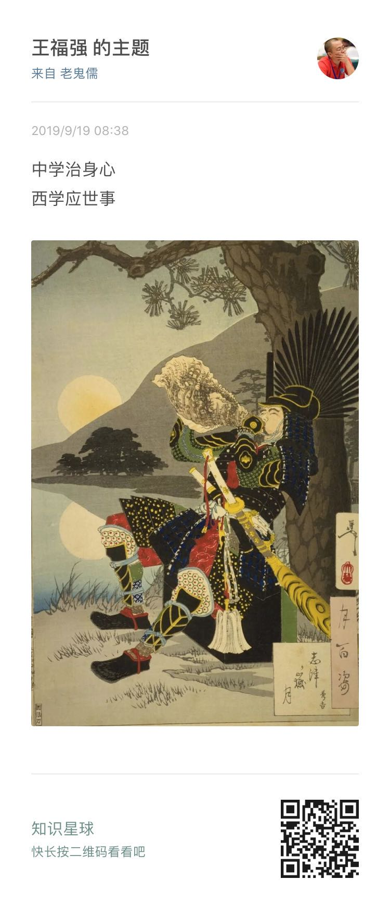
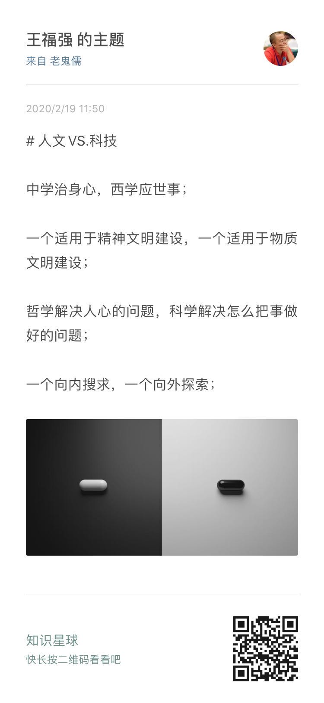

% 谈古今论中西，问题是你谈论对了吗？
% 王福强
% 2020-02-19

我对于中西医的口水战实在是不感兴趣 ^[虽然在《深度思考揭秘》一书中也多少提了些自己的观点]
， 因为从来是各自认知各自喷，同样的词语，在'上中下三九流'那里也是理解地千差万别，所以，避免自寻烦恼的最好办法就是只找那些跟你同路的人去探讨和辩识，这不，今天‘**得心研习社**’的内部讨论我觉得就挺好，所以就分享下， 各位看官觉得有用就拿去，觉得是放屁那就忽略好了...

我经常说我前半辈子是被西方的东西给毁了，其实是半开玩笑的，**文化其实没有好坏之分，只看其跟当前环境适合不适合**， 很多时候，我们借西学去贬低国学，其实是泛泛地比，我觉得更多是在用西方的科技与东方的人文在比，但其实这种比较是没有意义的， 这不， 20年前就有明白人说的很清楚了...

[没这么一说儿啊~](video/east_and_west.mp4)

我不知道别人是怎么去格物致知的，反正我的思维框架里面，从来是将人文与科技分开：

1. 人文是帮助我们妥善安置自己的灵魂的，是向内求的东西； 但科技则往往是为我所用向外探索这个世界和各种事物的思想、思维、理论、技术等思想工具或者实体工具；
2. 国学里面的东西更多是偏人文，国人大部分人对西学的认同更多是偏科技；
3. 人文更多适用于精神文明建设， 科技则多适用于物质文明的建设；

所以，我很认同这句话： "**中学治身心，西学应世事**"

我不会非黑即白、非此即彼的去用二分法，即使要用，那也是格物致知早期为了拆解搞明白才去分，之后一定是合，**只有融合，才是大道**：

你问我到底选哪个，我当然是能都选就都选咯， 这又不是现实世界里开拓成本那么高，在思维世界里，虽然慢思考也得付出能量，但较之现实世界的改造，那就太Easy了，所以， 思想的世界里，鱼和熊掌我都要！

