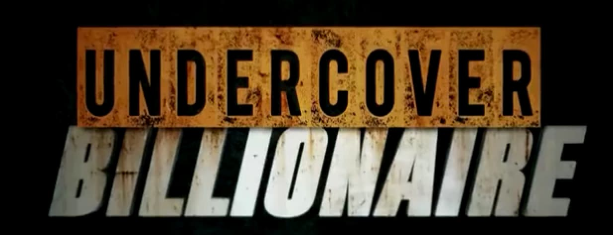
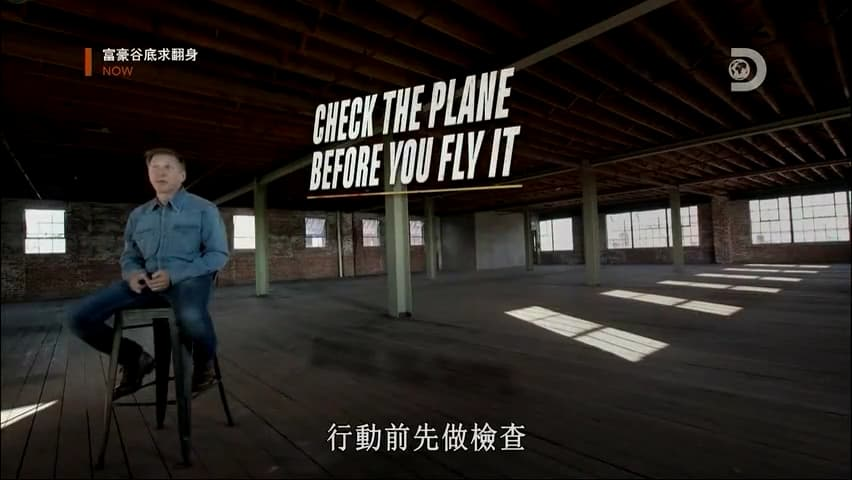
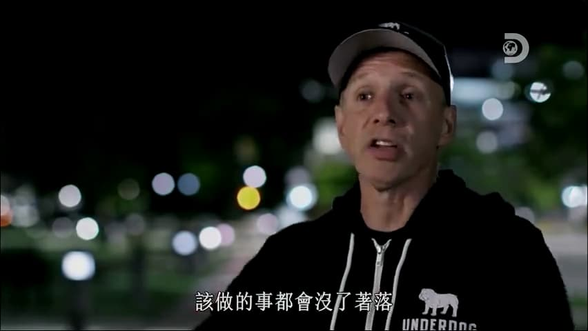
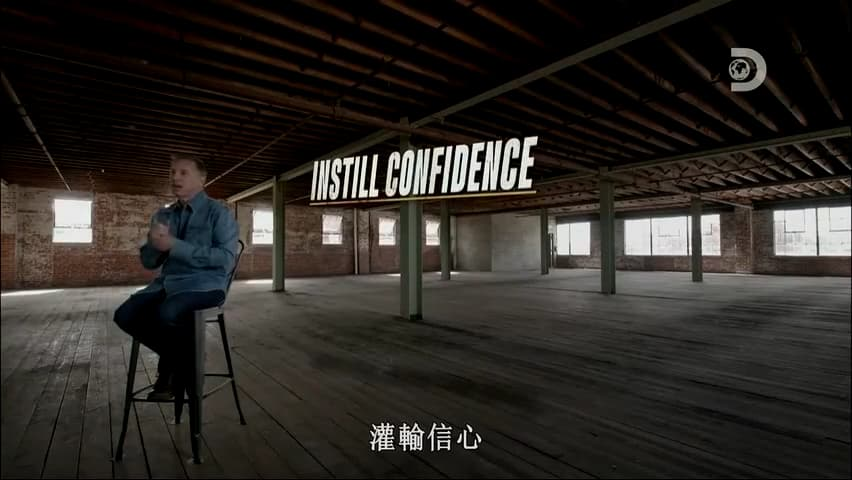
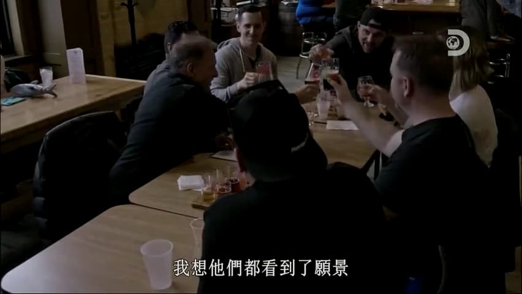
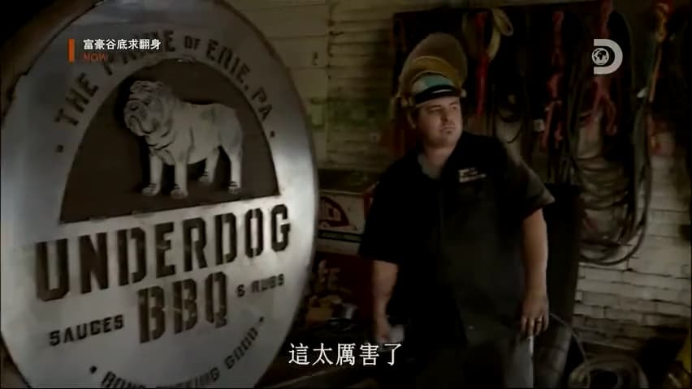

% Undercover Billionaire, Another Donald J. Trump's Apprentice Show?
% 王福强
% 2020-03-25

说实话， 这个纪录片我是纠结了很长时间才决定整个看一下， 原因就在于，别人给出了Brief， 那也是别人的理解， 看起来也只是一片好似成功学的文章，但一个事情，还是要自己感受过之后才会有自己的收获，so the following is my thoughts after watching.

# 关于商业(About The Business)

## 不确定性之下的探索

很多人或许商业PR稿看多了， 觉得那么多成功的企业，都是一开始就知道做什么，然后一帆风顺的走到今天的成功，但实际上，这只是马后炮。

在创业的路上，很多时候就连创始人自己可能也没有想清楚或者发现很好的商业机会，自己淌过，或许对这一点更会心有戚戚焉。

## Needs VS. Supply

经济学有一个经典笑话， 大家或许都听说过，那就是就连鹦鹉都可以是经济学家，只要它了解了供求关系。

所以， 老生常谈的道理看看就好， 干过，或许才能有答案。

我也看到很多国内创业4，5年的企业家，干过了，才深刻理解这句话，但没干过，光知道这句话也没有用，听听就好，还是看你应用的怎么样，干的时候有没有这么干。

是否适合所有人？ I don't know，或许有些人的特质就是不会这么干，但也可能干成了，只是前期消耗肯定比先找需求的做法多得多。

## 先求生存再求发展(Survival First, Dream Second)

Glenn发现，只有先安顿下来，才会开始思考创业的主要目标，当他为了生存而疲于奔命的时候，创业这事儿是不可能的。

对于任何人，任何企业都是如此， 先要有生存下来的底线，然后才有资格谈梦想与事业成功。

## 重视现金流(Cashflow Matters)

现金流怎么强调都不为过， 尤其是经历了这次疫情的洗礼，相信各企业负责人会对这一点儿的感受更加深入骨髓。

过去你会年度、半年度、季度、月度的去盘你的企业现金流， 相信现在很有可能会每周、每天的去看现金流，cool，at least this will keep you alive.

# 关于运营与执行(About The Operation)

## 彩排(dry run)

飞行员起飞之前都要做起飞前的检查（《清单革命》这本书也对飞行员checklist的重要性给予了极大的赞誉），在日常的商业和企业运营中， 任何项目要成功，最好也是提前进行彩排，彩排是提高成功概率的最佳实践，一定要记得用！

## 目标与执行(Result First & Work Smart)

领队的人和执行的人，在目标的认知和行为模式上有很大的差别：

- 领队的人要权衡目标和预算，所以会通盘考虑做事过程中哪些是重要的，哪些可以适当降低优先级；
- 执行的人（或者说专业的人），很多时候对目标的完美给予更多重视，但对预算和工期往往不重视甚至于很是排斥；

当然，如果要对目标负责，就得要求领队的人做好沟通和引导，为团队成员提供清晰的目标和上下文说明，然后团队成员才能work smart， 否则即使是smart的人，也没法work smart。

# 关于人才与组织(About People and Orgnization)

## 人才致胜

没有人会排斥说专业人才不重要，任何成功的企业家都知道专业人才的重要性，更知道“专业的人做专业的事儿”的道理。

但是， 好的领导者也很清楚， 人才有些时候不是培养出来的，而是选拔出来的。

## 情绪与压力(Everyone is under stress)

克里斯汀其实是一个很好的leader人选，作为后厨的owner，她是很match的，有能力组织团队一起合作拿结果，有经验，有能力，也做了很多宝贵的工作，但很可惜的就是，她的情绪在与Stenn的合作方面很成问题（不得不承认，我其实跟她很像），最终不得不一拍两散。

其实这不能说是任何一方的问题，但在当时的情况下， 没有人会放下情绪去解决问题，当时的核心问题一定是拿下销售目标，而克里斯汀对自己负责区域内的工作预估和准备方面明显成了目标达成的致命缺陷。

如果事后理性来分析， Glenn作为总的负责人，也是有做的不到位的地方， 他没有明确给出上下文和工作职责与目标，只强调责任和结果（当然， 他的理念如果就是`人才是选拔出来的`，那么他这样做也是正常的）。

克里斯汀嘛，如果按照一个合格的后厨负责人来要求，确实要对`备货以及整个食材的烹饪过程进行合理调度和把控`负责，因为这在她的核心职责范围。

但是，在当时的情况下，大家都顶着很大的压力，所以就出现了中间情绪的碰撞和不理性行为。

不得不说，能找到合适的人而且还能长期愉快地合作，真的不容易。

What A Pity.

## What Makes A Leader 

我在我的《极简管理课》一书中也老早说过，作为领导者，很多时候你是要给大家希望的那个人，即使你背后有很多的心酸和痛苦，依然要笑着面对大家。

没办法，不是所有人都有成为领导者的心力和能力，做为一名领导者，你就是要比别人忍受更多的痛苦。

除了忍受比别人更多的痛苦，你还得想方设法把事情做好，把自己负责的目标达成，而不管这中间需要协调什么人，寻找什么资源，anything，everything，你得自己去跟进落实，对目标负责，所以，为了达成目标， 不管过程中需要什么，这都是你的责任。

不仅如此，你还得适时地给大家打气，给大家鼓励，给大家信心，给大家希望，谁叫你是Leader呢？

你是没有理由给自己找借口的！

还有就是， 在创业的过程中永远不会一帆风顺，永远有意想不到的事情发生，俗称Shit happens，这个时候，你作为领导者，首先自己不能消沉，再苦再难也得抖索精神，重新爬起来。

偶尔自己猫着疗伤也是必须的，只是低谷的时候，别去打扰别人就好。

最好的状态就是，别让坏事牵着自己的情绪走。

## 共情与愿景

阿里土话讲， “相信相信的力量”， 但永远是说起来容易做到的难，你看看过程中这些人就知道了，当你背着房贷车贷和家庭的时候， 让你相信创始人的一句愿景和许诺而不拿工资，你把自己代入一下，扪心自问一下，你真的能做到吗？

但是， 一旦你相信并全力以赴， 结果是让人振奋而热泪盈眶的。我很喜欢这个Underdog的Smoker， 当这哥们把Smoker拉到现场的时候，我都不禁心情澎湃。

企业的估值其实是一个未来的东西， 企业的愿景也是，前者只看投资人认不认，后者则看合伙人或者员工认不认。

## Luck 

不是所有的老板都是马云，都是Glenn Stearns， 有些人就是幸运，芸芸众生里，好的老板永远是极少数，幸运的人也是。

最重要的是，你要什么，你能抓住什么，至于Luck， 那只能做加分项了，只看老天爷给不给你，难道不给你就不活了？  每个人还是会有自己的人生轨迹， 只是**别对Luck抱以全部的希望**。

# 后话

这个纪录片难免让我想起十几二十年前川建国（Donald J. Trump）同志当总统之前搞的《The Apprentice》， 同样的美国梦，不一样的创业故事。

故事的真假和意图其实并不重要，重要的是，你从中读到了什么...

