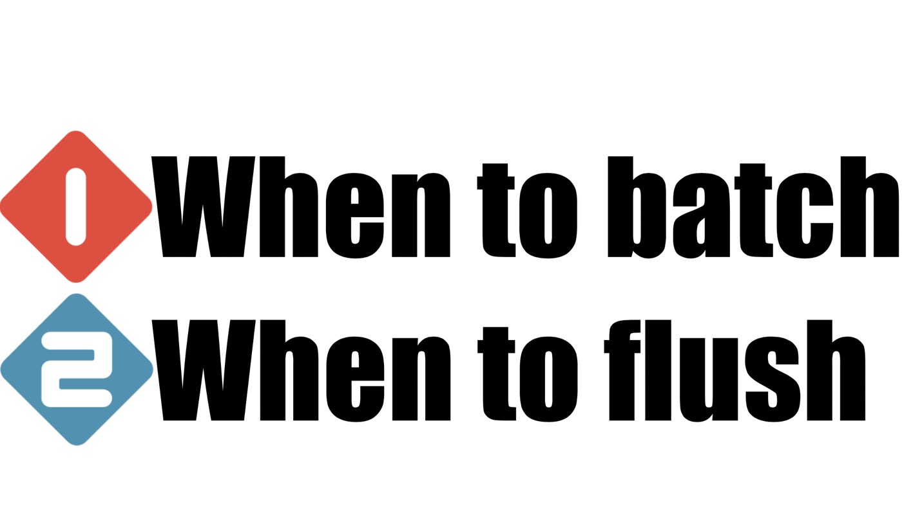
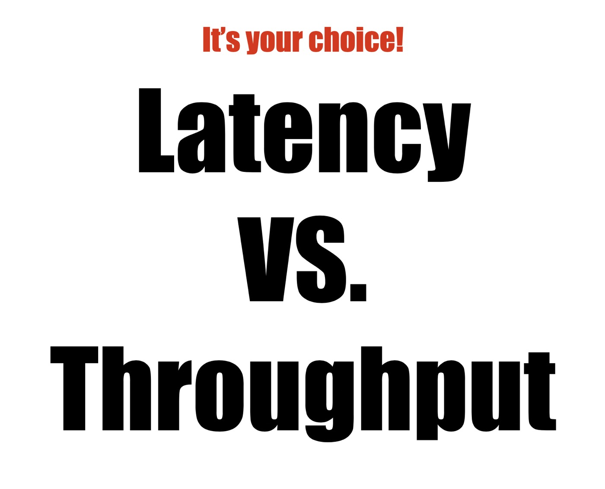
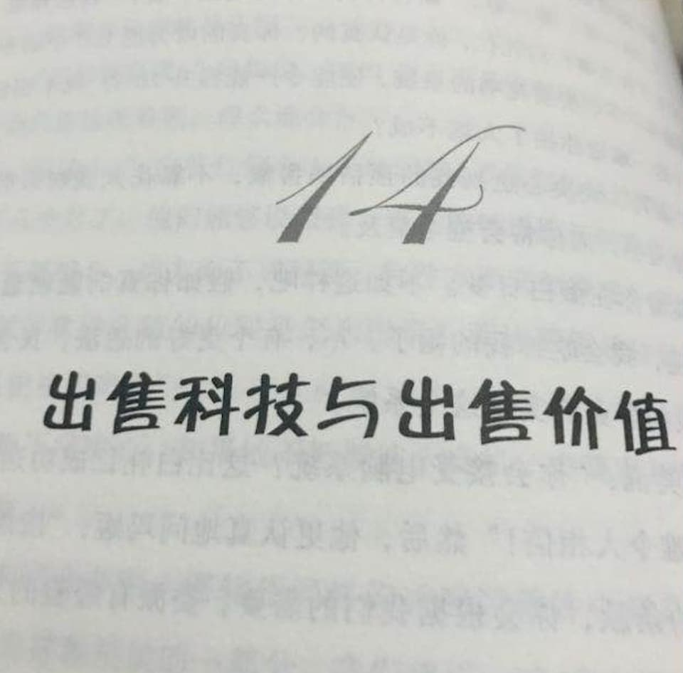
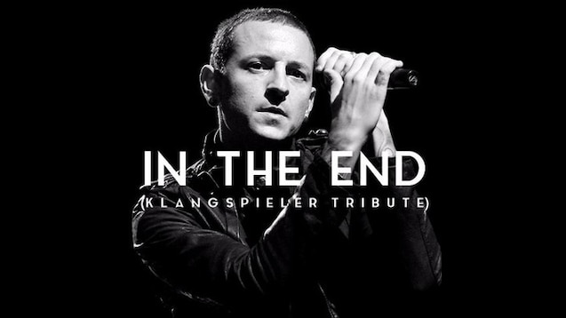

% 软件与科技产业如何实现价值最大化？
% 王福强
% 2020-04-06

幸得前阿里老朋友推荐，这阵子一直猫在老家读高德拉特（Goldratt）教授的一系列企业管理相关的书籍， 纵使过去了十几二十年，发现其中很多东西依然有效， 而且这些东西在我做技术和架构工作期间的经历与这几年做顾问过程中的经历和感受都是想通的。

比如这几天刚读完的《Necessary But Not Sufficient》这本，讲得其实就是企业信息化或者ERP等软件系统如何真正的为企业创造价值， 酌情摘录几点与大家分享...

# feedback in steps
书里面的场景还是工业时代偏工厂和生产领域的事情， 但这并不妨害我们理解书中的思想，比如批量生产与交付的思路，在我们日常的互联网系统设计与实施过程中已经十分常见了。

什么叫`feedback in steps`？ 这是我用自己的语言阐述地一种思路， 其实就是不要什么都准备好了才干，可以分阶段分步骤的先干起来，也从而可以更加及时地得到过程中的反馈并寻求调整与改进。 本质上，这是在吞吐量(Thruput)和及时性(Latency)之间做出权衡。 

我在2013年阿里技术嘉年华上做的题为《架构模式与实践漫谈》的主题分享 ^[阿里内网技术大学应该是有这个分享的视频，外网能不能找到我就不知道了，感兴趣的同学可以自己去找下]中也曾经提到这种架构设计思路： 

本质上就是以一种**流量型思维**来构建整体的**可持续输出最终结果**的交付链路。

# selling tech or selling values?

一家公司创业伊始， 尤其是软件公司或者技术公司， 肯定是以自身的优势作为主业，那么自然在销售的时候更多还是强调自身的技术实力和产品的技术含金量更多一些， 但是，一旦公司发展起来，像书中的“霸软”公司那样， 营收和市场都触碰到了前期的天花板， 公司下一步又要怎么走的时候，就会有了这个to be or not to be的战略转折点的思考了： *我们到底应该出售科技还是出售价值*？

在今天这个面向2B产业创业的浪潮中，这个问题其实同样值得这个行业的创业者思考的。

其实出售价值**肯定是对的**，出售价值换句话说就是面向客户需求（客户第一）， 客户不是要买你的技术或者软件系统，客户其实要用这些东西来解决自身的某类问题或者限制，如果你能使用你的科技或者软件系统帮我搞定所有相关问题， 我才懒得买你的科技或者软件系统呢， 这就好比说，你拿着自己的电钻帮我把墙上的孔钻好， 我又何必兴师动众地去买个电钻呢？ 所以书中霸软公司的明星客户才会给霸软一个难以拒绝的offer： 每年给你一个亿，剩下的你全搞定！

但是，很多时候牵扯到各方利益， **现实**就没有那么理想化了...

# think stack VS. think platform 

霸软的明星客户有个VP有点儿膨胀，他想整合整个供应链， 让整条供应链都使用同一套管理理念，同一套ERP系统，同一套...

我为什么说他膨胀呢？ 其实他这种想法我叫做think stack， 怎么讲？ 就是垂直整合，这与今天很多公司在阿里的示范效应下搞平台化(think platform)是两个方向。think stack的玩法到底能不能成呢？ 起码我认为很难，因为这不是什么供应链的问题，更多是价值链和利益链的问题， 这两条链才是决定能不能把整个产业链条连接起来的关键， 显然， 各个产业这么些年，完全没有朝着这个方向发展，因为利益分配机制决定的，没办法 ；）

不过， 你要是在企业或者公司里面规划东西，还是要以think stack的思路来思考的，尤其是架构师。在企业内部这个粒度上或者更小粒度上，think platform更多是一种将单一场景做深的思路，但如果要系统化地为企业整体利益考虑， think stack才是打通各个经脉的关键。

比如，我在上一家公司就一直跟技术团队强调， 为了保障整体的系统稳定性和响应及时性， 我们需要构建AlertStack， 而不是星星点点的监控告警，在还远没有能力构建智能聚合告警体系或者AIOps体系之前，think stack的思路可以帮助我们事半功倍。

# it's all about people

最后， 我想说说组织和文化的重要性， 在这几年的咨询与做顾问的过程中，也是感受最深的地方。

很多企业，核心问题根本不是什么软件、系统、科技等先进不先进， 而是做事的人**用心**不用心，归结到根儿上，就是这家企业的组织和文化决定这家企业今天和明天是什么一个样子。

今天我朋友圈转发了一篇ElasticSearch相关的安全通告（"15000台ElasticSearch服务器遭到攻击"），有阿里老技术人感叹， “*没想明白为啥直接放在公网， 这要多么无知才行啊*”， 是啊， 或许真的是无知，也或许不是。但这些年看过各种各样的企业之后，我看到这种现象其实一点儿都不惊奇，因为阿里的技术人（尤其是老技术人）做事兢兢业业一丝不苟， 可不意味着所有企业里的技术人都这样，吊儿郎当儿多了去了， 就算是再好的工具交到他们手里， 也不见得能够发挥出这些工具应该发挥出来的效果。

晚上在youtube上看到以色列建国相关的纪录片，尼玛， 埃及纵然从苏联搞来了n多高科技装备，还请来了n多军事顾问， 最终打仗的时候却是， 基层士兵连最基本的武器操作都不会（因为等级制度，军事顾问只教军官，军官跟基层又脱节自然夹带私货不给）， 这多少人来都白给啊， 你说这样的组织能打胜仗？

我们都知道金刚石和石墨都是碳元素的同素异构体，但他们的特性却是天壤之别，原因就在于他们的结构不一样， 一家企业的组织就是这家企业的的结构，虽然公司这种经济实体已经有几百年的历史了，但市场上的公司在组织结构上还是会有差别（当然，大部分差别不大）。

组织是其一， 最致命的是文化和价值观这种软性的东西， 就像是一家企业的精气神儿， 这才是区分公司与公司差别的关键因素。软件与科技只是手段和工具， 组织与文化才是致胜的关键！

员工既可以是成本也可以是资产，in the end, it's all up to you！

