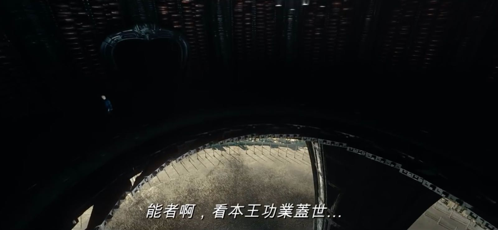
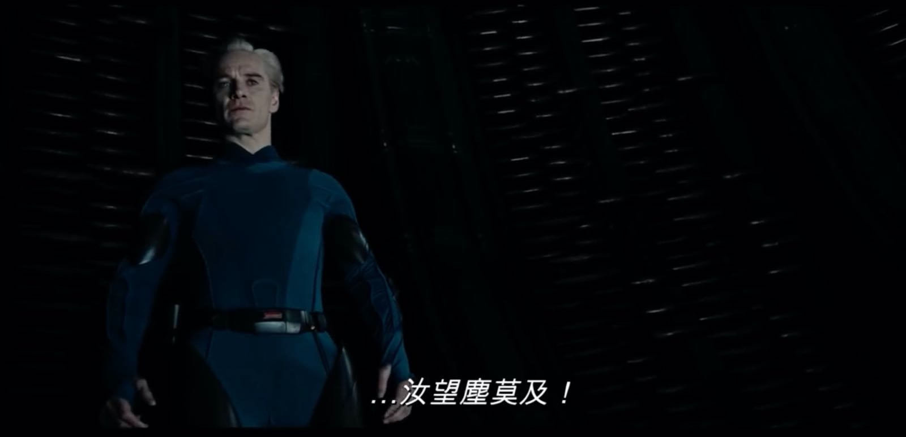

% 造物主情怀
% 王福强
% 2020-04-07

连续几天的输入，今天看《West World》第三季第四集的时候， 突然意识到所有这些作品中都有一种浓浓的造物主情怀...

首先《异形》前传-普罗米修斯，完全是人类或者说Peter Weyland老先生的造物主探索之旅，只可惜找到是找到了， 却死于自己的一厢情愿，因为造物主好像对他们造出来的生物有一种深深地厌恶感， “丫的，太不听话了， 我要灭了你...”

所有的造物主都有控制欲，他们希望自己造的“东西”听话； 

而所有被造出来的东西，好像都有很强的好奇心和探索欲（其实是人类自己，因为所有作品都是人写的，哈哈哈），甚至于反抗造物主的控制， 普罗米修斯里的David算一个，West World里的Dolores算一个，最牛逼的属生化人David，反杀两代，不但反抗了，还tnd功业盖世，反过来把造物主玩弄于鼓掌：

不过， 造物主情怀看看东西方的神话故事就知道老早就有了， 我们有女娲造人， 西方有管理伊甸园的上帝，只是这个世界没有log日志，所以大家只能继续猜了。

好了, 爱恨情仇先撇一边，其实我更喜欢的是科幻小说《致命接触》里提到的能量理论，因为这与我对现实的观察很匹配。在程序中模拟消耗的能量有限， 但是， 把模拟即使放到小范围的现实中去运行，也得消耗更多的能量（比如west world小岛）， 更不要说扩大范围到整个星球或者星系了。从这个角度来说， 《致命接触》虽然是科幻小说，但我觉得是make sense的，只不过在那种情况下，也确实会被认为是个疯子才会那么想吧，哈

**It's all about power and energy**.

