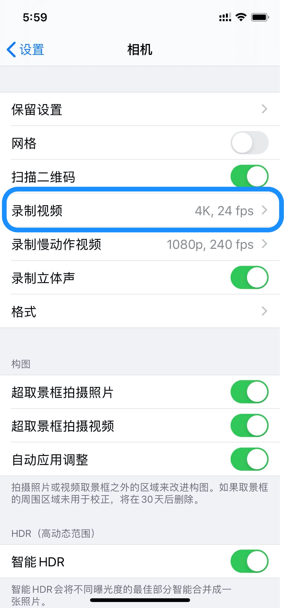

% 使用ffmpeg压缩视频复盘
% 王福强
% 2020-04-23

LD使用手机录了一个直播健身操课程的视频，想要放到她十多年前的一个上网本上播放，方便她不在老家的时候丈母娘可以照着跳操锻炼身体，原本一个很简单的诉求，没想到过程还挺曲折的， 所以，有必要记录并分享出来，以免其他人也有类似的诉求需要满足。

# 简单过程复盘

首先， 上网本你们听说过吗？ 听说过的估计都是大叔级别了， 这也意味着这上网本的硬件配置在今天看来其实已经很低了， 低到什么程度呢？ 上眼瞧...


那么，录制和传输视频的源端设备iphone 11 pro是什么个配置呢？



所以，当我把7.9G的4K原视频拷贝到上网本之后， 卡卡卡到爆啊...

这个时候，就只能祭出神器ffmpeg啦， 我压： 

`ffmpeg -i OGLF3661.MP4 -vcodec h264 -acodec aac output.mp4`

只从7.9G压缩到1.9G， 拷贝过去，还是卡卡卡...

我再压： 

`ffmpeg -i OGLF3661Compressed.mp4 -b:v 800k output.mp4` 

还是卡， 我又压(`ffmpeg -i output.mp4 -c:v libx265 -crf 28 o2.mp4`)，还是卡， nnd, 这样不行啊， 好好研究下视频相关的基础理论吧！

什么bit rate啊， FPS啊， CRF啊，google了一大通， 嗯，终于心里有数了...

不用通过bit rate或者crf压缩了，直接对标上网本的分辨率，因为我发现原始视频的分辨率远比上网本的(1024*800)高得多的多：

```
$ ffmpeg -i 视频文件.mp4   // 查看视频文件相关信息，这里是已经压缩过几次的文件
...
Stream #0:0(und): Video: h264 (High) (avc1 / 0x31637661), yuvj420p(pc), 886x1920, 795 kb/s, 60 fps, 60 tbr, 15360 tbn, 120 tbc (default) 
...

$ ffmpeg -i o2.mp4 -vf "scale=-2:960" o3.mp4  // 在压缩了好几遍，1G左右文件的基础上分辨率减半
```

哗啦， 终于可以音频和视频都对上， 还能流畅播放了，最终压缩后的文件大小是470.6M！  


# 遇到的问题

## 设备接口不兼容的问题
我年前回到山东没有带转接头，所以，苹果电脑只有他娘的Type C接口， 而给上网本重装了windows xp之后， 发现网卡驱动可能有问题， 连接不上wifi，所以， 我初步打算使用Dukto做局域网传输的想法宣告失败， 还好LD她二哥在家还有台笔记本，我就开了共享，然后先从我的MBP通过wifi传输到那台笔记本，然后再用U盘拷贝到上网本， WTF！！！


## 分辨率像素数值的问题
开始按照分辨率压缩的时候，我用的是这种命令格式：

`ffmpeg -i o2.mp4 -vf "scale=443:960" o3.mp4`或者`ffmpeg -i o2.mp4 -vf "scale=iw/2:ih/2" o3.mp4`

都会抛出异常：

```
[libx264 @ 0x7fd37b81e400] width not divisible by 2 (443x960)
...
```

原来是ffmpeg对像素数值有要求（奇数反正是不行的）， 所以最后采用了这种方案：

`ffmpeg -i o2.mp4 -vf "scale=-2:960" o3.mp4`

但`-2`只能用在一个位置，不能宽和高都用。


## H.264和H.265兼容性问题
我下载、拷贝、安装了好几个视频播放器和解码包到上网本， 最后发现， H.265虽然是当下最推荐的编码方案， 但还是针对新的设备， 考虑到兼容性，还是H.264保险一些， 起码， 重装了window xp的老设备装了这么多备选方案，还是播放不了H.265的视频。


# 小结一下

1. 尽量使用crf做压缩，crf的取值ffmpeg默认是23，在压缩的场景下，自己选择23-51取值范围即可；
2. 视频处理是真耗啊， 我mbp 16核直接打满，怪不得人家专业的都直接上工作站呢；
3. 怪不得大家都不愿意维护和重构遗留系统， 兼容性问题太多了, 追新不是没有理由的...
4. 技术人的乐趣外人永远不懂，LD给这个事情的评语是，“你日薪都可以给你丈母娘买一台了，你却耗费了这么长时间...”，哈哈哈哈 
5. ffmpeg真乃神器， 开源免费还好用，我们程序员一直用它 ；）


