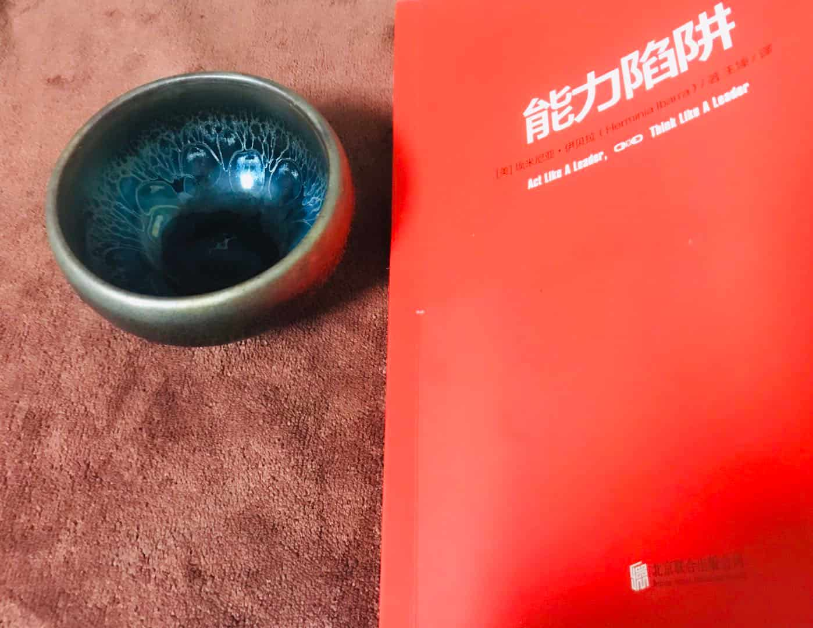
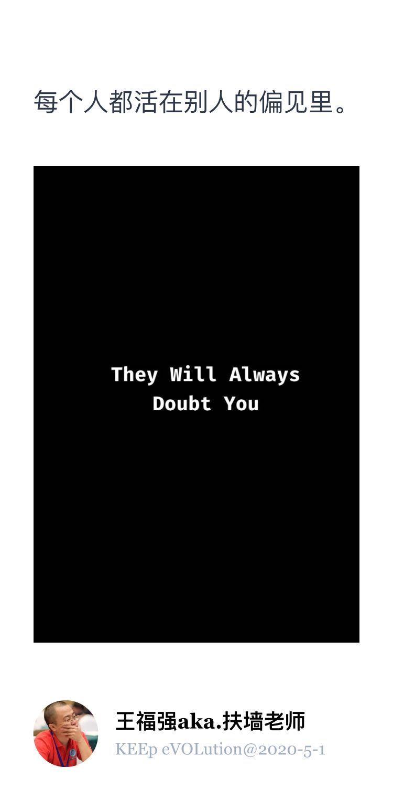

% 《能力陷阱》读书摘录
% 王福强
% 2020-05-02

读这本书是看到优维老王的朋友圈在晒这本，所以买来一看...

> 因为是摘录，所以就不要指望通篇有啥行文上的结构和条理性了吧，偏意识流，想到哪儿或者摘录到哪儿说哪儿了。

整本书其实在强调改变，强调人际关系网络的重要性，强调专业人才转管理的过程中能力模型的转变和思维模式的转变， 有些时候目标不可能想的那么清楚，不妨只是从接受新的观念、新事物、新行为开始， 或许之后回头就会发现自己已经完成了蜕变。 在迎接新我、新职位等过程中，可以先模仿偶像，再优化并内化为自己的能力。

多尝试朝更多不同的方向发展自己， 不用坚守所谓的自我，因为当你做成一件事情之后，你的标签也就新增了， 你有了新的自我，而且你的自我，其实是多面性的， Shape Shifter变色龙不一定就是贬义词，我们其实都有多面性，只是在不同的环境展现不同的自我而已。“每个人都有多面性，都有很多个**自己**”。

那些曾经对你有用的想法和工作习惯只有在经受住考验之后才可能一直适用， 否则它们就需要做出改变。 （能力陷阱Competency Trap即此）

> Niche Product书里翻译为小众产品，我觉得翻译成利基产品或者拳头产品更贴切些。

要扩展人脉，就要营销自己，而不是让自己成为他人营销的被动接收者， 要让自己抓住每一次可以发言的机会。另外就是，多参加陌生人组织的聚会， 或者自己组织聚会，让第一圈层带第二圈层的人进来。

对于专业人士来说，一个陷阱就是认为能力很重要，其实对于客户来说，他们更需要的是一段良好的**关系**， 这段关系能对他们的业务提供帮助。（有了关系， 什么解决方案啦，系统啦， 产品啦，都不是问题，他们只是对业务提供帮助的种种工具和手段）

[Lake Wobegon Effect](https://baike.baidu.com/item/%E4%B9%8C%E6%AF%94%E5%86%88%E6%B9%96%E6%95%88%E5%BA%94/1947546?fr=aladdin)挺有意思（沃贝贡湖效应），其实每个人都会高估自己或者说对自己都有一种积极的幻想， “自我观察的差距（Self-observer Gap）”，即我们如何看自己和他人如何看我们之间的差距， 其实差别还是挺大的。就像我们对他人的评价会有偏见一样，我们也会对自己持有偏见。

讲故事的能力很重要， 能够随着不同环境和时间变换故事的讲述， 适配自己的需求的能力，还是很值得重视的。

改变或者说转变其实挺难的， 在痛苦的时候，一个人的决心其实没办法支持自己完成改变， 另外就是 身边的人会认为你做不到或者坚持不下去， Musk最痛苦的时候那句话还依然历历在目： “They Will Always Doubt You”， 不管是有意还是无意的，这些压力都会持续的消耗你想要改变的决心，抵挡不住，你就只能被打回原形。

改变有变得更好的可能性，但改变不一定就会带来更好的结果。路怎么走，自己看着办咯， 只是， 现实生活中常常是，人们不会听下来思考或者问自己一些更重要的问题，而是让时光荏苒从指尖溜走。

为了一个可能性，你愿意付出心力和行动吗？ 可以变得更好，但是不确定能不能达成，你得在行动中摸索自己的答案，寻找未来的自己。

