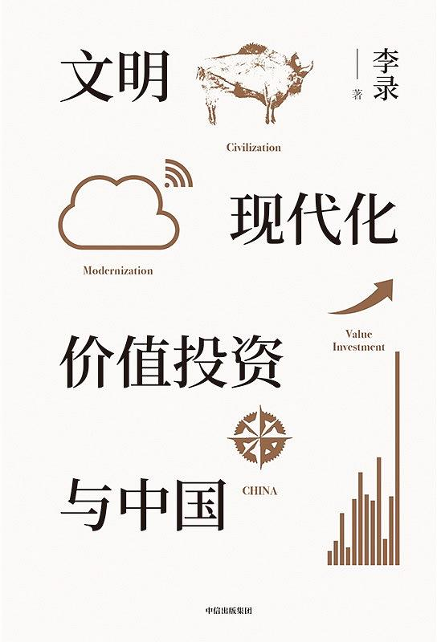

% CEO们都在读什么书
% 王福强
% 2020-06-05

现在不想写长篇大论了，推荐几本书吧， 都是朋友圈或者私下CEO一对一推荐的， 既不牵扯不该说的商业机密，也不牵扯对人的八卦，so here we go~

# 意愿经济

这本书是持续创业者（快10年了）钱总极力推荐给我看的，但这阵子实在跑外勤多些，还没来得及看， 钱总是很务实很正的一名创业者，他的推荐本身就是一种有力的背书， 其中有一条推荐理由是“里面有拼多多是怎么崛起的奥秘”， 嗯， 你看不看我不知道，我肯定得看 ^_-

😯，对了，据说这本是投资人圈里必看。

# 苏世民：我的经验与教训

这本书是好几周之前在朋友圈（dei，扶墙老师的朋友圈）看到的红书， 著名投资人兼企业家老李朋友圈晒的，苏世民是谁？ 黑石集团董事会主席兼CEO， 美国人，苏世民是他的中文名。

书适合谁读我就不知道了，你们自己看着办， 上海某大佬说这本书言过其实了，你们也可以做个参考 ；）

# 文明、现代化、价值投资与中国

也是著名投资人兼企业家老李朋友圈晒的，今天刚推荐的， 我了解了下，原来是跟“李录”这个人有关，但我今年看到了PR稿， 看到了作者出书， 所以，难免提不起兴趣看，但既然是大佬推荐，各位看官或许也有兴趣看看吧， 我主要现在更习惯撸起袖子，还没到激昂文字的时候 ；）

