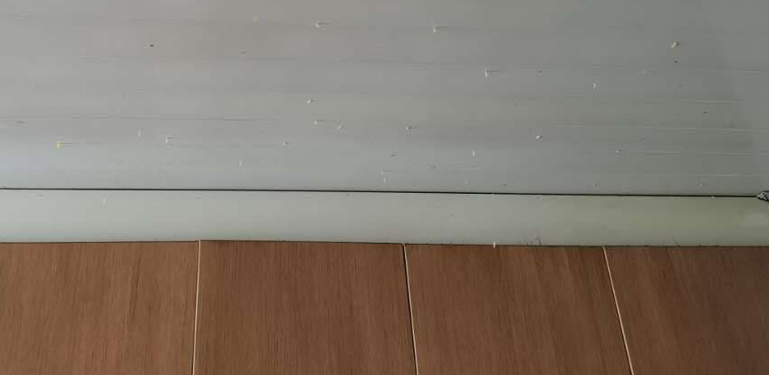

% 青虫的故事
% 王福强
% 2020-07-07

出差两天，家里出现了奇特的景象， 罗经理还特意给我留着现场，让我观赏一下：



或许是这两天上海的天气实在太潮了，也或许我不在镇不住它们，这些蠕虫一个个都跑出来撒欢儿了， 清理完了寻找根源，才发现是罗经理三哥去年从大东北给邮寄来的干豆角丝儿，上面还有没有孵化的虫卵， yeesh...

不管怎么样，总算清理完，但没到扔垃圾的时间，所以，暂时就把清理完的死的活的一起弄袋子里暂时放门口柜子上了， 罗经理要出门办事儿，我也得补觉，两天没睡好，昨天晚上还拉肚子跑了四五趟厕所，急需补充能量回血...（哦，对了，早上车停在小区还被人无端剐蹭了，yeesh，过几天真得找时间烧香去，感觉bad luck有点儿多，哈）

当罗经理回来跟我尖叫的时候， 我发现， 朦朦胧胧中担忧的事儿还是发生了， 因为我还记得**青虫的故事**， 这些小蠕虫或者青虫等软体动物，看着很弱逼，但它们其实很坚持，虽然爬得慢，但它们从不放弃， 所以，门口柜子上又爬出来一些，yeesh...

为了缓解罗经理的紧张情绪，我就开玩笑，“这不都正常嘛”，然后就被鄙视了，然后我就反思了，因为我知道**青虫的故事**，但罗经理不见得知道，各位看官估计也不一定知道，所以， 借着蠕虫事件，与大家分享**青虫的故事**， 我保存了很多年了，哈哈哈


```
(base) ➜  ~ sqlite3 $HOME/FuqiangWorks/notes.sqlite3 'select * from notes where content like "%青虫%"'
### 蝗虫与青虫

祖父用纸给我做过一条长龙。长龙腹腔的空隙仅仅只能容纳几只蝗虫，投放进去，它们都在里面死了，无一幸免！祖父说：“蝗虫性子太急躁，除了挣扎，它们没想过用嘴巴去咬破长龙，也不知道一直向前可以从另一端爬出来。因而，尽管它有铁钳般的嘴壳和锯齿一般的大腿，也无济于事。

当祖父把几只同样大小的青虫从龙头放进去，然后关上龙头，奇迹出现了：仅仅几分钟，小青虫们就一一地从龙尾爬了出来。

命运一直藏匿在我们的思想里。许多人走不出人生各个不同阶段或大或小的阴影，并非因为他们天生的个人条件比别人要差多远，而是因为他们没有思想要将阴影纸龙咬破，也没有耐心慢慢地找准一个方向，一步步地向前，直到眼前出现新的洞天。

人生中，经常有无数来自外部的打击，但这些打击究竟会对你产生怎样的影响，最终决定权在你手中。

面对问题，不能急燥，冷静思考很重要。

在遇到困难时，不要气馁，只要朝一个方向努力，一定可以成功。|storiette|2018-05-04 11:07:28
```

当然，这个故事的保存应该是早于2018年，我的notes数据库迁移了很多次，时间戳不代表created，故事有些成功学味道， 看看就好了，对于急躁的人来说，当然应该向青虫学习，但往往学也没鸟用，适当帮助刹车估计还行，毕竟，性格这东西，没有绝对的好坏，就算想改，也没那么容易。

Worms, They are **slow, but never stop**...


