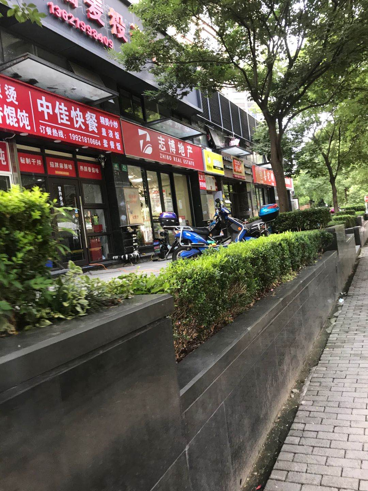

% 为什么一定要做大或者做强
% 王福强
% 2020-07-13

走在路上，看到街上的一个个店面，我就会有些莫名的“恐惧”：

这其实就是中国中小企业的缩影，如果只是安于现状，那就会沦落为这样的一个个小店铺， 没有特色， 仅靠少量的自然流量存活， 而只有连锁店，比如中原地产，比如链家，比如来一份， 才会形成流量的网络覆盖。

在国内， 其实工匠精神也好， 勤劳质朴也罢，你说它是优点，其实也是缺点，起码换个角度，坐在从业者的角度与坐在经营者的角度，两者要求的素质和优点是不一样的， 一方的优点，在另一方的眼里就会成为缺点。

其实所谓的工匠精神，本质上还是重复练习下的熟能生巧， 这种东西，只有市场需求确定且稳定的情况下，才有可持续的发展环境，在一个不确定的环境或者需求不明的情况下， 东西做得再好，而没有人买，这个生意模式也是不成立的，毕竟， 你得先赚钱吃饭，然后才有精力去精益求精， 精益求精从商业的角度来说，其实就是更多的成本投入，如果这些额外的成本投入换来的精益求精不能换来更高的收益或者更强的竞争力， 经营决策者其实是不会同意从业者去精益求精的，就跟我之前一篇文章里提到的那样， 专业人员和经营者眼里对“精益求精”的理解其实是不一样的，很典型的“一种表达、两种解释”。

随着国内和国际经济形势的持续放缓， 增量模式其实是有些越来越难了， 所以， 大家现在更多会去拼存量模式。 但在已有相对固定的蛋糕上搞分配， 人一多，势必就是个“红海”， 当然， 红海也不全是劣势， 在增量高增长的年代，红海或许是劣势战场， 但在存量时代， 红海却变成了优势，因为你可以很明确的知道，这片红海里的客户需求是确确实实存在的， 你只要发挥自己的优势，把自己的核心能力聚焦到核心产品， 通过把事情做得更好来取得相对更好的业绩就好了，不是有那么个故事嘛，“我只要跑得比你快就行了...”

还是跟我在[《深度思考揭秘》](https://afoo.me/books.html#%E6%B7%B1%E5%BA%A6%E6%80%9D%E8%80%83%E6%8F%AD%E7%A7%98) 里说的那样， 凡事最终都是要辩证地看， 时势一变，事物也就跟着变了， 守着一种准则不解决问题， 灵活应对，顺势而为才是明智之举啊！

