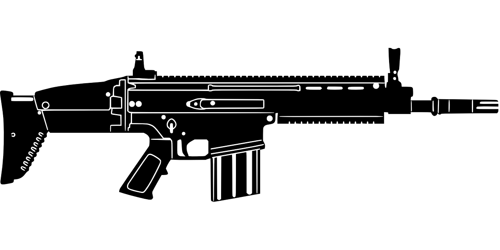
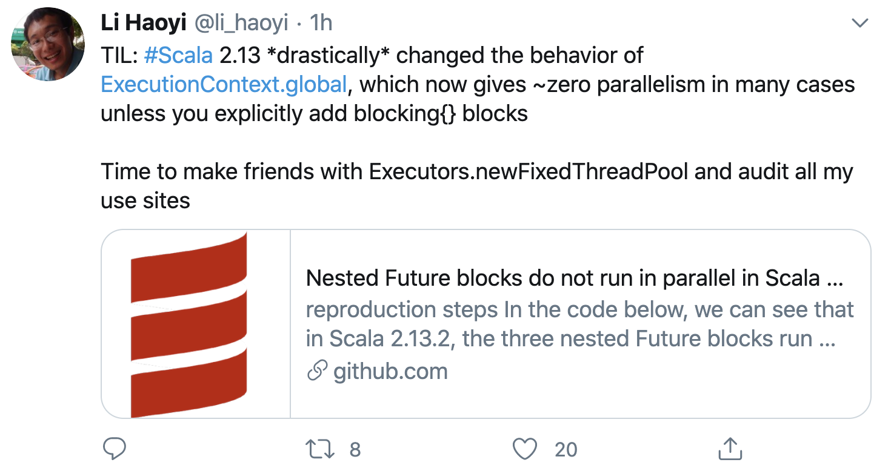

% Why I am called myself Scarja?
% 王福强
% 2020-07-21

> 别的不能说，只能聊聊技术与架构设计啦...

大家都知道， 我虽然不写生产代码很久了，但偶尔还是会用Scala（Lang）写写prototyping，但我不是典型的Scala老粉红，我更多用的是一种裁剪后的Scala，或者说走的是用Scala来写Java的曲风，所以，我一直说我用的是Scarja， 即带点儿伤疤(Scar)的Scala+Java。

我在老早之前就说过了，Scala的设计初衷和理念加上主流社区的一些工程实践， 其实，并不太适合大规模的上生产环境，你用它来写Endpoints型的应用或者服务是OK的，但如果要用它来写较为通用的Component或者说SDK Library，就没那么好玩了， 交叉编译，Scala自身版本之间的行为不一致甚至不兼容，所有这些东西都会让你处处有惊喜。瞧， 已经不止一个人反映这个问题了，比如今天Scala小王子lihaoyi就牢骚了一把：

其实在此之前就有人反映Scala各个版本之间的Collection行为不一致的问题， 甚至于让我很不爽的一点就是， 2.12里Scala和Java的Collection转换用的`import scala.collection.JavaConverters._`， 升级2.13却得改成`import scala.jdk.CollectionConverters._`， 其实一个产品让用户不爽的就是这些小的地方，计算机语言的语法设计， 类库的接口设计， 产品的UI/UX设计，其实都是一个道理：**你是不是让你的用户更加乐于接受、更容易接受你的这种设计**。 所谓Don't Make Me Think， 无非也就是这样。

我为什么一种用Scala，其实无非也只是尝试了n种计算机语言智慧化，也就Scala的语法和设计更符合自己的口味罢了，但也还是没法完全匹配个人的口味，所以只能裁剪着用。比如我只用最基本清晰的语法和特性，比如我只用Java类库而很少用Scala社区的类库，比如我就是用Scala来写Java...

语言之争其实没有意义， 因为萝卜白菜各有所爱， 最主要的是这个东西能最终形成一种能力，让你可以**解决现实中的问题**，这才是最终诉求。

但对自己来说，简单、务实、高效的工具，显然更有价值。

