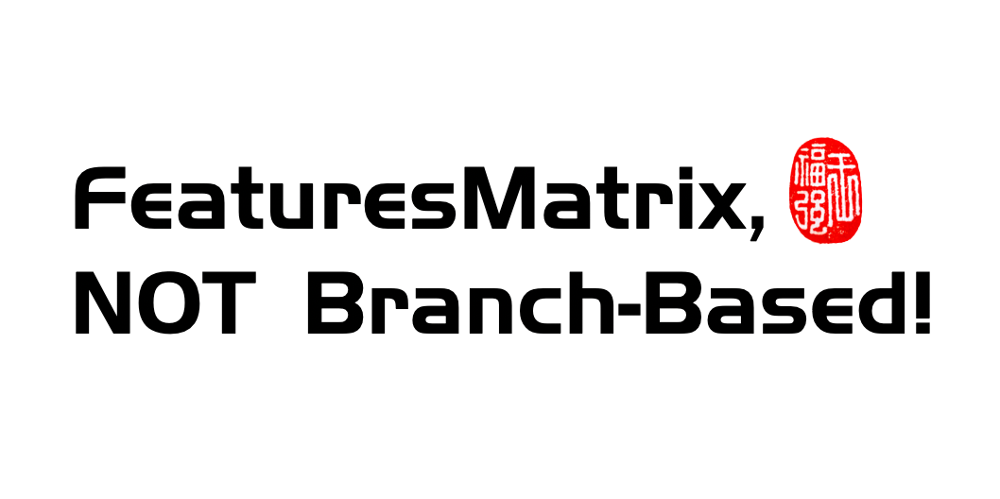
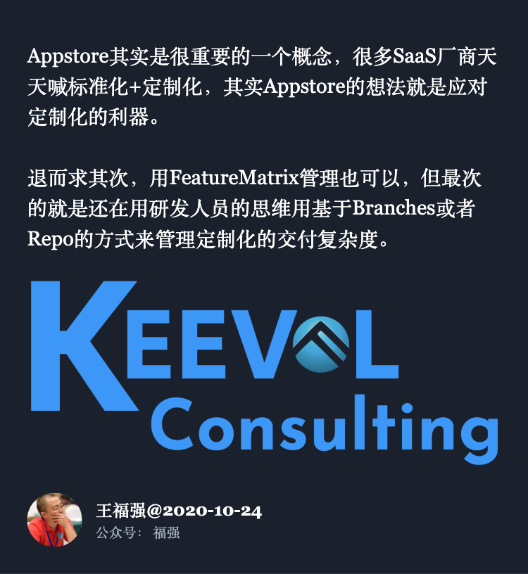

% 我对SaaS产品研发的些许观点分享
% 王福强
% 2020-10-25

本来这篇打算昨天1024写的， 但临时写了个表单页面到今天早上才搞定（老了， 手生的厉害，惭愧...），所以就挪到今天来写吧，毕竟好久没输出了，也跟大家分享一下我看到的、听到的以及自己想到的一些东西...

所有的SaaS从业者今天都知道一个痛点但却没有办法绕过，那就是**定制化**！ 尤其是大客户，更是必须定制化，但定制化初看起来很完美，客单价高， 客户灯塔效应也强，但细算下账却发现，不赚钱，赔本赚吆喝倒是没那么惨，但这不赚钱却不是长久之计啊~ 

所以， 大家开始思考怎么在标准化和定制化之间做个平衡，通过标准化来降本增效，通过定制化来创收，只不过，想法都挺好也挺对，但就是落地执行的过程中千差万别，我总结下来就是各家SaaS公司团队的产品和研发能力决定了实践落地上的层次差别， 但我今天不想谈怎么实践落地，我只想谈谈在规划合理、资源投入合理的情况下，怎么样去做一家SaaS公司的产品和研发才合理。

我觉得一家SaaS企业的产品研发或者技术演化应该经历几个阶段， 即：

1. 代码分支管理阶段
2. Feature配置管理阶段
3. 微应用和应用市场阶段

下面详细说说这些阶段是怎么回事...

# 代码分支管理阶段

这个是最初级阶段，企业都是从小长起来的， 但小的时候，往往团队也比较弱，团队里的人才也稀少，而且更偏简单的业务研发，业务量也很难说有跳跃式的增长， 这个时候， 来一个项目做一个项目是最自然的状态（项目制）， 对于研发团队来说， 最自然的工程管理实践也就变成了一个项目或者一个客户给开一个分支（甚至于copy或者mirror一个repo，也不是说没有这么做的）。

这不是low，这是这个阶段的常态。

但是，当你的业务增长已经进入平稳增长的时候，研发团队如果还是采用这种方式来管理交付，那么问题就大了， 这也是很多CEO对产品研发诟病的地方，但是埋怨也没有用，我说了，是你的团队和人才梯队决定的，你找不到合适的人来发展组织，自然就得依托现在的团队的工程能力来做事，而他们现在就只能用Branch-Based交付方式。

那么，进入业务成长期，应该用什么交付方式呢？

# Feature配置管理阶段

实际上，当业务进入成长期的时候， 与之最匹配的团队交付模式应该是基于Feature或者Module的模式， 然后配合配置管理，从而达到复用性与灵活性并举的效果。

将交付管理的粒度依然聚焦在代码repo或者branch粒度是这个阶段的企业最大的问题，也是最常见的问题。

实际上，你可以从服务化开始抽象，剥离，然后在产品端做整体规划和分治， 该复用的复用，该剥离的剥离，就像是大树的主干和枝叶一样，做到枝叶无论如何疯长， 主干+feature配置来管控他们的挂接和去除就可以了。

这里需要产品和研发从前和后一起规划和协作，对产品架构师和技术架构师要求都上来了，能不能落地，还是人，还是你的团队行不行。

但原则永远都是：

# 微应用和应用市场阶段

一旦你的SaaS企业进入成熟期， 你应该有足够的资源投入来做更稳固的生态了，当然也意味着你有更多的本钱来找更好的人去落地生态规划了。

为什么说生态？ 因为现在的SaaS已经不是你自己唱独角戏的时候， 也没有必要什么事情都亲力亲为，从平台层面将SaaS业务夯实之后，你就可以开始考虑怎么制定规范，让其它第三方合作伙伴也一起投入到自己的SaaS大生态里来了， 微信+小程序， XYZ+小程序， 苹果和Google的App Store， 其实都是映射自己的SaaS生态而构建的基础设施，在开放的Web生态下使用的软件交付形式或许是微应用，在Mobile上则更多会是APP， 这也是大家现在有目共睹的现状。

但同样需要各位CEO注意的就是，这个阶段的资源投入更巨大（而且是长期持续）， 可以第三者视角去参考下业界做得最好的SaaS企业应该是什么样的一个量级，抬头看天也得低头看路，梦想最终还是需要有现实的支撑啊！

# 后话

**什么阶段做什么事情，什么阶段就选择怎么做事情，有些时候就是有什么本钱打什么仗，有些时候就是没有这个本钱可以去聚拢更多本钱加油干**， 这些话怎么理解，大家自己看着办咯~

