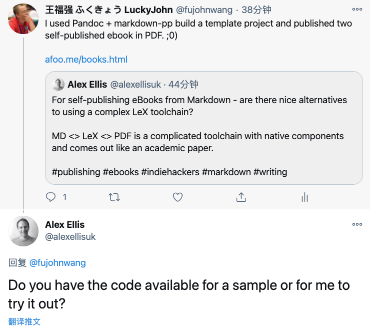
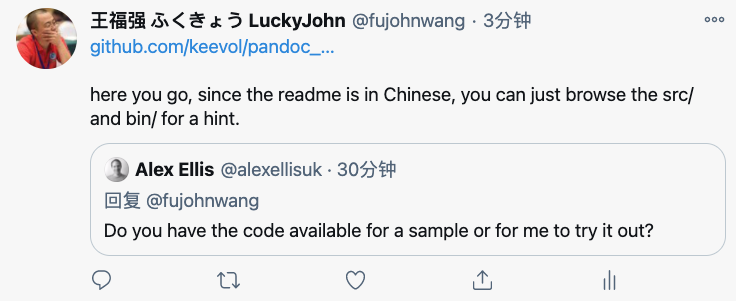

% 开源啦~ 开源啦~ 有自己出版电子书需求的同学欢迎自取~
% 王福强
% 2021-01-14

原本只是简单回复一下，没想到这位兄弟当真了，唉， 罢罢罢，谁让俺脸皮薄呢， 就顺势开源了吧！ 

如果你也习惯用Markdown码字，那么， <https://github.com/keevol/pandoc_md_book_starter>这个项目或许你也会感兴趣， 因为切换语法或者语言的习惯成本还是挺大的 ^[老胡之前推荐了<https://github.com/mraible/infoq-mini-book>, 也很完备， 但却要用asciidoc来书写，所以没有采纳，有习惯用asciidoc的兄弟则可以自取]， 毕竟，最终还是内容为王嘛， 工具只要自己趁手就好。先前《深度思考揭秘》和《极简管理课》^[https://afoo.me/books.html]两本ebook其实就是使用这个项目构建的。

<https://github.com/keevol/pandoc_md_book_starter>基于Pandoc ^[https://pandoc.org/]和Markdown-PP ^[https://github.com/jreese/markdown-pp]两个核心项目构建， 其中Markdown-PP的作用就是可以让我们以更加结构化的形式组织内容（比如分章节，自主调整内容目录和排布等）， 而Pandoc则是生成html/pdf和epub格式电子书的关键。

> NOTE
> 
> 开源的内容摘除了发送邮件的逻辑和脚本，因为牵扯私人邮件账户内容和电子书交付逻辑。

整个项目是一个脚手架/模板项目，可以直接Clone或者Fork，然后在其基础上进行定制和使用。核心代码在bin目录，就是一堆脚本。 而电子书的源码(内容编写部分)则在src目录下，一个简单的Convention是，存在一个index.md的索引或者整书的入口文件（其内容夹杂了Markdown语法和Markdown-PP的自定义语法）， 其它章节内容则分目录存放和编写，每个目录下原则有一个Markdown源文件以及一个images目录用于存放插图。大家查看了项目的src目录样例之后应该可以一目了然。

内容编写完之后，可以使用bin目录下脚本编译并生成相应格式的输出结果， 项目支持html,PDF以及epub格式，输出结果位于${CURRENT_DIR}/build目录下。

> NOTE
> 
> epub虽然也支持，但实际上并未规模化使用和交付，如果需要，请自行改进一下吧~

如果使用过程中有什么问题，也可以到项目主页提issue，当然request merge就更好了。

GL & HF

