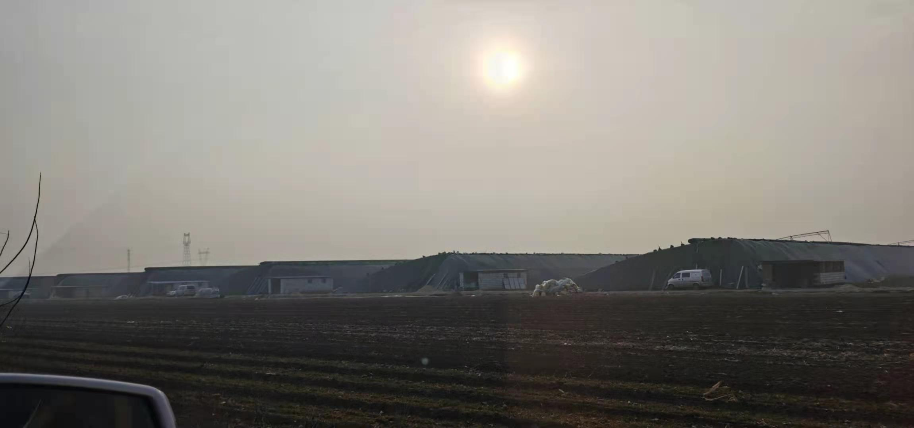

% 村官的逻辑
% 王福强
% 2021-01-26

三年前，财哥从北京回到了他出生的这个平原上的小村庄，为的就是一口气， 因为原村长摆了他家一道儿， 所以他回来竞选村长，为了就是把原来的村长拉下马， 借着多年经商的人脉，终究如愿以偿。

这仨年， 为了村里的“洋枣儿”产业，他拉钱， 拉人， 拉资源， 让村里很多人都种上了大棚，自此走上了致富之路。每家种大棚的年收入从几十万到上百万不等， 而且再也不用受原村长那样的剥削， 一度电几块钱的时代，一去不复返了...

今天陪室友回老家，走在原来泥泞但现在却满村都是的水泥路上，听说， 财哥在村长换届的时候， 落选了...

惊不惊奇，意不意外？

虽说财哥的初心“不蒸馒头只为争口气”，但这三年也算是为村儿里做了很多好事儿了， 怎么会落选呢？

我估计一个是“强龙难压地头蛇”，因为一个借口是， 财哥不是党员， 那“竞争对手”起码为了找到这个死穴，肯定窜和了n久吧！

另一个就是，农村选举村长有个潜规则， 其实就是贿选，每家给多少钱，拿钱的人自然是“拿人嘴短”， 财哥的竞争对手在长期的竞选斗争中练就地这方面的经验肯定是更为丰富的。而财哥既是做实事又是施恩人， 我感觉要是再让他去贿选，估计心里很难迈得过那个坎儿吧？！ （当然，村民或许有自己的逻辑， 比如他做了这么些事儿， 肯定从中赚了很多钱 ，赚了钱又没分我们，干嘛选你？）

最后就是一个底层逻辑： **“忘恩负义”太容易**。凭良心是一件很不确定的事情，而且一旦你对一个人一群人一直都很好，偶尔一次不睦或者小瑕疵，这个人或者这群人对你的感受和评价可以直接翻转直下，做好人，那就难在这儿，人性如此。

当然， 这些都是我自己的臆测， 不一定就是事实， 只是这个现象对我来说倒是没觉得有多奇怪罢了。
