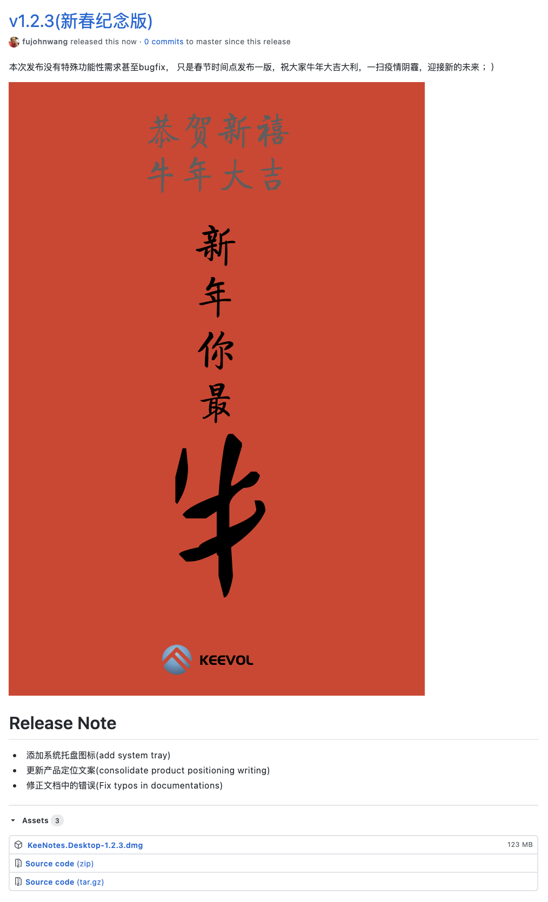

% KeeNotes发布新版恭祝大家新春快乐~
% 王福强
% 2021-02-11

包包子包饺子忙活完了， 趁着下午空闲发布KeeNotesv1.2.3(新春纪念版), 本次发布没有特殊功能性需求甚至bugfix， 只是春节时间点发布一版，祝大家牛年大吉大利，一扫疫情阴霾，迎接新的未来 ；）

可以直接下载安装：<https://github.com/keevol/keenotes-desktop/releases/download/v1.2.3/KeeNotes.Desktop-1.2.3.dmg>

if you use homebrew, just type: `brew update && brew upgrade --cask keenotes` to upgrade.

如果你使用homebrew，可以直接使用homebrew安装升级。

