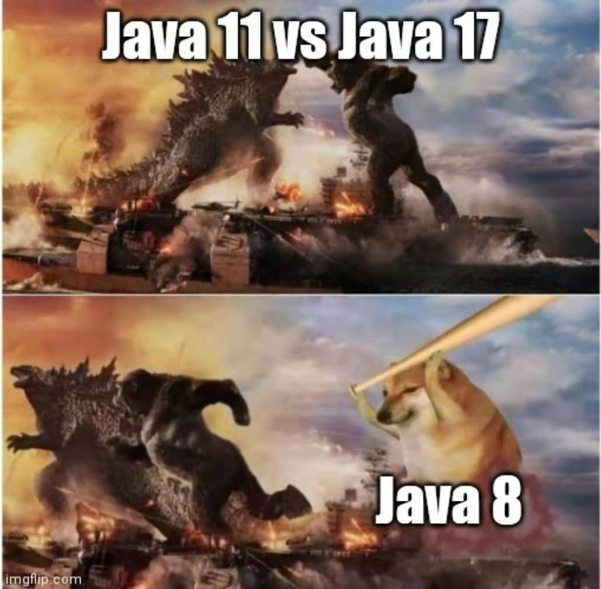

% 今年值得期待的几个技术发布
% 王福强
% 2021-02-19

# Scala3

自己写PoC或者工具的时候，一直用的语言是Scala，但自认为一直是以克制的态度在用Scala，所以我也自诩为Scaja（即用Scala来写Java，来用Java的生态环境）， 不过随着Scala3发布的临近，我倒是挺期盼到时候会不会发展出一套Scapa哲学的 ^[Write Scala the Python way]；）

不过从我的角度来说，任何技术到我这里都得进行裁剪，Scala3也不会例外，因为我觉得Scala3继续走在复杂tricky的邪路之上，哈哈哈，到时候又得砍掉n多不用的特性才会符合我的使用标准，目前看来几个好的东西：

1. toplevel defs（去除了package object这种原本就没想清楚的东西）
2. entension methods（kotlin借来的？反正大家互相学习共同进步呗）
3. intersection和union types（更pragmatic）

其它像given/using， conversion之类，我认为就是增加实际工程复杂度的玩意儿，学术上或许很爽，从用户（程序员）的角度来说，就不够界面友好。

尤其是Scala3 RC1发布里提到的`uninitialized for wildcard initializers`特性，我想从人性的角度来说，届时大家或许宁愿会选择赋值一个null了事吧~

# ElasticSearch8

没有啥高大上的理由，唯一的期盼理由就是把index的`type`字段给去掉了，这更符合Search的数据结构设计，而不是数据库的数据结构设计。

我想，当年那么设计或许更多也是为了兼容或者降低大多数程序员的理解和使用门槛吧~

# Java17

我觉得JDK自从9之后就走上了邪路，11虽然是LTS，但从统计数据上来说，大多数公司或者Java开发者还是停留在Java8， 希望Java17这个LTS发布之后，能够对这个生态有个修复和提升吧~

