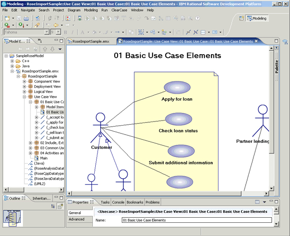

% 那些曾经风靡一时的研发方法论
% 王福强
% 2021-04-01

# TDD

TDD = Test-Driven Development，即测试驱动开发， 最经典的就是下面这本书：

我不能说充分理解了TDD的精髓， 但遥想当年的印象，最深刻地就是作者尝试用一种“如果你想不明白，就先从写简单的测试开始写”的方法让我们设计并编写出优秀的软件。

虽然工作中应用这种方法论做实践的时候总觉得哪里不对，但直到方法论作者本身一句“公司雇你来又不是让你写测试的”（言外之意是"找你来不是写测试的，而是解决问题的"），TDD从此逐渐消失在软件研发的主流方法论行列中。

其实作者自己说的也很中肯，估计也是在自己历练的不同阶段提出TDD然后又不提倡TDD了，TDD总有些把写测试当工作之嫌，而且实践证明， 不写测试也是可以设计和实现好的系统。

# UML

UML在软件行业也是神一样的存在，虽然说这些年没有那么风行了，但依然还是活跃在某些地方、某些人心里和手上。

遥想当年Rational Rose有一套，“幺幺，切克闹”，那是多么牛逼的一套神器啊，只可惜，现实表明，当初从UML图到代码生成并上线的宏伟蓝图，最终还是没有实现。

实际上，UML只是一种沟通的媒介和方式， 现在基本上也就sequence diagram或者use case diagram用的多一点儿吧~

软件研发的核心还是人，以及人和人之间的沟通和交流，工具只是辅助，用不用，用什么，都是由不同的人群自行决定的。但一套工具如果大部分从业者都不怎么用，那还是有其被废弃的理由的。

# Anti/Design Patterns

其实设计模式总体是好的，都是前人经验的总结，如果你没有自己动手有足够的编码经验，直接看书或者尝试去理解，那么，我感觉应该收益不大。

其实Design Patterns不是不风靡了，而是基本上在类库和PaaS等基础设施已经成熟的情况下，这些设计模式都沉淀到了直接可用的SDK/API了，另外就是如果你编码时间**足够长**， 基本上也可以达到“心中无剑（Design Patterns）、手中也无剑”的境界了，写代码基本上也不用机械地去思考这种场景应该用什么设计模式，就可以编写出有良好结构的代码了。

当然，这就跟组织理论里那句“先僵化，再优化，后固化”一样，你开始总会有一些学习Design Patterns的过程和阶段吧~

# 后话

你还有什么其它的补充吗？ 欢迎在后面补充和留言 ；）

