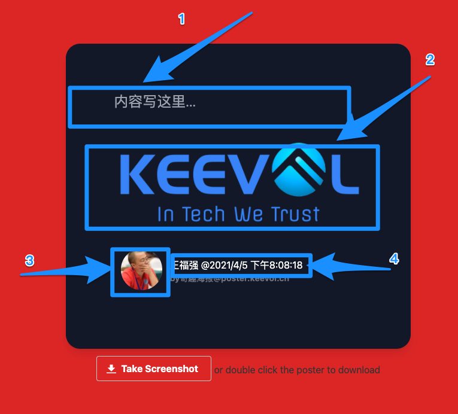
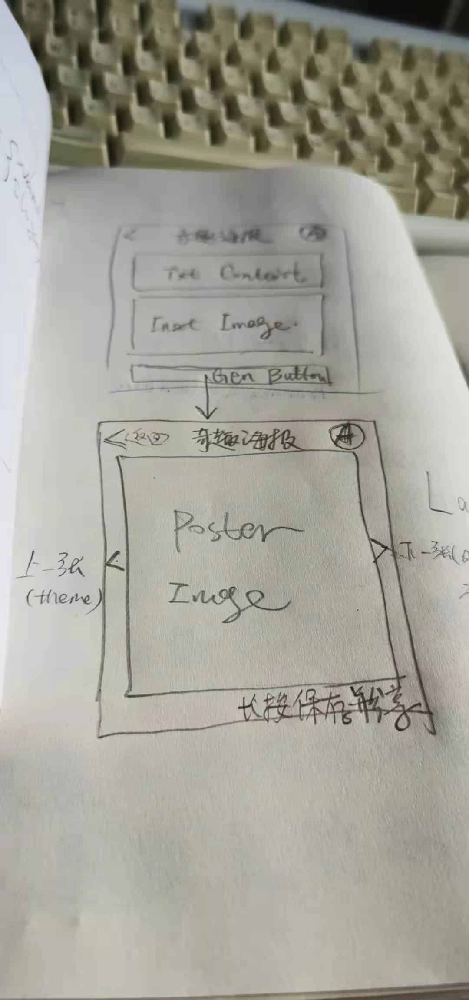

% 分享一款海报神器 - KeePosters
% 王福强
% 2021-04-05

这款工具的诞生源于有朋友经常问我，我日常分享用的海报是怎么做的。

其实是我自己折腾的，但很多信息都固化掉了，每次想改版，也是直接改HTML或者Javascript代码，对用户来说肯定不友好，所以，既然有人喜欢，那就就着今年玩svelte和tailwind的机会，撸了一个海报工具出来分享给大家使用，姑且就叫它“[奇趣海报](http://poster.keevol.cn/)”吧！

虽然默认插图用的是：

但大家可以点击图片区域选择自己想用的插图，当然，头像部分也支持同样的操作（第一版是固定死的，所以不太适合大家使用，现在动态可定制，不再有固定信息的问题）。

奇趣海报采用所见即所得的方式支持四个位置的信息定制 ^[原稿是使用多页面Wizard的形式，实现过程中直接调整为所见即所得的方式]，如下图所示：

其中，1的位置是海报内容的主要输入区域， 2是插图/配图，3是头像（可更换）， 4则是用户可以按照自己的喜好加入自己的个性化信息。

所有这些选择定制之后，就可以点击按钮生成海报并下载到本地使用。（当然，也支持双击海报的所见即所得区域生成海报并下载）

好啦， 基本介绍就这些啦， 很简单的小工具，祝大家玩得愉快，GL&HF `^-^`

> NOTE
> 
> 登录并固化信息（不用每次重复选择和更改）以及多海报模板功能暂时NotImplemented，敬请期待(Stay Tuned)~

下面是最初的想法原稿：

