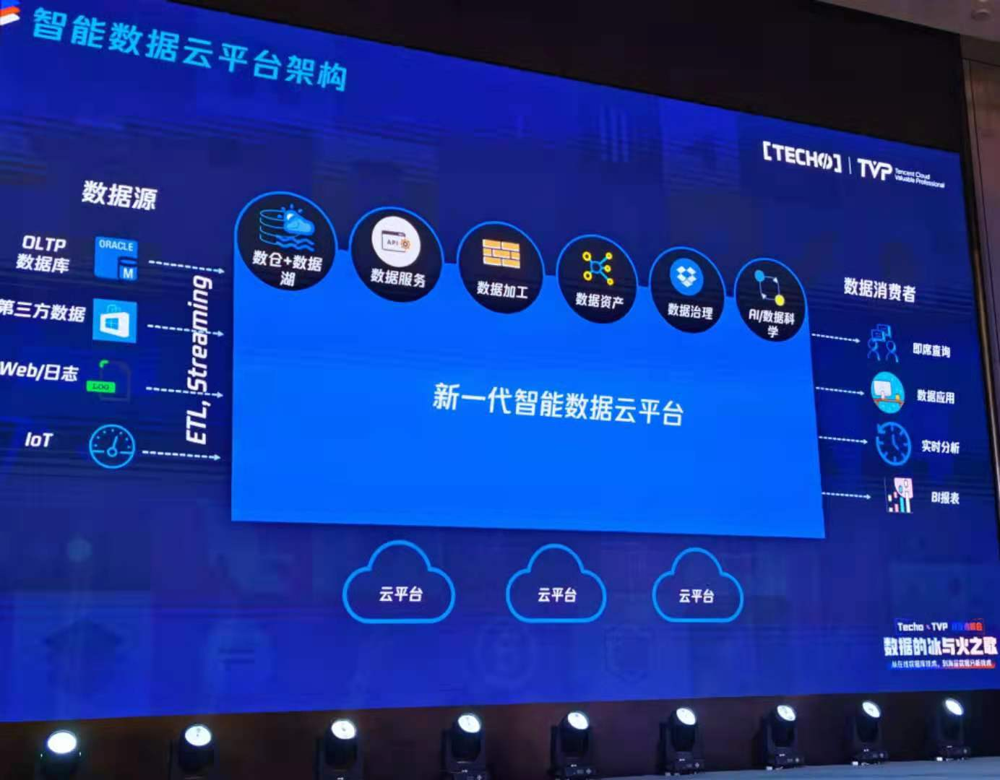

% ODS、DataLake与Diversity
% 王福强
% 2021-04-24

其实DataLake（数据湖）在不同的人那里会有不同的理解，但在我看来， DataLake（数据湖）其实就是传统数据仓库理论中的ODS ^[Operational Data Store]层概念的扩展，只不过， ODS传统上往往汇聚的是相对单一的结构化数据， 而DataLake（数据湖）则多样化的引入了多种结构化与非结构化数据进行存储（和计算）。

在数据行业有一个术语叫"Garbage In, Garbage Out"， 也就是数据最好是得经过清洗提纯（ETL）之后再进行下一步或者下面N步的数据处理，ODS层存放的其实就是初步清洗和提纯之后的数据。

但随着基础设施存储能力与计算能力大大大的提升，一个不成熟的想法就可以诞生了（我猜的，别太当真），我tnd可以把所有数据都拿过来集中起来存储和计算呀，管你哪儿来的， 管你啥格式，管你需不需要来， 我照单全收，反正老子有钱，哦不， 反正老子有磁盘，你想要啥数据的时候， 我都可以从这些照单全收的数据里帮你提取出来不就得了吗？ 还不用像过去孙子一样求爷爷告奶奶地找业务研发把数据库schema设计的合理一点儿，反正啥数据都收上来了，要的时候都有。 这就像淘金一样， 泥沙俱下没关系，金子本来就是从沙子里提纯出来的嘛，反正老子有钱，哦不，又错了，反正老子有空间，都先照单全收了，慢慢炼！ 淘金策略就是爽， oh，yeah~

