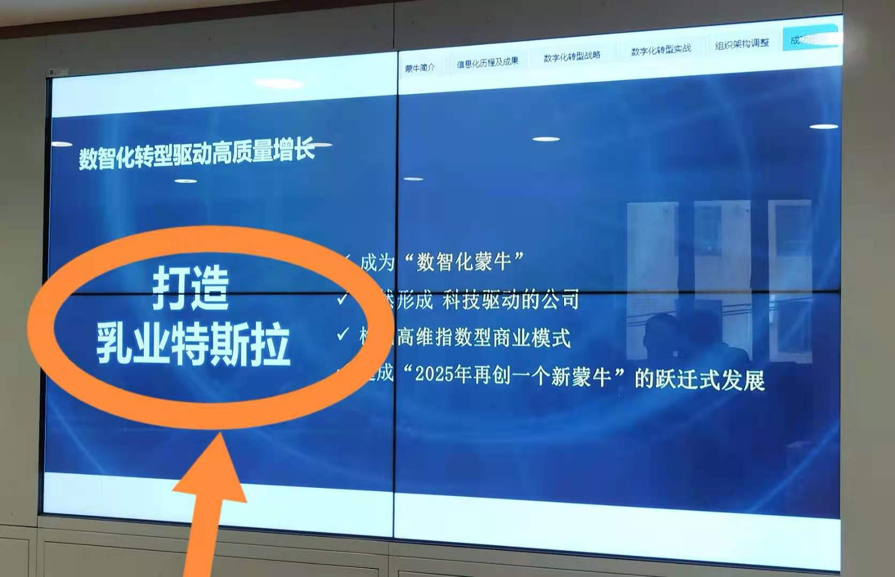

% 客户视角、业务类比与脑暴
% 王福强
% 2021-05-20

今天下午参加了复旦卓越领袖学堂有关数字化转型的一个课程分享，由蒙牛的CIO/CDO张决张总分享她们在数字化转型中的一些思考和实践，收获良多。

我想着重提一个细节，即我们在提一个概念的时候，这个概念到底是从客户视角提出来的还是从厂家视角提出来的？ 往大了说，这叫能不能做到客户第一，往小了说，也会影响我们在营销与传播上的穿透力。

比如， 张总提到她们使用的“常温类”与“低温类”这样的词汇，其实都是厂家视角，而不是客户视角。 

这几天客户之一的CEO兼高中同学恰好也在跟我持续打磨他们的企业战略定位与对外文案， 过程中也暴露出很多非客户视角的不知所云， 比如，我理解他们的组织结构和业务，所以，我可以理解他们提出来的科小弟、财小妮的角色称号到底是什么意思，但对于客户来说，第一眼直觉上很难搞清楚这是在说什么。

另外就是如何一句话跟投资人或者客户说清楚自己的业务与商业模式（相信对于toVC老手来说这已经是必修课了），使用拥有强大影响力的其它行业龙头做类比，借助这些龙头的高权重与广泛的传播和用户认知，通常是一个比较好的方法或者说“套路”：

比如，蒙牛使用特斯拉作为业务和行业类比，在特斯拉如此火爆的今天，客户很容易就可以通过这个类比对蒙牛的业务或者新战略愿景有一个相对容易接受的业务和产品认知。

但像“打造科技服务行业的麦当劳”就不是一个好的类比或者Slogan，麦当劳我们都知道，而科技服务就显得很宽泛，客户第一眼直觉上很难搞清楚你到底是干什么的。

这个时候， 不要一个人冥思苦想，我们还有个工具叫脑暴（Brainstorming），即使用集体的智慧，虽然我出来创业第一个项目没搞成，但我依然认为当时发动大家脑暴搞出来的“有薪人”是一个很好的品牌关键词 ^[有薪人=有薪水的有心人，面向职场人的app]。

word is power，合适的word是穿透客户心智的利器， 千万不要在这个地方偷懒哟 ^-^

