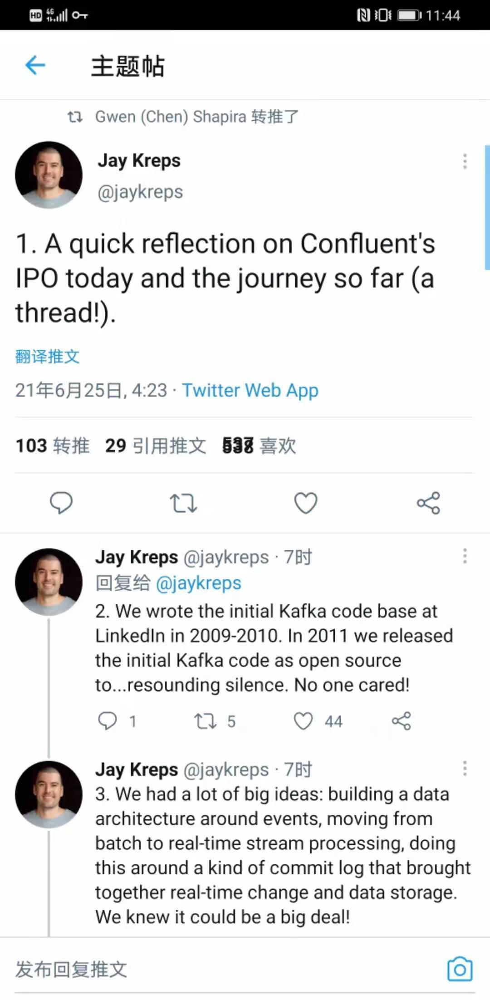

% Kafka、Eromanga与Confluent IPO
% 王福强
% 2021-06-27

> 原本想在Confluent IPO当天写这篇的，但得参加活动并准备《技术、商业与人》的试读运营与分发，所以，没有时间及时搞定这一篇，今天补上...

Confluent公司IPO啦~

什么？ 你没听说过Confluent公司？ 那你一定听说过Kafka吧？ 对， Apache开源基金会的那个Kafka，不是历史上的人名，毕竟，我们还是围绕着技术多一些 ；）

Confluent作为Kafka背后的那个“男人”，在Kafka开源的基础上做商业，打造了一系列的外围生态与衍生服务，包括但不限于Schema Registry，Gateway Service以及把Kafka云化(Cloudify Kafka)，Confluent的IPO相当于对他们工作的价值给予了确切的一个里程碑似的肯定，也给予了诸多技术创业公司继续砥砺前行的激励，所以，恭喜Confluent！

借着Confluent上市之际，Kafka的最初代码编写者也对Kafka的历程做了一个简单的回顾：

这也让我想起来2009年到2010年左右在阿里巴巴做海量数据中间件的那段经历， 今天很多公司使用的阿里巴巴开源出来的Canal项目 ^[我其实一开始不知道Canal跟我当年写的代码与架构之间的关系的，之后后来grep代码发现有自己的@author信息，而且查看Canal设计，觉得很熟悉，才大体了解了这个产品演化的脉络，真正来讲，Canal是楼江航主导开源的，后面由另一个小伙儿接手了（听说也从阿里出来创业了）]，如果去看代码和底层架构，其实依然可以看到当年我设计上的优与劣，很多东西放到今天来重新设计与实现，绝对也不会是今天这个样子，但往事不可追，let it be~

那Kafka和Conflent IPO跟我在阿里巴巴做中间件的经历有啥联系呢？ 其实，我是最早研究Kafka的国内开发者之一，对Kafka的Paper、blog posts以及源代码都做过全面深入的研究，而也正是着迷于Kafka当时的先进性，我在实现Eromanga数据中间件 ^[Eromanga和Erosa组合起来形成了今天Canal的基本整体，Eromanga名字来源于Eric掌舵的平台技术部时期，Dubbo也是同一时期的产物，整个平台的产品体系叫pampas，而且多个同事一起出来搞了家公司就叫潘帕斯(https://www.ipampas.com/)，算是帮忙打个广告了，哈哈]的时候，直接就把Kafka的优秀特性inline或者说copycat到了Eromanga中, 包括但不限于sequent write、direct copy、HA、message pub/sub等。

当时考虑到运维与推广，更多将Eromanga和Erosa ^[Erosa是处理CDC与数据库协议的关键，细节当时给上海交通银行信用卡中心的同学做过企业内部培训《实时数据追踪与流计算》，但很可惜，大部分同学是应用研发，能感觉出大家对个中“滋味”无甚了了]两个中间件的职能inline到一个中间件了，实际上，今天来看，最合理的设计规划应该是直接用Kafka替换Eromanga，只做好Erosa就可以了，消息的接入、分发与计算都后置，专有中间件各自做好各自的事情。

当然，这也带给我们一个启示：

**If you are big, architect distributed;**

**If you are small, go inline way.** 

以此纪念当年的技术geek情节并再次恭喜Confluent IPO和Kafka的成功。

