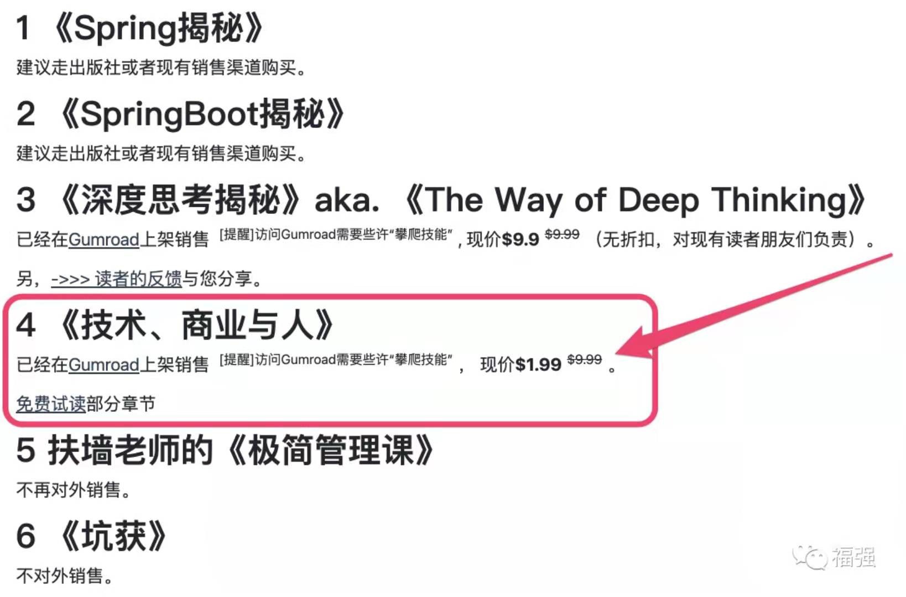

% 《技术、商业与人》上架销售！
% 王福强
% 2021-07-01

​

昨天还在跟一位老总聊天，老总赞我对创业的理解深刻，我也只能自嘲“**也就理解深刻了，事儿干的一般**[破涕为笑]”

2021年上半年已然过去， 给自己留下点儿印记，要么是代码，要么是文字，这本《技术、商业与人》就算是对自己创业**阶段性的**总结和展望吧！

之前不清楚内容是自嗨还是真有价值，所以就邀请了几十位朋友试读给些反馈，现在看来，大家都可以从中收获一些有益的东西。所以我想，如果这本书真得有价值，那么也应该有些商业上的小小收益，遂借着党100周年生日之际上架销售，如果有感兴趣的同学，可以访问我的博客地址<https://afoo.me/books.html>了解与购买：

文末也有部分前期试读的同学的一些反馈与读后感，其中也不乏有识之士由此引申分享的更多商业思考与实践。

本书分三个部分：技术、商业与人， 不是每个人都做过技术，也不是每个人都做过商业，所以，内容其实是散文性质的，大家可以根据自己感兴趣的内容做跳跃性阅读，比如，桂总直接就跳到了自己当下关注的SaaS与开源部分的内容章节。

前几天刚跟同在创业的老肖畅聊一回，老肖总结的“**创业要注意两个安全：第一是人身安全，第二才是经济安全**”， 相对于创业因为踩了莫名红线而陷身囹圄的朋友，我应该算是幸运的了，这也得感谢记不清是哪位贵人之前跟我提了个醒儿， “**创业不要把自己创进去**”，所以，很多业务领域这四年即使很难，但我也是不碰的。

商业上的成功固然喜人，但，大家也要对创业有一个正确的认识。

希望这本书可以给大家一些hint和启发，足矣~

***福强， 2021.07.01***

