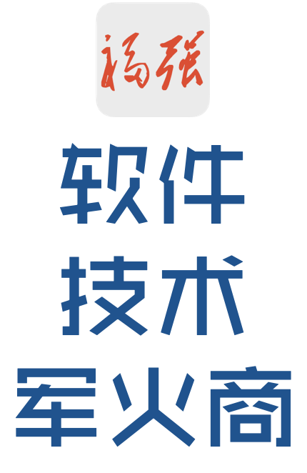

% 没事儿别闲得做咨询！
% 王福强
% 2021-07-22

源于某兄弟接了北京某上市公司的咨询业务跟我吐槽和倒垃圾 ^[配合对市场的洞察和过往经历，某上市公司是谁，我直觉性地就猜得到，起码七八年前砸100万顾问费让我去帮忙做做顾问，我去了一趟就没再去， 丫的，那时候就看出不是什么做事的场子， 这几年CIO换了n轮，利益黑幕都tmd两度空间就晓得，事儿能做好才怪！]，遂写点儿忠告，没事儿别做咨询，哈哈哈

**打出来的逻辑、踩出来的坑儿**, 全是切身体感 ；）

# 顾问不管落地！！！

重要的事情说三遍：

**顾问不管落地！！！**

**顾问不管落地！！！**

**顾问不管落地！！！**

落地意味着对结果负责，那么，你要么全部外部化的对客户的结果负责（你自己是内部化），要么inline到客户内部去对结果负责，两边不靠的，那就是人力外包，要么被你牵着，要么被客户牵着。

# 不对客户的组织现状负责！

即使如此（不对客户的组织现状负责）， 顾问或者第三方依然夹在中间难做人。

事情做得好不好， 本身还是看客户方是不是一个做事的态度、文化和组织关键岗上的人，你丫就个辅助和外脑，顾问费能抵全职利益吗？显然不能，所以错配就别指望对等了，痴心妄想。

见到很多企业和机构内部人事关系复杂的一逼， 还tmd指望做事？ 里面的人都没有做事之心，你丫一个外人做啥春秋大梦呢？

世间真理就是，什么问题都是组织的问题，**什么问题最终都是人的问题**，我不搞人，没那天分，也没那闲心，CEO/董事长自己都搞不好，我一个外人操碎了心也没用啊！

所以，福强现在就是做个技术军火商，你要是对技术产品和工具有需求，欢迎洽谈，你要是有痛点自己搞不定，也欢迎洽谈，毕竟工具和产品在手，也适当可以提供培训和“雇佣军”训练业务；）

# 咨询模式的本质是卖时间

所以，按时间按天算钱是正当诉求，因为这就是个短期的钱，没有中长期沉淀，即使多收点儿咨询费，光算钱上的账，也不如打工。

咨询业务要干，最多就是个引流业务，别指望做成主业，虽然“四大”现在也做技术全栈的咨询和交付，但并非啥性感业务，只能说“四大”人家有品牌效应， **背锅的价值**都比你大，记住，你不是“四大”！

# 后话

其实很多东西在《坑获》里都有收录，但不方便放出来，《技术、商业与人》 ^[https://afoo.me/books.html#%E6%8A%80%E6%9C%AF%E5%95%86%E4%B8%9A%E4%B8%8E%E4%BA%BA]倒是有些散篇，感兴趣可以拿去一读...

