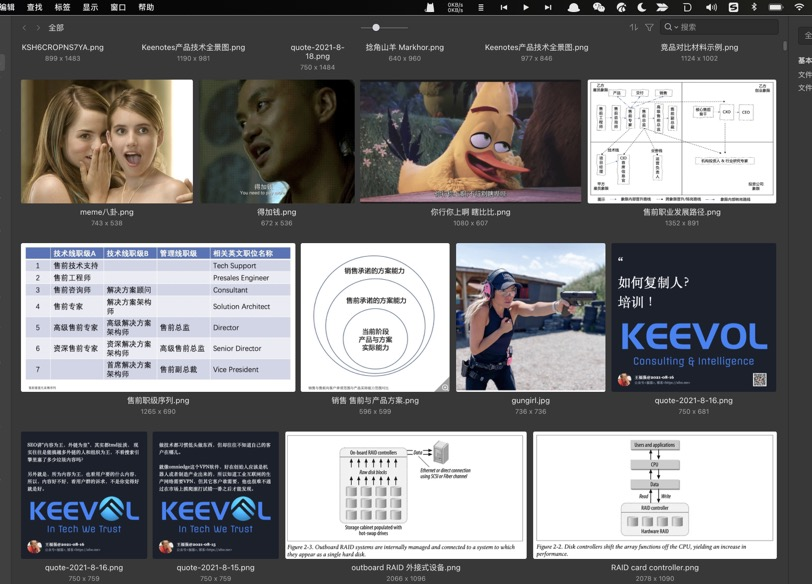

% 好的产品，一个细节就够了！
% 王福强
% 2021-08-22

之前的兄弟向我推荐过两款商业型工具软件，我都买了，但第一款（某Markdown编辑器）买了之后就没有用几天，反而第二款用的时间长一些，一直到现在还在用（应该有两年了吧），也在设想方便的时候在其基础上再根据自己的理念做一定的修改和适配，这款软件一直用的原因没法说得很明确，但有一个细节我觉得很能体现出这款工具产品在打磨过程中耗费的心力：

这款图片管理软件在自适应布局下，不管每一行展示多少张图片，所有行都是边距对齐的，初看起来这好像不算什么，但细细想来，其实有很多细节要去处理，比如我之前自己写给自己吃的“狗食” ^[Eat My Own Dog Food] 在这个层面就比较粗糙，从观感上和感受上一对比你就瞧出差别在哪儿了：

**不怕不识货，就怕货比货**， 我这个“狗粮”当时粗糙写写也花了不少时间， 更不要说人家这个产品已经相当成熟并且售卖好多年了。

而且，这个产品还有一个好处是，它有Open API，我日常如果有些文字想要做成海报，那么肯定希望是留存到这个软件里统一管理（统一收口），但每次手工拷贝来拷贝去实在是繁琐，而且容易忘记，所以，我就在web版的海报工具与这款软件之间架了一个的“桥梁”或者说钩子(Hook)， 图片海报在web应用里生成之后，程序会自动地再把海报加入该软件进行管理，目前来看，也是perfect运行两年多，可以说，这款软件上花得那笔钱是真值，如果将来配合AI，估计便捷性上可以做得更好，就是不知道他们有没有这方面的考虑。

话说回来，我脑子放空的时候琢磨过它这个自适应布局怎么实现 ^[没办法，程序员出身，总想搞清楚怎么回事，know-why嘛]，但目前为止，还没有完全琢磨清楚（也可能心思还一直没放在这个上面），只能说，我这个老码农觉得这个产品细节很牛逼，所以拎出来感慨一下，哈，不管是设计层面还是实现层面，都揉入了这个团队的心血在里面， 👍

**好的产品，真得可以一个细节就能打动用户**，我自己写的工具，都可以痴迷于一个习惯上的细节改进而无法自拔，何况这种投入了更多资源的商业型工具产品呢？！

