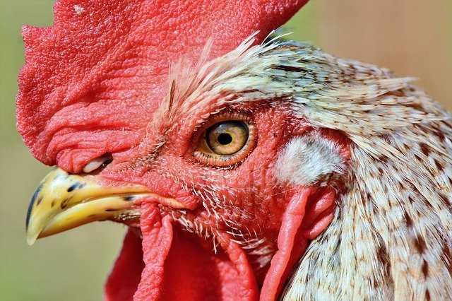

% 说鸡
% 王福强
% 2021-09-20

不要想多了，真的是要说“鸡”这种动物，而不是某种器物。

我们都知道有个词儿叫“鸡贼”， 这个词儿其实很有讲究，首先说这个“贼”字。“贼”字本义是破坏，简单来说就是不让你好、见不得你好。我们通常把盗贼放在一起，其实盗和贼是不一样的，盗亦有道，只劫钱财不伤性命， 贼就不一样了， 劫财是必须的，劫个色就更好了，甚至看被抢对象不爽直接砍死算了，这是贼，比盗那不知道坏到哪里去了。

再回来说这鸡，这鸡吧，有个习性。这里不知道有多少小伙伴儿是农村出来的，或者观察过鸡和鸡群， 鸡吃食的时候， 它是不会好好吃食，它要么用爪子刨一地，要么就会去“叨”另一只鸡或者去抢另一只鸡嘴里的食儿，纵使食盆儿里食物满满，也要毅然决然地去抢另一只鸡嘴里那点儿，这是鸡。

把鸡的这个习性和贼放在一起，各位是不是就对“鸡贼”这个词儿更有立体感了呢？

那么，老问题来了？ **鹤立鸡群，谁更难受？**

在鸡群里，你的策略其实无非两种， 要么**做一只斗鸡**，“就是不服你，小样儿，不服来抢，我还干不过你？”（但同时也意味着，你已经变成了为了斗而斗，却忘记了，丫的老子就想弄点儿食儿吃，而边上或者其它任何一个地方，食儿都tmd比任何一只鸡嘴里的要多得多得多）

另一种策略就是另一位马老师说的“**远离鸡群**”，如果既不选择做一只斗鸡，也不选择远离鸡群，那么这只鸡的命运就很被动甚至很悲剧了： 要么被“叨”死，要么就自己默默祈求遥远的救世主（别人帮你挪个窝儿）。

这就是鸡，跟另一种水里的动物在某些习性上有点儿像，甚至更贼；）

