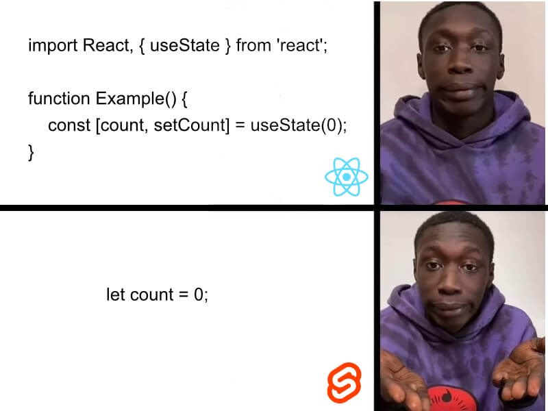

% 对数据库的爱有多少可以重来？
% 王福强
% 2021-10-11

\#从数据库谈到组织和人才发展#

今天中午吃饭，邵总提到说，*金融机构大部分系统都是直接捅数据库*，然后我就把这个话题扔到某个地方访问不到的网站上， 发现讨论挺激烈的，遂觉得这个话题值得展开来说说...

其实对于金融机构来说，或许直接捅数据库才是最务实的做法。 只要数据库够强劲，有何不可？ 

软件无非就是解决两个问题： 存储与计算， 如果数据库可以通过SQL更好的搞定这些， UI + DB不是很合理吗？ Oracle为啥牛逼？ 不就是可以让你直接捅、随便捅吗？

现在很多应用和系统都搞分层、搞治理，无非还不是因为标准化生产的大背景下组织结构和边界决定的吗？ **有多少核心系统需要重点关注？ 又有多少非关键系统需要那么精细化的设计与治理？！**

真正的高手从来不是谁掌握最高深的技术， 而是谁能根据具体场景选择最为合适的技术。工具箱里千万般工具，当下只择最合适的那个，这才叫牛逼。

**每家企业所处的阶段不一样， 组织和文化的土壤不一样，人和工作的思路更是不一样**， 天天学阿里、学字节你就能成为阿里和字节吗？ 别做梦了，多少老板都没想明白，你看到的阿里和字节只是结果， 而阿里和字节怎么成长为今天的样子、投入了多少资源、付出了多少心力、脑力和体力，你绝对是意想不到， 这也是为啥我会觉得很多老板抱怨地很non-sense，说自己找了个高P、找了个C_O却发现没什么鸟用， 其实大部分情况下一定没鸟用，但这个没鸟用不赖你找来的人，更应该赖CEO自己，因为你没有营造出适合这些人发挥作用的土壤和环境，而这东西也是大平台极具竞争力的地方，更是他们不会show给你看的地方。当然，很多时候show给你也没啥鸟用，就跟人一样，**活到最后，都是活个自己**，公司和组织更是。

这些话，听明白的就明白了，听不明白的也就没必要听了， 晚安~

