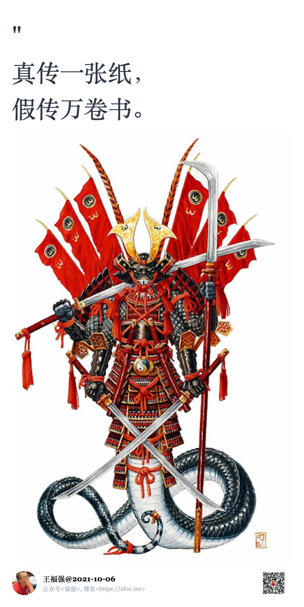

% PPT、专利与白嫖
% 王福强
% 2021-10-27

今天在成哥的SRE群里， 甲方乙方各执一词， 技术创业公司老总大吐苦水，甚是热闹，“一家比一家PPT做得精美绝伦，一家比一家话术说得天花乱坠，一家比一家报的价格低到尘埃里...”，乙方抱怨甲方天天想着白嫖，甲方代表则表明了自己白嫖的正当正确，哈哈哈，说实话，这就是正常的现实，**抱怨也没用，抱怨不解决现实的问题**， 而当前的现状其实就是大家“不抱怨，只为成功找方法”造就的。

其实在现有错配（严重错配、极其错配、再延伸就不敢说了的错配）的资源分配格局下，所有人都只能想尽办法去拼抢那么点儿资源，你不抢，不意味着别人不抢，你不抢，有可能就饿死，尤其是T**oB的生意，本质上就是个存量分配的竞争**：

在一个特定资源格局下搞分配，所有人又那么正向的天天想怎么办，那必然是这样的市场环境，没啥好抱怨的 ；）

一定是拼谁的PPT做得更加天花乱坠，谁的客户关系绑定的更紧，谁的价格要的更低...

包括后面牵扯出来的专利的话题，中国的专利本质上就不是为了专利的目的，更多还是拿高企，做资质，拿补贴，提高门槛。 所以怎么批量制造专利，怎么通过专利制造资质门槛或者越过资质门槛，一直都是做到一定体量的企业要去做的事情。tmd搞200多个专利的企业，真有jm用嘛？ 真jm有，只不过不是那么用 ；）

然后说回白嫖，白嫖有一部分是具体个人的问题，有一部分是供应商管控与牵制手段，乙方天天想着对甲方施加“登门槛”效应，甲方也得小心防范别踩到坑儿里爬不出来呀，也是合理的存在：

总之，接受现实，有心就慢慢改进，大环境不会因为你一个人的抱怨就怎么样，但可能会因为你一个人的努力而有些亮色。

所以，**你是限定性思维还是探索性思维**也决定了你会怎么理解上面四句话...

