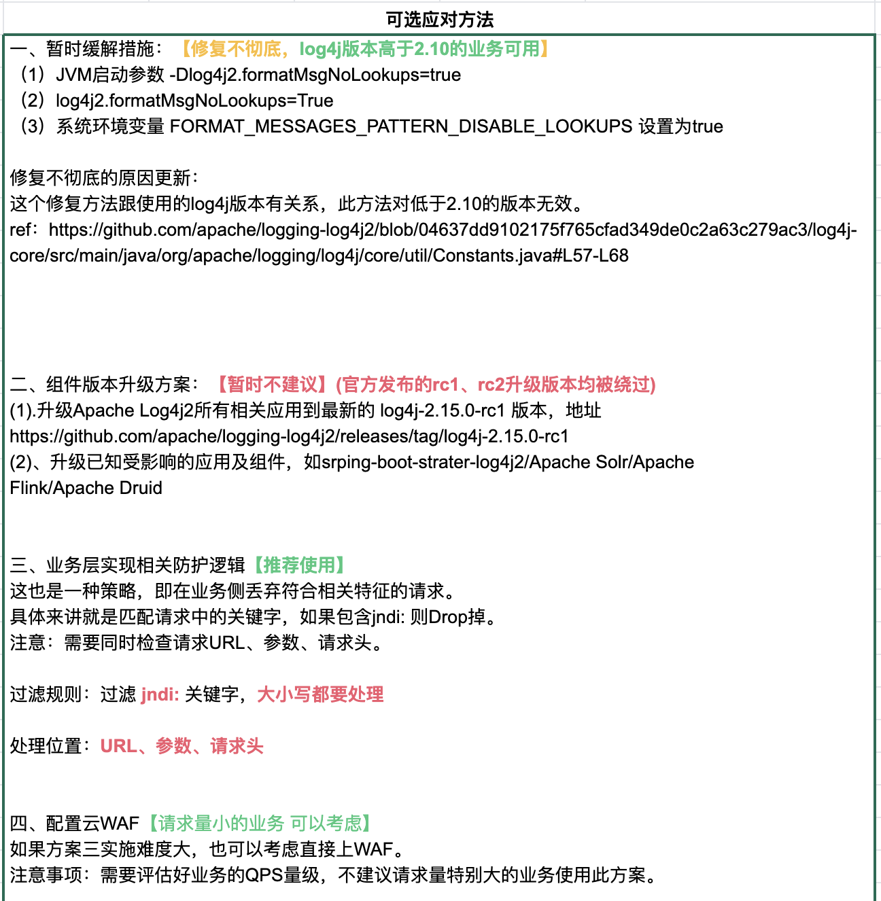

% Shit Happens: log4j 0day灾难始末
% 王福强
% 2021-12-10


今天最靓的仔是谁？ 非log4j2莫属啊！ 

(抱歉，已经算是昨天了，码完字才发现已经是2021年12月11日凌晨了)

# internet-melting-shit happens

我是昨天晚上或者说今天凌晨看到斗象安全推送的消息，然后直觉上意识到log4j2的这个0day爆破力度会相当大，第一个是这东西太底层，相当多类库、系统都依赖它， 另一个就是Java虽然在语言排行榜上处于下滑趋势，但架不住存量大，况且即使下滑也依然是占据榜单头部区域，你想啊，两三个年营收以千亿计的乙方公司为招标单位提供的技术体系和方案都tmd是Java和Spring生态的，就更不要说其它公司了，说影响范围不广，你信吗？

所以， 我直接转发了漏洞报告到我的朋友圈，然后睡觉，毕竟，虽然我不操心，但有人或许要因此而睡不好觉了呀，**早发现、早预防**吧！

# 怎么检查我方或我厂有没有中招？！

国外有位仁兄给的方案挺轻量的：

> How to detect if affected: Start netcat parallel to your app: "nc -lp 1234", then type the following into app where it gets logged (e.g. the query string of your search): "${jndi:ldap://127.0.0.1:1234/abc}" If you then see garbage/emojis in the netcat console your're vulnerable!

简单来说就是在你应用节点上用nc起一个服务，然后在自己的应用里注入这样一个字符串：`${jndi:ldap://127.0.0.1:1234/abc}`， 如果nc的控制台有打印出一些乱七八糟的信息，恭喜你，你中招了。

当然，再专业点儿、再直观点儿的做法是像下图这样：


我想今天dnslog.cn估计qps会涨不少，哈


# 哪些服务和系统将收影响？

> The vulnerability impacts Apache Log4j 2 versions 2.0 to 2.14.1.

所有直接或者间接使用了log4j2从2.0到2.15rc2版本的应该都受影响， 一些重量级明星项目比如Kafka、Druid以及Minecraft这种世界级范围内的游戏都在受影响的行列，更不要提各个公司的内外部系统了。

影响不可谓不大...

# how this shit happens？

log4j2的这个0day是RCE漏洞，即远程代码执行(Remote Code Execution)， 意味着别人可以给你的程序或者系统注入一段他们的代码，然后，很多“美妙”的事情就不知不觉之间发生了，最主要的是，你还不一定知道。

> 说到0day，某携程神级运维一品大员反映说这个缺陷8年前就已经存在，被仙界（我估计他说的是安全界）利用的够够儿的了，今天才抛向人间，惊得鹧鸪乱飞...

我昨天和今天在客户那里连轴转开了两天会，所以，白天没时间深究，只是空闲之间看各个群里讨论的热烈， 晚上回来抽时间扒拉了一些资料和代码， 尝试跟大家分析下这个破事儿是怎么发生的，如果有误，也可以拍砖，我再深入学习下。

首先是这个事情要发生，有几个关键条件：

1. log4j2在某个版本之后允许JNDI Lookup了；
2. 既然允许， 那我做JNDI Lookup就可以有来有往了：
   1. 出栈(outbound)如果不做限制，那我就可以让查询指向任何服务（不管是内部的还是外部的）；
   2. 入栈(inbound)结果回来之后，你怎么处理我给你的结果？ 
3. JNDI目标服务器上存放的数据结构和规范是什么样的？

抱着这些疑问，我们就可以抽丝剥茧地缕出一个头绪了：

1. JNDI规范确实定义了服务器端数据结构的存储规范，如果你按照这个规范来，那么恭喜你，天生具备了被捅的特质，因为java的serialization机制早几年就被爆过了，而JNDI服务器端数据存储规范其实就是基于java serialization搞的。
2. 但规范归规范，还要看客户端是怎么处理的，是遵循规范，还是简单toString？ 毕竟，log4j也只是一个log类库，最终还是要转成toString才能打印到文件嘛！
3. 查看github上紧急修复和merge的记录以及2.14.1的源代码，我发现没那么复杂，其实，事情出在toString上面， jndi查询回来的结果对象是通过Objects.toString转成String字符串的， 而Objects.toString的逻辑其实就是交给参数对象的toString： `Objects.toString(jndiManager.lookup(jndiName), null);`
4. 嫌疑就变成了返回对象的toString方法，只要允许jndi查询，并且查询的目标服务器是cracker方的服务器，那么，cracker就是可以给你返回任何结果对象，自然也就可以给你一个复写了toString的对象，而这toString返回之前，他搞了什么事情，那就天知地知他知你不知咯~
5. 而且你去研究下rfc2713， 活脱脱地一个java序列化粪坑，javaClassName，javaCodebase，javaSerializedData这些规定属性（attribute），摆明了给人家注入提供便利啊， 更不要说refAddr类型的结果了， 哎， **结果反序列化之时，就是你被爆菊之日啊**！！！


# 怎么防护？！ aka. 解决方案与权衡

业界总结了几种规范的应急机制， 我也厚着脸皮勾搭了下阿里内部长时间未联系的负责2000+人安全团队的高P， 大体上给出的思路是：

> 边界先用waf和rasp之类的产品防住，再升级log4j的版本

最早在成哥的SRE群里亚猛给的规范指导书也值得借鉴：



整体思路有了，还没思路的各位看官可以寻路而去了，愿意了解更多的，可以随我继续往下再探一探，看一下这个思路是怎么总结和权衡出来的。

## WAF级别

WAF是Web Application Firewall的缩写， 使用WAF的好处是不需要对现有成千上万的服务和系统进行干预和重启，只要在WAF上对这次log4j2的JNDILookup漏洞引发的流量特征做封堵就好了，配置规则也不需要重启还实时生效，so easy~

但问题有可能是， 流量特征没有那么容易封堵完全，比如：

```
讲个笑话，log4j这个洞的payload格式比想象得多得多得多。

现在90%的waf规则都是无效的~

我举个例子：${sys:ldap://
```

所以， WAF也只能解决燃眉之急，不解决根本问题，可以缓解，但无法根治。

## RASP级别

扶墙老师不是专职搞安全的（虽然什么都会一点儿），差点儿看成asap...


所以，特意查了下RASP是个什么东西 - Runtime application self-protection:

> 运行时应用程序自我保护（RASP）是应用程序安全生态系统中的一项创新，可通过提供对隐藏漏洞的更多可见性来处理对软件应用程序层的运行时攻击。它本质上是一种安全软件，可与应用程序或其运行时环境集成在一起，并不断拦截对应用程序的调用以检查其安全性。RASP软件无需等待威胁影响应用程序。相反，它会主动在进入应用程序的流量中寻找恶意软件，并防止在应用程序内部执行欺诈性呼叫。

简单来说就是跟应用自身融合在一起，可以从多个层级和粒度主动防御，怎么实现，那就是专业人士的事儿了，总之我觉得很牛逼，下面这个截图应该就是本次log4j2漏洞被某rasp拦截后的效果：


## 应用级别

RASP其实也是应用级别，但我们也可以泛化一下，你不是可以梳理每个应用，主动对调用log4j的地方做消毒（sanitization）呢？

开玩笑啦，你真别当真， 牵扯面大，不好实施不说， 风险其实也是最大的。 实施的时候参差不齐，其实也没法保证完全解决这个问题。

最不建议这么做！

## 类库级别

log4j2团队在爆出漏洞之后，也是紧急修复了多个版本， 包括rc1， rc2， 直到最新的2.15.0，算是初步修复了这个漏洞（但其实也是讨巧，对代码逻辑感兴趣的同学可以去看下，其实采用了一种类似“电路短路”的策略，在前面添加了各种基于host， class之类的封堵策略）。

所以， 可以尽快让自己组织内的团队升级类库版本并重新发布服务和系统。

这种方案需要滚动发布，所以，相应的，你的devops平台准备好了吗？

重启过程中依赖先后顺序梳理过吗？ 演练过吗？ ；）

## JVM级别

最经常提到方案其实是java虚拟机级别的，一个是升级jdk/jre，因为Java 8u121之后如下两个相关属性都已经默认是false了：

- com.sun.jndi.rmi.object.trustURLCodebase 
- com.sun.jndi.cosnaming.object.trustURLCodebase

> Java 8u121 (see https://www.oracle.com/java/technologies/javase/8u121-relnotes.html) protects against remote code execution by defaulting "com.sun.jndi.rmi.object.trustURLCodebase" and "com.sun.jndi.cosnaming.object.trustURLCodebase" to "false".

另外就是直接改参数并重启：

- 修改 jvm 参数 `-Dlog4j2.formatMsgNoLookups=true`
- 修改配置 `log4j2.formatMsgNoLookups=true`
- 将系统环境变量 `FORMAT_MESSAGES_PATTERN_DISABLE_LOOKUPS` 设置为`true`

不过，所有服务和系统重启，又回到了升级类库一样的尴尬之中， 谁担责所有服务和系统都重启的责任？  谁又能保证重启过程不出问题？ 谁保证你做了这些就一定可以彻底解决问题？ 说句不好听的， 你disable了某些配置参数，你又怎么保证对所有服务和系统的健康度没有影响？ （有没有某些关键系统依托日志的关键格式来决策？ 升级也好，改配置也好，改虚拟机参数也好，都需要批量操作，而且不敢保证服务的健康度）


## Agent热加载

这种方案就是基于运行期加载的javaagent来禁止JndiLookup相关的功能， 这种方案风险适中， 也不需要重启所有系统和服务， 但首先要保证agent的代码没有问题，其实就是，这个方案即使上了，事后还是需要收拾残局， 必须要等log4j2新的版本彻底修复了这个漏洞并发布之后，所有服务和系统再发布一次，否则，下次可就不一定会有人记得你中间热加载过这个agent咯~

[volker_simonis](https://twitter.com/volker_simonis)(https://twitter.com/volker_simonis)提供了一个patch： https://github.com/simonis/Log4jPatch， 可以作为一个选择。


# 后话

不管怎么说， 在经历了轰轰烈烈地被爆之后， log4j2的这个漏洞也终于迎来了它的正式编号： [CVE-2021-44228 – Log4j 2 Vulnerability Analysis](https://www.randori.com/blog/cve-2021-44228/)(https://www.randori.com/blog/cve-2021-44228/), 升级最新发布的2.15.0版本也可以初步从根本上解决问题，但你回头想想是不是还是有些后怕？ 

很多时候， **看得见的危险其实没那么危险， 那些看不见的威胁才是最危险啊！**

扶墙老师和他的读者群专属海报一张，借机正好也可以与大家一起分享：


# References

- [Log4Shell: RCE 0-day exploit found in log4j, a popular Java logging package](https://www.lunasec.io/docs/blog/log4j-zero-day/)，https://www.lunasec.io/docs/blog/log4j-zero-day/
- [Schema for Representing Java(tm) Objects in an LDAP Directory](https://datatracker.ietf.org/doc/html/rfc2713),https://datatracker.ietf.org/doc/html/rfc2713
- [JNDI规范](https://datatracker.ietf.org/doc/html/rfc2713)里规定的javaObject存储逻辑决定了获取之后的解析和使用逻辑, https://datatracker.ietf.org/doc/html/rfc2713
- [默认情况下禁止 Minecraft 日志记录中使用 Message Pattern Lookup #1209](https://github.com/huanghongxun/HMCL/pull/1209),https://github.com/huanghongxun/HMCL/pull/1209
- 还有就是log4j2的相关版本的源代码
