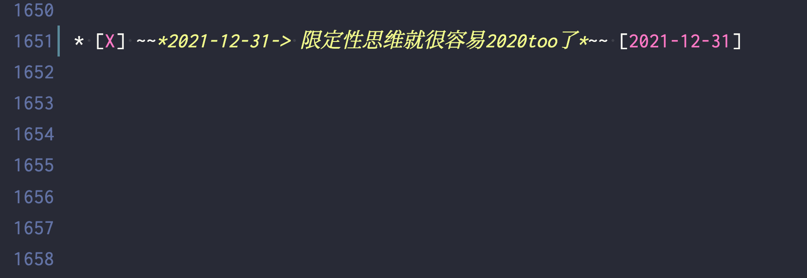

% 2022还是2020？
% 王福强
% 2021-12-31

看似玩笑，实则看你怎么看。

昨天正好跟佩信集团IT团队做了个私享，谈了下管仲的四句话：

> 不为不可成
> 不求不可得
> 不处不可久
> 不行不可复

大多数人实际上只会理解一层意思，少数人或许可以解读两层意思，但应该只有极少数人可以辩证解读、灵活运用。

这背后的差异在哪儿？  思维模式。

所有的外物都是每个人心镜的投射，你的心是什么状态，所有外物映照出来的就是什么状态，跟外物无关，只与你的本心有关。 你可以说这很唯心，或许吧，但人其实就是唯心的，你接受亦或否定，其实也是本心的轮转，不是吗？

还记得我之前经常放出来的那个问题吗？  “你是探索性思维，还是限定性思维？” 

不同的选择，注定不同的结果， 但我又无意于说得太开，因为这东西本来就是一个开放性的问题，最有意思的反而是不同个体的反映。

有的人因为相信所以看见，有的人只有看见才会相信，这是差异，更是差距，而这种差距，本心即是本源。

马上2022年了， 其实不想写这段文字，但早上手贱写了TODO备注项，所以，还是写下几句，算是一个了结，也是一个展望吧！

我的年度TODO LIST也该翻篇了，最后， 预祝大家新年快乐～

