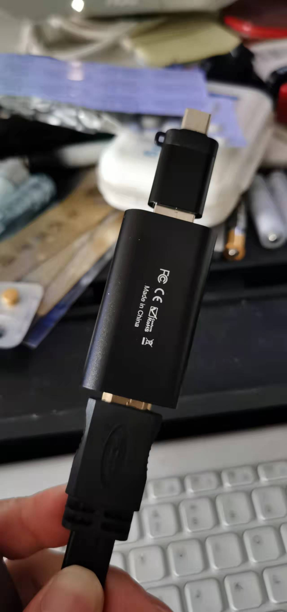

% 怎么把手机摄像头作为obs输入源
% 王福强
% 2022-01-01

Macbook Pro16的摄像头实在太渣，现在任何一个手机的摄像头都比它强吧，所以，考虑怎么把手机的摄像头作为直播视频的输入源纳入OBS，简单了解了一下，基本上就两个思路：

- **有线**方案
- **无线**方案

# 有线方案

恰好去年闲着无聊逛电商的时候搞了个玩具型视频采集卡，所以，组合`视频采集卡 + USB HUB`把手机和电脑连接起来之后，OBS就会自动识别把手机作为一个USB视频设备了，唯一不爽的就是串联各种线和各种转接头...

这是视频采集卡再加个USB转Type-C的转接头：

这是USB HUB转接HDMI和Type-C：

# 无线方案

无线方案嘛，基本思路是这样的： 手机端起一个推流的客户端，然后把视频流推到一个推流服务器，之后，OBS里新加一个Media Source（去除本地文件选项）， 指定推流服务器对应的URL，把视频流从推流服务器拉下来就可以了。

手机装app客户端当然可以，也可以选择像[obs.ninja](https://obs.ninja/)这样的网页版，不需要安装任何客户端，点开连接并授权就可以开始推流了。

如果有技术能力，自己假设一个推流服务器，自己折腾推流客户端逻辑，当然就更内聚了，不过，纯粹就是为了玩技术而玩儿了 ^[当然，初衷是为视频内容创作者提供工具就也是正事儿，哈]，忘了其实初衷是为了玩内容 ；）

