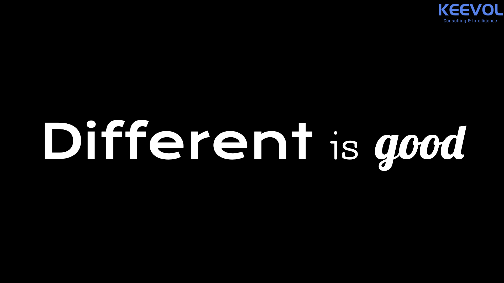

% 我对叶茂中先生手记的三点感同！
% 王福强
% 2022-01-16

信息密度比较高，看得比较慢， 还没看完，但已经可以深深感受到叶茂中先生在哲学层面的修为不一般，虽然是以广告营销切入，但个人哲学才是底层逻辑。

姑且谈三点个人的观点...

# 实打实

所有观点简单直接，鞭辟入里，没有一丝累赘和修饰。

> 从来没有一个客户找广告公司的目的是为了做专业的广告、高雅的广告，他们对广告的需要只有一个：“成功”地把产品卖出去。

企业的目的其实就是利润，广告和营销的最终目的其实就是把产品卖出去，把钱收回来。有一说一，虽然赤裸，但确实事实， 没有利润，没有赚到钱，所有的体面，所有的情怀都是屁。

# 事上练

> 在战争中学会战争。

叶茂中先生也不是一开始就可以声名鹊起，也是一步步地遇到困顿，然后思变，寻求转型， 也就是**打通**一道道的关卡， **打穿**一道道的困境，遇山开路、遇水搭桥， 遇事处事，一步一步走到今天。

所有的知识都是公开的知识，所有的知识都是别人的智慧，只有将别人的知识和自己事上练的感悟融合为自己的智慧，才算学有所成，事有成果。

# 传帮带

你说他作坊也好，说他不是现代公司也罢，这些都不重要，重要的是，他知道自己要什么，而你可能并不不知道。

不是所有人都要做公司，也不是所有公司都能做成大公司。

当所有人都盯着大公司和集团的时候，却忽略了这个世界上最原始最有效的组织方式， 那就是师徒制，传帮带。

国内因为竞争和利益的原始分配格局，导致说，很多都是让个人自己去摸索。 但实际上，**一个人要成长更快，没有什么比言传身教更有效的教育和培训方式了**。

所以KEEVOL的咨询工具箱里也会把**传帮带(CBD Methodology)**作为关键工具之一。

一个成熟的机构和团队，只要形成传帮带的传统，也依然可以保持组织的持续进化。

对于生态来说，Different is good！

