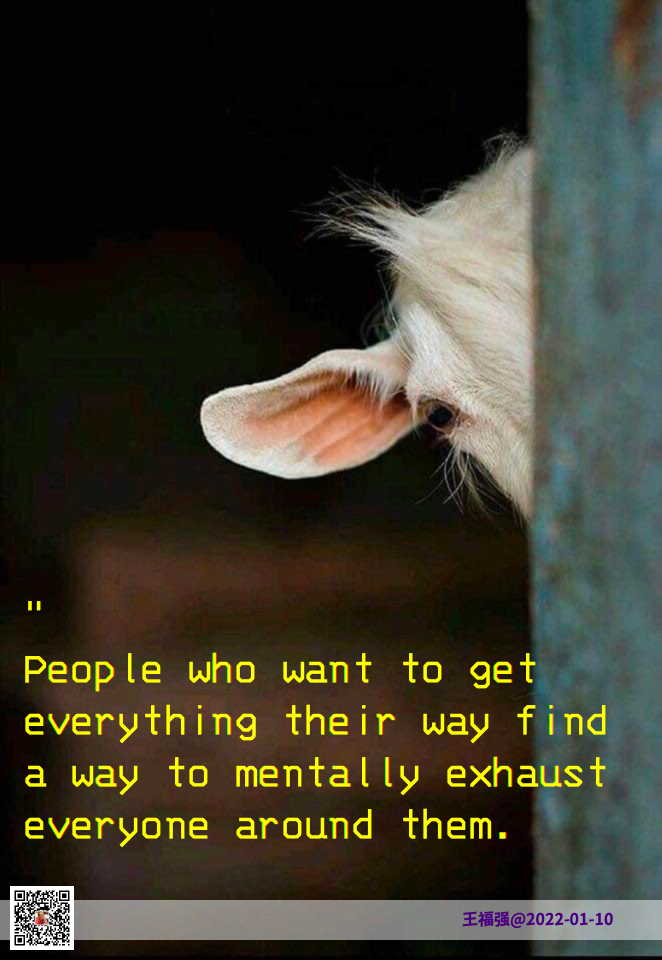

% 销售管理为什么要求一定要打卡？
% 王福强
% 2022-01-21

没有带过销售团队，所以也不知道底层逻辑是啥，不过，姑且可以猜一下，说得不一定对，有销售管理者欢迎拍砖。

作为外行，我最早其实对于销售打卡这事儿觉得很non-sense，但是这些年又慢慢转变了思维，原因就是我在《深度思考揭秘》里提到的hierarchy常态。任何一个行业都有高手和普通职员，一个高手其实是很难理解普通职员在做同一样事情上的效能差距的，尤其是当TA做了管理主管之后，通常会用TA的标准去要求下属，这就是我说的 **“应该”的诅咒** 的由来。 这个现象学术上叫“虚假同感偏差”，我之前也有文字提到过，不光是主管， 这些年碰到的很多CEO也是同样的行为和思维模式，包括早年的自己，所以当时在我周边工作的人估计都很不爽；）

二八定律大家应该都听说过， 其实销售打卡这事儿，我觉得是用常规管理手段来管理那些只能贡献20%业绩的80%的普通销售，即使不能提高业绩，也求不要跌破底线。打卡了跌破底线姑且还能说“尽力了”， 不打卡跌破业绩底线那就是态度有问题了 ；）

这有点儿“劣后”的意思，当然，不是金融领域的那个“劣后”，而是说，**如何让普通人成就非凡事**（也是阿里的土话之一，哈）

天才其实很少的，所以，大部分组织还是得依赖普通人成事，在这个背景前提下，就得靠个别天才设计和规划体系和流程，然后其他人填充枝叶就好了。工程上为什么要越简单越好？ 管理上为什么强调要“简单易行”？ 无非就是让普通人都能干掉。处处都想要碰到个天才，你运气咋那么好呢？

所以，企业看似在拼业务，其实在拼组织，拼你怎么用普通人成就企业的使命和愿景。 如何让普通人成就非凡事？ 复杂的事情搞定后，把标准、简单、批量化的事情交给普通人去干。 普通人还是不会怎么办？ 培训啊， 怎么批量化复制人？ 就是培训。

说白了，培训一定程度上也是服务于“劣后”场景的。

