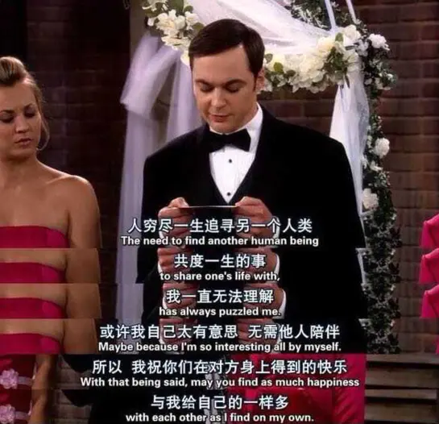
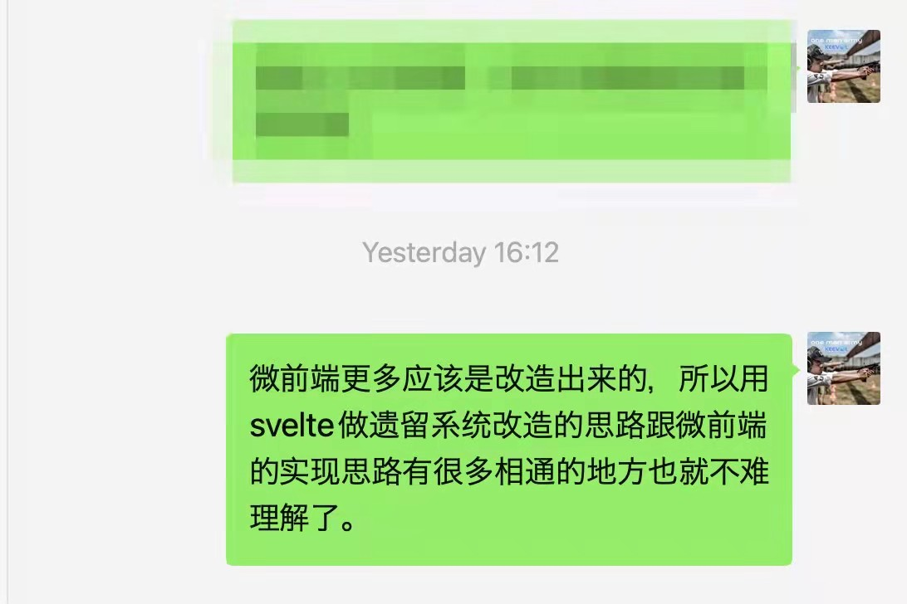

% 谈谈关于反馈的几个思考
% 王福强
% 2022-02-13

其实是今天看到有人分享一个产品图片， 然后联想到自己这阵子几个事情上的思考，感觉可以放到一起跟大家做个简单的分享。

对于笔记软件来说，这些年我对它们已经完全失去兴趣了，因为对于个人来说，重要的是能够即时记录下闪过的想法，不是比较软件美不美观，功能炫不绚丽，所以，我自己打造了自己的一个笔记体系，了解我的同学估计也猜得到，叫KeeNotes。 KeeNotes有很多端或者入口， 但经常用的就是微信公众号入口，置顶了之后，一有念头闪过，我就会通过这个入口跟自己“自言自语”， 有些时候搞得我“室友”经常怀疑我是不是外面有人了，但其实她不理解个中乐趣；）

好吧，只是开个玩笑，其实我想说的是，在每次输入笔记之后，我的KeeNotes微信公众号入口现在其实是没有反馈的：

这就意味着，我不知道我发的note到底有没有给我保存到remote的存储中，只有工作状态时，用PC打开后台才可以确认，这从用户体验上来说其实挺糟糕的，但好在自己用，所以能托就托... ^[后面新开发的飞书入口就解决了这个糟糕的细节]

这其实是一个很小的细节，但做没做，在产品的体验上却能体现出很大的差异。

大多数时候，用户（其实就是你我）需要的是**即时反馈**，忽视了这种心理诉求，小则产品不受欢迎，大则影响公司战略与营收， 比如脑黄金和脑白金就是很好的一个案例。

史玉柱在湖畔大学做过一个分享， 他说脑黄金到3000万营收就再也上不去了，但脑白金却没有上限， 当他和团队打造完销售手册之后，他已经可以看到10亿营收的门槛了，事实也证明当年他们干到了13个亿， 这其中的差别在哪儿？ 

差别就是脑黄金吃完用户很难马上就感受到好处（“虽然确实是个好东西”），而脑白金则可以第二天醒来就能感受到产品的功效到底如何，所以， 最终脑白金的营收天花板远超脑黄金。

这就好像你给客户撕心裂肺地奉上一套好的方案， 但客户没感觉，反而帮助客户解决一些眼前的小问题， 客户反而更觉得有帮助，因为TA可以即时地获取到反馈。 毕竟，你自己觉得好，客户根本就无从知道，就跟做技术的都知道，架构虽好，但现实却是大家都喜欢“救火队员”。 扁鹊和他哥的故事一直在延续，但也没有办法，**人性是不变的**。

创业其实也是一样， 讲求**小步快跑、快速验证**，不是说长期主义不好，而是说长期主义成功地概率更低，风险更大，长期主义最大的问题就是需要极其痛苦的煎熬，还不一定看得到希望，这是反人性的，而且最终结果怎么样也未知，很多成功故事告诉你长期主义的丰厚回报与风光无限，却从来没人跟你提长期主义也有最后万劫不复的，所以，**路怎么走，你的自己选**...

