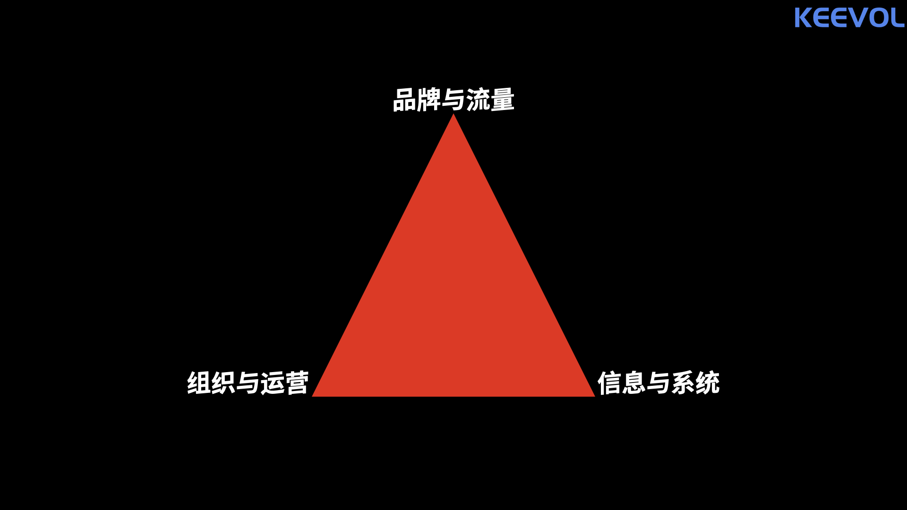

% KEEVOL如何辨识企业
% 王福强
% 2022-02-15

在KEEVOL眼里，企业可以根据三个维度来大体上做个度量，KEEVOL称之为**企业三元素**：

当然， 你把它们扩展成常用的雷达图也是可以的，但KEEVOL更喜欢“三(3)”这个数字，所以， let it be。

# 明星企业

所有三个元素都做得很好的企业，算作是明星企业，都有谁，咱就不一一列举了，他们的品牌和流量应该已经教育好大家了。

# 腰部企业

一般**流量**做好的企业都饿不死，这里的流量不单单指C端业务，也指B端的商务关系与销售资源， 能把流量做到八九十分， **组织和运营**以及**信息和系统**这些元素只要分数过得去，一般都还可以。

**获客能力是企业的核心能力**，有些行业的获客就算是`资本狂烧+组织狂招`都是无法短期就能出效果的， 尤其是不能跟在这些行业里已经沉淀了二三十年的企业比，这些企业就算组织很烂，信息和系统很烂，而你信息和系统很强很超前，都无法跟它们抗衡，不信你可以问问这些年要进入某些传统行业的互联网人出来搞的企业带头人。

(90+, 60, 60)的组合会靠资源上的优势完胜(50, 80, 90)的组合。

# 生存线上的企业

为什么商战要分类分阶段？ 就是因为生存线上的企业只能先打游击战，这是无法越过的一个过程。

生存线上的企业，三元素往往都低于及格线，这是结果，也是状态，就看能不能通过打破一点的及格线从而把整体拉起来。

但难就难在，越是在这个阶段和状态的企业，往往越是雪上加霜的状态（还记得我经常挂在嘴边的“雪锦霜花定律”吗？），能爬出来的都是奇迹+运气。

# 小结

企业三元素是KEEVOL总结的一个方法论工具，希望对于我们理解市场上各式各样的企业能有所帮助。

