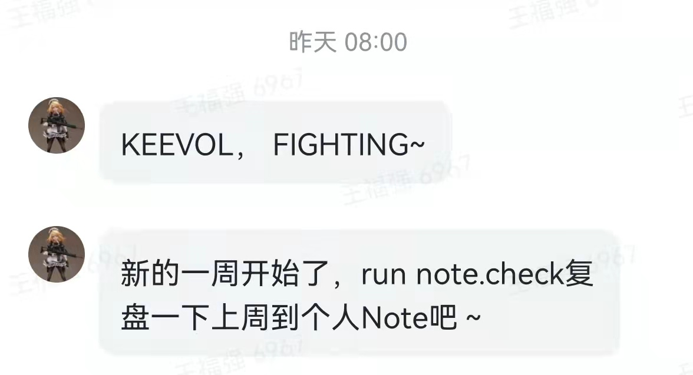

% 我的PKM理念与Keenotes产品实践
% 王福强
% 2022-02-15

此PKM非彼PKM，企业有KB（Knowledge Base）， 个人有PKM（Personal Knowledge Management），我之前一篇'[也谈谈知识管理与真实](https://afoo.me/posts/2021-07-25-pkm-and-real-words.html)'里已经提到过， 我对笔记工具(Note Tools)的要求有三点：

- **访问快**
- **启动快**
- **够持久** 

这是整个**知识管理体系**的第一环，Note或者说闪念只是快速全量输入，类似于数据仓库里的ODS层（哈哈，有点儿太技术了，非技术人员可以忽略这个类比），有了原始语料，我们才可以对它们做回顾、重新组织， 然后再输出更有价值的文字和内容。

我之前讲过一个理念，**你可以不用持续输出，但你一定得持续沉淀**（或者说持续输入然后沉淀）。

**Note层**其实就是持续沉淀的那一环，这一环要做好，其实就有很多点需要考虑，比如**信息分级输入**， 毕竟， 不同分类、不同敏感度、不同来源的信息如果不加以区分，后期很容易一团浆糊没法用，那么，输入的价值也就大大折扣了。

为了对信息输入提供不同的分级支持，我在打造KeeNotes的时候提供了多个输入端，这些输入端是以信息敏感度的高低进行排布的：

1. **Slack + Outgoing Web Hook**, 摘录，非原创内容的收录，信息敏感度最低；
2. **微信公众号入口**，最常用的入口，信息敏感度中低；
   - **飞书入口**，类似微信公众号入口， 地位对等，只是使用习惯和频度上的差别；
3. **Keenotes Android版**， 信息敏感度高，使用频度低；

另外， 桌面端也有三个入口，分别是：

1. **KeeNotes Web版**， 基于Svelte ^[如果你不知道svelte是什么，那么我就王婆卖瓜，顺道兜售下自己写的Simple Svelte ；）]的打造的本地web应用；
2. **KeeNotes Desktop版**，原来开源，但因为需要申请软著，所以撤回；
3. **Keebox入口**， Keebox是个人桌面工具， 也提供了Keenote的输入入口；

所有桌面版因为不依托其它平台，所以， 信息敏感度可以不关注区分。

所有输入端的内容都会统一交给frontier服务器与后端存储服务，这些服务通过私有VPN相互关联，保证信息通路的绝对安全，最终保证信息落地到私有存储。

这是PKM第一环的整个链路与工具产品实践。

PKM的第二环是回顾，每周一会通过自建的推送助手发送消息提醒我对上一周的碎片化思考进行回顾，**记忆曲线**的“干活”，各位看官应该懂的吧？ ；）

PKM的第三环即**组织整理输出**， 这个就不做过多赘述了， 包括这篇就是这个环节的产出， 通过**Markdown+Pandoc+Git**管理的纯文本“源代码”，输出格式根据平台和渠道而异。

就这些，各位看官有什么更好的实践吗？ 欢迎留言分享~

