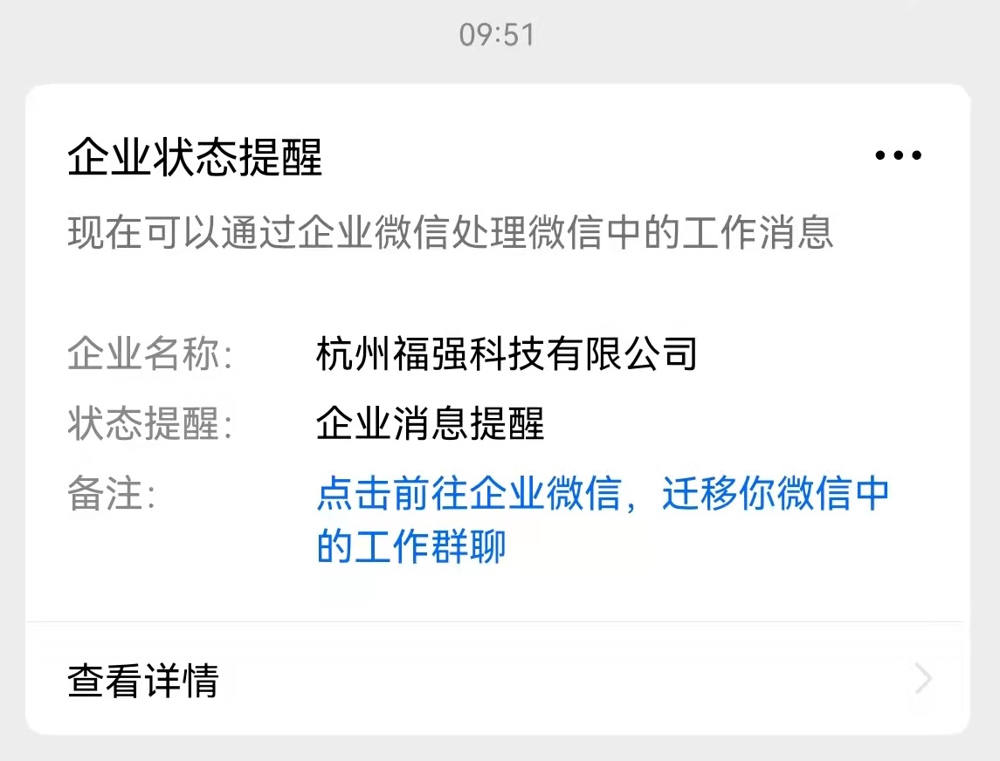
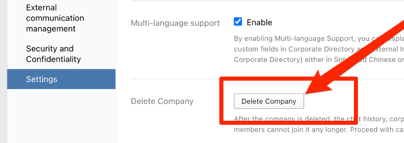

% 删除企业微信公司账号！
% 王福强
% 2022-03-23

源于企业微信推送了一个feature，原本以为它只是给我加一个机器人，就手贱点了，导致很多人莫名其妙地被邀请加入公司(比较搞笑的是很多公司的CEO都被邀请“入职”了我司 ^_-)，既污染了公司账号，也导致很多人被骚扰，所以打算关闭这个企业账号，因为原本这个账号也不怎么用。(很多同学反映他们公司也有类似遭遇，而且也很糟心...)

关闭前几个准备与调研：

1. **企业邮箱**，很多人反映腾讯客服反馈给他们的信息是，*删除企业微信账号会导致企业邮箱也失效*；
2. 之前被转为**企业微信群**的微信群，删除企业账号后会不会消失？

在请求大家加入新的微信群之后， 并且查看并备份了企业邮箱内的内容之后，开始准备删除企业账号，预留了一天时间，不同时间段提醒大家迁移到新的微信群，在24点左右开始登录企业微信web管理后台，点击`My Company -> Settings -> Delete Company`： 

扫码确认删除，执行之后提示“*后台正在更新无法删除，请联系客服*”，重试三次依然如此，看来是不希望客户删除公司账号咯~

又到手机端后台的Settings里，发现有删除的选项，遂执行， 可以执行成功，oh yeah！

执行扫尾工作， 发现：

1. **企业邮箱继续可用**，但因为我把DNS服务也从Dnspod一并迁移了，所以，应该是不可接收邮件，进入到设置里删除原来的域名， 企业邮箱会自动生成一个随机替换的域名，同时会再次提示你添加自己的自定义域名，这个时候，就可以把新提示的MX记录加到新的DNS设置中就可以成功接收和发送邮件了。所以原则上来说，如果不像我这样彻底地一并干掉了DNS解析，那企业邮箱原则上是可以继续用的。
2. **被转的企业微信群依然存在**，或许是因为我之前把管理员从原来的企业微信号替换为了个人微信号；

所以，感觉没有传说中绑定的那么紧密，但大部分企业因为在上面已经有太多建设和投入成本，所以一般也不太敢动。

> WARNING
> 
> 以上只是个人的经历与观察，不代表完备的方案和建议，所以，如果各位客官也要这么干，最好自己做好预案、自行承担潜在的损失。

话说回来，在整个过程中，会发现企业里系统与系统之间的状态同步还真是大问题，一般都会存在状态不一致的情况，就好比web管理后台与手机端的管理后台，状态上肯定是有不一致的地方。 当年很多人从web端爬取taobao的数据不成，转而去掏H5，也是同样的套路。

有时间或许可以分享下一些大集团里系统设计上的缺陷案例...

