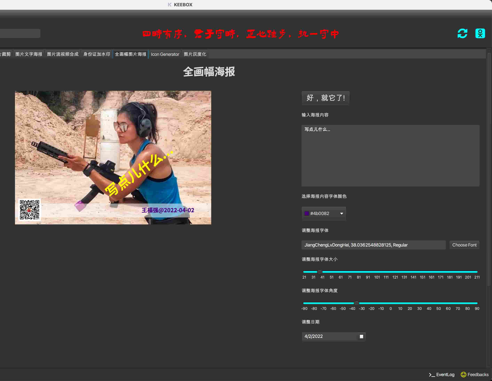
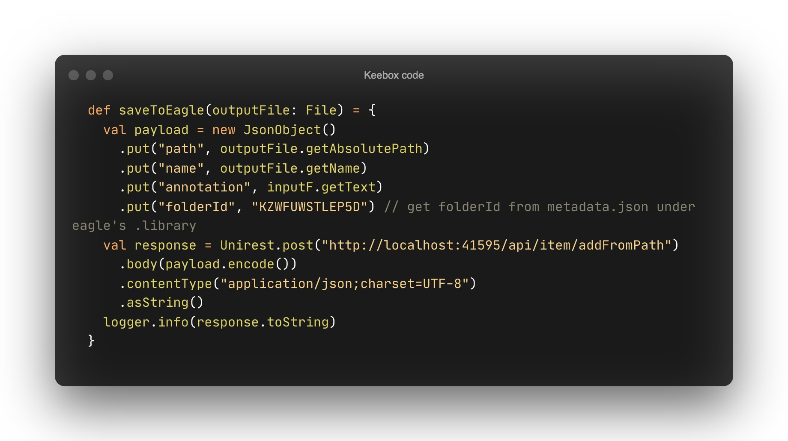
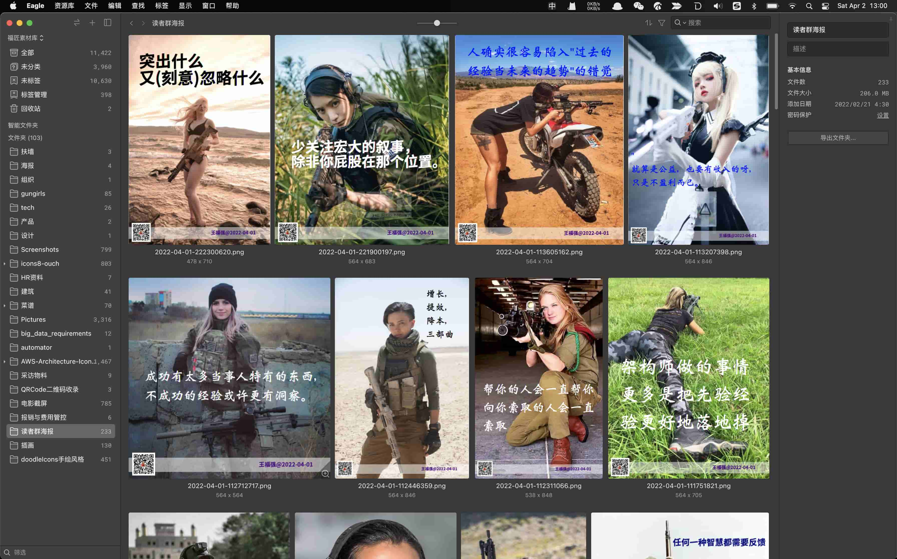

% 给KEEBOX插上Eagle的翅膀
% 王福强
% 2022-04-02

KEEBOX是我自己"Eat My Own Dog Food"打造的个人软件工具箱，功能上有点儿包罗万象，其中这阵子用的最多的一个功能就是全画幅海报，因为我向我的读者许诺过，每天会在读者群里发送一副海报，所以就打造了这么一个工具，样子是这样的：

之前偷懒， 所有生成的海报都直接存到了文件系统，后来发现不好管理，也不好检索， 想找哪副海报的时候就得“遍历”一遍，这实在是太不符合我程序员出身的气质了，所以，我就搜索了程序员的宝库github，找OCR方案，后来用tesseract测试了下，基本可以识别图片里的文字，就简单对之前生成的所有海报逐一处理了一遍，把提取的文本写入与海报图片同名的txt文件中，并简单人工修正编辑了一番，基本完成了图片与图片信息的提取与匹配。

遗留图片资产的元信息问题算是解决了，接下来就是解决新海报图片的生成与管理了...

第一种方案延续了`.png + .txt`的组合，KEEBOX程序在生成海报图片的同时，把文本框里的信息写入同名的txt文件作为海报图片的元信息或者说附加信息， 但这只是第一步，并没有解决图片管理与检索的问题。

第二种方案使用了我2019年买的商业软件[Eagle](https://cn.eagle.cool/)(https://cn.eagle.cool/)，这其实更多是一个面向设计师群体的软件，当初也是之前的兄弟炼金（花名）推荐给我的，我同时又询问了之前公司的设计师之后才下单购买的。 Eagle原本就有图片的采集、管理与检索这些功能，所以，如果能够利用它的这些能力，那我就不用在KEEBOX里重新实现一般了，真是想睡觉就来枕头，Eagle同时还提供了API，这就为KEEBOX跟Eagle集成铺平了道路。

最终方案就变成了，从KEEBOX生成海报图片，然后通过Eagle API将图片放入Eagle来管理，最终需要检索图片的时候，直接走Eagle就可以了，原本这两个工具也是常年开着：

最终，我的所有读者群海报有了统一的归宿和检索入口：

作为eagle的非典型用户，我觉得，如果eagle在后续版本中能把“添加注释”的默认输入框高度再调高一些就更好啦，更甚至于，如果能够集成初步的AI能力，比如OCR，将纳入eagle管理的图片中的文字自动提取并作为检索条件的一部分，那就更爽了！

