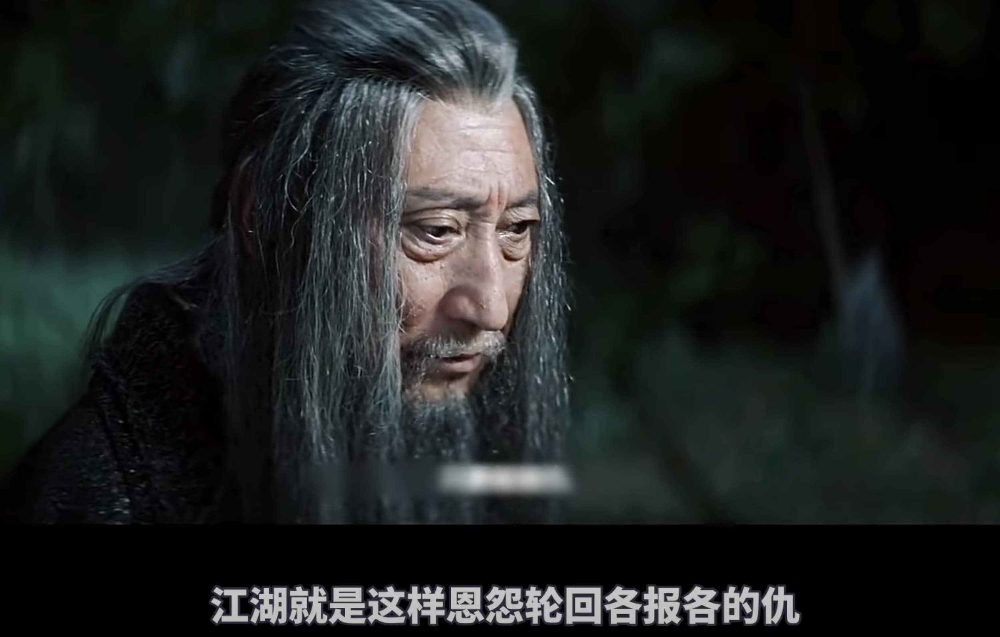

% 不要因小不见大！
% 王福强
% 2022-04-13

原本这个春天没有表达的欲望，最多做做技术科普（比如搞了个《架构百科》视频号），但这两天有几个事情挺有意思的，所以，说说...

**大宵禁**已经很长时间了，空闲的时候会刷刷电影解说，毕竟，这东西可以单位时间内摄入更多信息，配合1.75倍速服用，效果更佳。 那天刷到了《捕鼠记》这部老电影，之前看过，但这次感触颇深的地方在于，因为一只小老鼠，俩兄弟搞得近乎抓狂，这tmd不就是日常很多人在做的事情吗？ 为了一些琐碎的事情，反而忘却了生活不是只有一只小老鼠，只是因为你只盯着那只小老鼠，然后整个生活就充斥成了只有一只小老鼠，最后还搞得满地鸡毛、稀里哗啦...

这几天有兄弟把创业搞了三年多的公司关了，嗯，你可以想到，TA自己总结也是被“疫情”干趴下了。最搞笑的是，这时候还发现有人模仿他们公司的官网，要举报还得提交各种资料。 其实，一点儿都不搞笑，也很正常， 国内这环境，做几年生意应该都有体感，很多事情没法论“是非”的。 所以，“将军赶路， 不追小兔”，虽然是在说**目标管理**，但很多时候也在告诉你，有些破事儿、小事儿、烂事儿，随TA去吧，盯着烂人烂事儿，你能收获什么呢？ 

有个词儿叫“孕妇效应”，说的是你如果成了孕妇，走在街上，你会看到更多孕妇，不是因为你，这个街上就孕妇多了，而是因为你把注意力放在了孕妇身上，所以才会觉得孕妇多了。其实，街上孕妇的数量可能一直就那么个比例。

很多时候，越关注什么，越会**放大**什么，盯着沙子，你眼里最后可能都是沙子，把注意力收一收，转移一下，这个世界很大，注意什么以及把精力投到哪里，自己才是主宰者！

**别跟烂人和烂事儿过不去，最终其实都是在跟自己过不去！** （虽然有些时候是很令人生气）

如果真的过不去，那么...

光“**向内求**”，有些时候也确实不解决问题 ;0)

