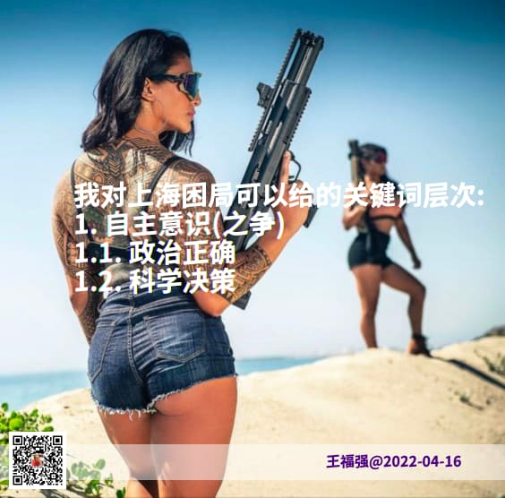

% 疫情管控之下的上海困局
% 王福强
% 2022-04-16

我觉得现在的上海困局用一句老话来说其实就足够了，那就是“神仙打架，百姓遭殃”。

重点是神仙打架，延伸出来的是百姓遭殃。

# 神仙打架

神仙打架部分就是中央与地方的自主意识之争，地方想要自主意识，中央则要削弱甚至打掉地方的自主意识。 

延伸一下就是政治决策还是科学决策之争：

- 政治决策就是人定胜天，上面什么命令，下面都要排除万难去争取胜利；
- 科学决策就是根据事实和依据**动态的**改变决策和举措，该isolation的时候isolation，该降低权重的时候降低权重，而不能万年不变的一套下来；

这两者冲突的背后隐藏的情绪是什么？ “非不能也，实不愿也”。

但有不愿的，也一定会有愿的，所以，各种冲突不是二元冲突，可能是三元甚至多元，因为有人也喜欢“顺势而为”，至于“为”什么，那咱就不好说了，毕竟一年可以搞几千亿营收的产业，咱不在其中。

# 百姓遭殃

百姓遭殃部分就更有意思了，不管从什么角度，总会存在两派观点，有的支持清零，虽然他们还饿着肚子，有的不支持清零，即使现在的封控还没有怎么影响到他们的菜篮子，当然，也有饿着肚子不支持清零或者不饿肚子支持清零的，总之就是“有错觉、有错位、有错配”，但大家还算务实，都会**自救**，再苦再难，也得**自救**，所以，才会有“配不上这么好的市民”之说，因为**单纯的管控而没有服务**，一定是会出现怨声载道的情况，那些还没有抱怨的，只是还没有轮到自己身上而已。

我很赞赏那些挺身而出，为了改善民生尽自己绵薄之力之人，我也很悲悯那些老的、少的、被病痛折磨的， 所能做的，只是祝愿这段可以尽快翻篇，老百姓要的其实很简单，只是人间烟火气而已。

