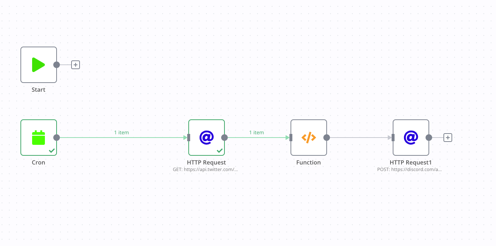

% 好工具：从n8n回归吃自己的狗食
% 王福强
% 2022-05-28

Build and use good tools: turn to eat my own dog food from n8n

---

今天讲讲n8n的故事...

n8n是一个flow platform, 可以自部署，可能对于js开发人员或者非开发人员，这个平台会有吸引力吧。

我个人使用下来的历程是这样的： 

1. 尝试构建复杂多节点的flow， 受挫于twitter的v2 api level不够；
2. 尝试简化flow，只用cron node + http requests这些nodes， works；
3. 今天发现，定义的flow周末也触发了discord webhook，看了下才发现，n8n的cron node貌似不支持完整的cron表达式？ 
4. 遂回归自己最拿手的底层技能，linux本地的crontab + 一个scala写的monolith提供web api， done！

虽然我很想用**好**工具，

但发现，**最适合自己的工具才是好工具**！

